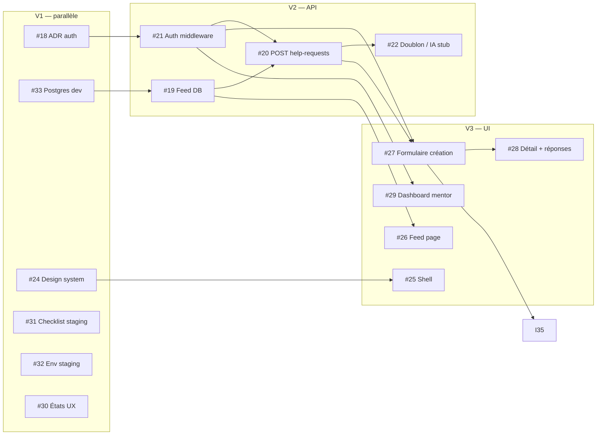

# GitHub Project — All-Aboard MVP

**Board** : [github.com/orgs/AllAboard-THP/projects/3](https://github.com/orgs/AllAboard-THP/projects/3)

Ce document décrit l’organisation du projet GitHub pour l’équipe All-Aboard (3 développeurs + agents). La **timeline produit** reste dans [Docs/README.md](../Docs/README.md).

---

## Structure du Project

| Élément | Détail |
|---------|--------|
| **Nom** | All-Aboard MVP |
| **Owner** | Organisation `AllAboard-THP` |
| **Repo lié** | [AllAboard-THP/All-Aboard](https://github.com/AllAboard-THP/All-Aboard) |
| **Visibilité** | Privé (org) |

### Champs personnalisés

| Champ | Usage |
|-------|--------|
| **Status** | Workflow kanban **6 colonnes** (aligné Hermes Kanban — voir ci-dessous) |
| **Pilier** | `Frontend` · `Backend` · `Platform` · `Transverse` |
| **Phase** | Aligné sur la doc MVP (Phase 0–4 + Ops) |
| **Priorité** | P0 (bloquant) → P3 (basse) |
| **Taille** | XS → XL (estimation relative) |
| **Vague** | Lot de livraison (`V1` fondations parallèles → `V5` backlog) — **grouper la Roadmap par ce champ** |
| **Date début** / **Date cible** | Fenêtres sur la Roadmap ; **même date début = travail en parallèle** |

### Roadmap — ne pas lire comme une liste séquentielle

La vue **Roadmap** GitHub affiche des barres sur une timeline. Sans configuration, tout semble l'un derrière l'autre. Pour refléter la réalité :

1. **Grouper par `Vague`** (ou par `Pilier`) dans les paramètres de la vue Roadmap.
2. **Aligner les dates** : les tâches indépendantes partagent la **même Date début** → barres côte à côte.
3. **Dépendances GitHub** (`blocked by`) : affichées sur l'issue ; empêchent de passer en Ready trop tôt.
4. Le **Board Status** reste la vue d'exécution ; la **Roadmap** est la vue de planification.

#### Vagues (lots parallèles)

| Vague | Période indicative | Piste | Issues | Parallèle avec |
|-------|-------------------|-------|--------|----------------|
| **V1 Fondations** | S1 | 4 pistes en même temps | #18, #24, #33, #31, #32, #30 | tout V1 |
| **V2 Auth & API** | S2–S3 | Backend métier | #21→#19→#20→#22 | #25 shell UI dès fin #24 |
| **V3 Parcours UI** | S3–S5 | Frontend produit | #25–#29, #26 | #29 mentor dès auth OK |
| **V4 Finition & ops** | S4+ | Qualité / staging | #34, #35 | après parcours minimal |
| **V5 Phase 3+** | S6+ | CORS, TanStack étendu | #23, #36 | backlog |

#### Graphe de dépendances (Phase 2)



#### Pistes parallèles par développeur (dès maintenant)

| Dev | Ready immédiat | Ensuite (quand deps OK) |
|-----|----------------|-------------------------|
| **Backend** | #18 ADR | #21 → #19 → #20 → #22 |
| **Platform** | #33 Postgres | #31, #32, #34 en parallèle |
| **Frontend** | #24 design system, #30 états UX | #25 → #26 ; puis #27+ après API |

**Script de maintenance** (deps + dates) : `.github/scripts/configure-project-dependencies.sh`

#### Configurer la vue Roadmap (UI)

1. Project → **+ New view** → **Roadmap**
2. **Group by** : `Vague` (prioritaire) ou `Pilier`
3. **Date fields** : `Date début` → `Date cible`
4. Zoom **Week** pour voir les chevauchements V1
5. Optionnel : sous-vue filtrée `Phase = Phase 2`


### Board — colonnes Status (validé)

Inspiré du [Kanban Hermes](https://github.com/NousResearch/hermes-agent/blob/main/website/docs/user-guide/features/kanban-tutorial.md) (6 colonnes). Adapté à une équipe humaine + agents sur GitHub Issues.

| Colonne | Rôle | Quand l'utiliser |
|---------|------|------------------|
| **Triage** | Idées brutes, à spécifier | Nouvelle idée sans critères d'acceptation ; besoin d'un epic ou d'une spec |
| **Todo** | Backlog spécifié | Issue template rempli, dépendances non levées, ou pas encore assignée |
| **Ready** | Prêt à démarrer | Assignée + dépendances OK + critères clairs — peut être prise immédiatement |
| **In Progress** | En cours | Branche ouverte, dev actif |
| **Blocked** | Bloqué | Attente humaine : ADR, accès Dokploy, review, clarification produit |
| **Done** | Terminé | PR mergée sur `Dev` (ou livré si ops sans PR) |

**Différences vs Hermes** : pas de dispatcher automatique ni bouton « Specify » intégré — la promotion Triage → Todo est manuelle (ou via agent + template issue). Le reste du flux est volontairement identique pour faciliter le travail mixte humain / agent.

**Transitions typiques**

```text
Triage → Todo → Ready → In Progress → Done
                              ↓
                          Blocked → (débloqué) → In Progress
```

**Règles équipe**

1. Ne pas mettre en **Ready** sans assignee (ou pilier clair).
2. **In Progress** = une personne, une issue (WIP limit implicite 1–2 par dev).
3. **Blocked** : commenter l'issue avec la question / le bloqueur.
4. Epics restent en **Todo** tant que des enfants sont ouverts.

### Labels dépôt (miroir)

- `type:epic` · `type:task` · `type:adr` · `type:spike`
- `pilier:frontend` · `pilier:backend` · `pilier:platform` · `pilier:transverse`
- `phase:2` · `phase:3` · `phase:4` · `phase:ops`
- `priority:p0` … `priority:p3`

---

## Répartition équipe (3 dev)

| Pilier | Responsable suggéré | Epics / issues |
|--------|---------------------|----------------|
| **Frontend** | Dev UI/UX | #15, #24–30, #36 |
| **Backend** | Dev API | #16, #18–23 |
| **Platform** | Dev infra / intégration | #17, #31–35, #37 |

Epic transverse Phase 2 : **#13** (parent du lot auth + parcours).

### Ordre de démarrage recommandé

**En parallèle (V1 — même semaine)** :

- **#18** ADR auth · **#33** Postgres · **#24** design system · **#31–32** staging prep

**Puis selon deps** (voir graphe ci-dessus) — pas une file unique.

---

## Vues recommandées (Project UI)

1. **Board — Status** (exécution) : 6 colonnes Triage → Done
2. **Roadmap — par Vague** (planification) : `Date début` / `Date cible`, group by **Vague**
3. **Roadmap — par Pilier** : voir les 3 pistes dev en parallèle
4. **Board — Pilier** : WIP par équipe dans **In Progress**
5. **Table — Ready** : filtre `Status = Ready`, tri **Priorité**
6. **Table — Blocked** : dépendances humaines + issues `blocked by`
7. **Table — Phase 2** : filtre phase MVP courante

---

## Workflow issue → PR

1. **Triage** : idée → compléter le template → passer en **Todo**
2. Assigner + lever dépendances → **Ready**
3. Prendre l'issue → **In Progress** ; branche `feat/<num>-court-sujet` depuis `Dev`
4. PR vers `Dev` ; `Closes #NN` ou `Refs #NN` ; `pnpm verify` (voir [AGENTS.md](../AGENTS.md))
5. Bloqué ? → **Blocked** + commentaire explicite
6. Merge → **Done**

### Definition of Done (tâche)

- CI verte sur la PR
- Champs Project à jour (Pilier, Phase, Priorité, Taille)
- Si changement Web/API transverse : journal dans [plan-mise-en-place-web-api-donnees.md](../Docs/plan-mise-en-place-web-api-donnees.md)

---

## Créer une nouvelle issue

- **Template** : `.github/ISSUE_TEMPLATE/task.yml` ou `epic.yml`
- Ajouter au Project : bouton **Projects** sur l’issue ou `gh project item-add 3 --owner AllAboard-THP --url <issue-url>`
- Renseigner les 4 champs custom

### Re-bootstrap (maintenance)

Script idempotent partiel (ne recrée pas les epics existants) :

```bash
.github/scripts/setup-project-items.sh
```

Nécessite `gh` avec scope `project` (`gh auth switch` compte ayant le scope).

---

## Inventaire initial (2026-05-13)

| # | Titre | Pilier |
|---|-------|--------|
| 13 | [Epic] Phase 2 — Auth & parcours | Transverse |
| 15 | [Epic] Frontend — UI/UX | Frontend |
| 16 | [Epic] Backend — API | Backend |
| 17 | [Epic] Platform — Staging | Platform |
| 18–23 | Tâches backend / ADR | Backend / Transverse |
| 24–30 | Tâches frontend | Frontend |
| 31–35 | Tâches ops | Platform |
| 36 | TanStack hors home | Frontend |
| 37 | [Epic] Phase 4 Agent/Indexer | Platform |

---

## Liens utiles

- [Docs/README.md](../Docs/README.md) — timeline MVP
- [Docs/To-do.md](../Docs/To-do.md) — promotion staging
- [Docs/map-of-content.md](../Docs/map-of-content.md) — cartographie doc
- [Dokploy instance](../Docs/deploiement-dokploy-instance-allaboard.md)
