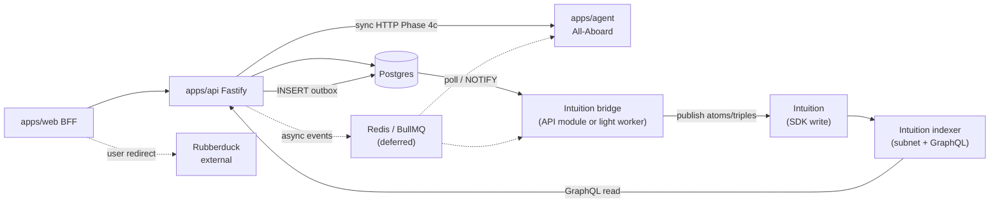

# ADR 0004 — All-Aboard Agent & Intuition architecture (Phase 4)

## Status

Accepted — 2026-06-01 (backlog framing [#37](https://github.com/AllAboard-THP/All-Aboard/issues/37) validated; revised 2026-05-27 — **Intuition indexer**, no in-house `apps/indexer`; revised 2026-06-02 — **`apps/agent` ≠ Rubberduck** (Rubberduck = external service); Phase 4 implementation [#66](https://github.com/AllAboard-THP/All-Aboard/issues/66)–[#69](https://github.com/AllAboard-THP/All-Aboard/issues/69) may start).

## Context

All-Aboard describes a product journey where **Rubberduck** (AI, **external service**, other team) can help quickly on simple requests ([user-journeys.md](../product/user-journeys.md) steps 4–5: user redirect), and where the **Intuition** layer (blockchain / knowledge graph) feeds the long-term vision ([architecture/dataflow.md](../architecture/dataflow.md), [integrations/intuition-docs-index.md](../integrations/intuition-docs-index.md)).

Eventually, All-Aboard exposes its **own in-app agent** (`apps/agent`); for some tasks, the agent (or API via it) proposes a **handoff** to Rubberduck rather than a local response.

**Repository state (Phase 2 shipped):**

| Component | State | Current location |
|-----------|-------|------------------|
| Rubberduck handoff heuristic | **Stub** — title ≤ 6 words → `hints.rubberduckEligible` | [`apps/api/src/app.ts`](../../apps/api/src/app.ts) (`POST /help-requests`) |
| Rubberduck handoff UI | **Stub** — informational message, no external redirect | [`apps/web/components/features/help-request-form.tsx`](../../apps/web/components/features/help-request-form.tsx) |
| `apps/agent` | **Scaffold** (#66) — internal All-Aboard agent | [`apps/agent`](../../apps/agent/README.md) |
| Rubberduck (external product) | **Outside repo** | URL / contract TBD with Rubberduck team |
| Intuition indexing | **Absent** | Read target: Intuition GraphQL; write: SDK / contracts |
| `apps/indexer` | **Not retained** | `Dockerfile.indexer` = historical bootstrap placeholder — **out of Phase 4 scope** |
| Dokploy deployment | Agent **disabled**; Indexer placeholder **to remove** | [deployment/dokploy-instance.md](../deployment/dokploy-instance.md) |

**Product decision (2026-05-27):** use the **Intuition network indexer** (documented Rust subnet + GraphQL API), not an in-house indexing service in the monorepo. All-Aboard **publishes** Intuition primitives; Intuition **indexes** and **exposes** the graph.

**Product decision (2026-06-02):** **`apps/agent` = All-Aboard agent** (internal AI orchestration). **Rubberduck is not `apps/agent`** — it is a third-party service; All-Aboard only decides handoff and redirects the user.

Epic [#37](https://github.com/AllAboard-THP/All-Aboard/issues/37) requires an **ADR** before any Phase 4 development. This document frames service split, boundaries with the existing Fastify API, and implementation backlog.

## Decision

### 1. Role of `apps/agent` (All-Aboard agent)

Dedicated **internal HTTP service** for **All-Aboard AI orchestration** — **outside** the Fastify API process and **distinct** from Rubberduck.

| Responsibility | `apps/agent` (All-Aboard) | Fastify API | Rubberduck (external) |
|----------------|---------------------------|-------------|----------------------|
| Evaluation / routing (incl. Rubberduck redirect?) | Yes (`POST /routing/evaluate`) | Calls agent or fallback | No |
| Future in-app AI orchestration (LLM, prompts) | Yes (beyond #66 scaffold) | No — delegates | No |
| Rubberduck conversational responses | No | No | Yes (Rubberduck team) |
| Rubberduck session / UI | No | Hint + web redirect | Yes (external product) |
| Help-request persistence | No | Yes (Postgres via Drizzle) | No |
| User auth (JWT) | No | Yes | No |
| Public exposure | **No** — internal network / BFF only | Yes (REST Phase 2) | Yes (separate product) |

**MVP Phase 4a contract** (#66 scaffold):

- `GET /health` — Dokploy healthcheck (port **4100**).
- `POST /routing/evaluate` — input: `{ title, tags?, authorId? }`; output: `{ suggestRubberduckRedirect: boolean, reason?: string }` — agent decides if user should be **redirected** to Rubberduck (stub ≤ 6 words rule, then configurable model). In [#68](https://github.com/AllAboard-THP/All-Aboard/issues/68), API maps `suggestRubberduckRedirect` → `hints.rubberduckEligible`.

No "respond" route on `apps/agent`: answering the user on Rubberduck is the **external service**, not this agent.

**Evolution:** multi-step workflows (tools, safety, streaming) for the All-Aboard agent stay in `apps/agent`; API only carries business results to the client (via BFF). **Rubberduck** URL and contract live in web/config (outside monorepo).

### 2. Intuition — network indexer + All-Aboard bridge

**Intuition indexer (network infra — consumed, not built):**

- **Rust indexing layer (Intuition subnet)** — see [Intuition Network](https://www.docs.intuition.systems/docs/intuition-network).
- **GraphQL** as primary **read** interface on the graph — see [GraphQL API](https://www.docs.intuition.systems/docs/graphql-api/overview).
- All-Aboard **does not reimplement** this layer.

**All-Aboard bridge (to build — issue #67):**

Light module or worker that **maps Postgres domain → Intuition primitives** (atoms, triples, signals — detailed mapping in #67 spike) and **handles write reliability** (retry, idempotence).

| Responsibility | Intuition indexer (network) | All-Aboard bridge | Fastify API |
|----------------|---------------------------|-------------------|-------------|
| Index on-chain data | Yes | No | No |
| Expose GraphQL read API | Yes | No | No (consumes server-side) |
| Publish to Intuition (SDK / contracts) | No | Yes | Emits outbox or delegates |
| Phase 2 community feed (Postgres) | No | No | Yes (`GET /feed`) |
| All-Aboard ops healthcheck | N/A | Optional if separate worker | `GET /health` |

**MVP Phase 4b scope** (#67):

- Postgres outbox (`outbox_events`): `help_request.created` events (later responses, signals).
- **Publisher stub:** consumes outbox, log + metrics; then Intuition testnet SDK without blocking initial merge.
- Idempotence via `helpRequestId` + `intuition_published_at` status (or `intuition_publish_jobs` table).
- **Read:** Intuition GraphQL query spike (e.g. claims linked to a request) — no Postgres duplication except explicit cache.

**Bridge placement** (#67 implementation choice, preference order):

1. Module `packages/blockchain` or `apps/api/src/intuition/` + outbox worker **in API process** (simple MVP).
2. Minimal Node service **without** indexing logic — publish + retry only — if secret/rate-limit isolation required.

**No `apps/indexer`:** the Turborepo/Dokploy bootstrap name wrongly implied an in-house indexer; it will not be implemented.

### 3. Queues and inter-service communication

**MVP decision:** progressive **hybrid** pattern.


```mermaid
flowchart LR
  Web["apps/web BFF"]
  API["apps/api Fastify"]
  Agent["apps/agent<br/>All-Aboard"]
  RD["Rubberduck<br/>external"]
  Bridge["Intuition bridge<br/>(API module or light worker)"]
  PG[("Postgres")]
  Intuition["Intuition<br/>(SDK write)"]
  Idx["Intuition indexer<br/>(subnet + GraphQL)"]
  Q["Redis / BullMQ<br/>(deferred)"]

  Web --> API
  Web -.->|"user redirect"| RD
  API --> PG
  API -->|"sync HTTP Phase 4c"| Agent
  API -->|"INSERT outbox"| PG
  PG -->|"poll / NOTIFY"| Bridge
  Bridge -->|"publish atoms/triples"| Intuition
  Intuition --> Idx
  Idx -->|"GraphQL read"| API
  API -.->|"async events"| Q
  Q -.-> Bridge
  Q -.-> Agent
```

| Phase | Agent ↔ API | Intuition ↔ All-Aboard |
|-------|-------------|------------------------|
| **4a** (agent scaffold) | None — isolated service + health | None |
| **4b** (bridge) | — | Outbox + publisher stub; GraphQL read spike |
| **4c** (agent routing) | Sync HTTP `POST /routing/evaluate` | Real testnet publisher (non-blocking request create) |
| **4d+** (load) | Redis + BullMQ for long AI jobs | Optional BullMQ for batch publish; indexer stays Intuition |

**Redis/BullMQ:** **deferred** beyond scaffolds (#66, #67); Postgres outbox suffices for initial publisher increment.

### 4. Boundary with Fastify API

API remains the **single entry point** for web (BFF) and versioned REST contract ([openapi.yaml](../../apps/api/openapi.yaml)).

| Flow | Mechanism | Notes |
|------|-----------|-------|
| Request create + `rubberduckEligible` hint | API calls `POST /routing/evaluate` (sync) or fallback; maps `suggestRubberduckRedirect` | [#68](https://github.com/AllAboard-THP/All-Aboard/issues/68) |
| Rubberduck redirect | Web — external product URL/config | Outside `apps/agent`; responses = Rubberduck team |
| Intuition publish post-create | API inserts outbox; bridge publishes | Async — does not block `201` |
| Enriched read (graph, certifications) | API or BFF queries **Intuition GraphQL** | Complements Postgres, does not replace in Phase 4b |
| Auth | JWT validated **only** in API/BFF | Intuition / LLM secrets off Web |

**Target outbox events:**

```typescript
// packages/types — Phase 4 evolution
type OutboxEvent =
  | { type: "help_request.created"; payload: { id: string; title: string; authorId: string } }
  | { type: "help_request.rubberduck_handoff"; payload: { id: string; title: string } };
```

No breaking change on Phase 2 `CreateHelpRequestResponse`: `hints.rubberduckEligible` remains (semantics: **eligible for Rubberduck handoff**); the **source** of the boolean changes (Agent instead of `wordCount`).

### 5. Dokploy deployment

Aligned with [matrix](../deployment/environment-variables.md) and [instance](../deployment/dokploy-instance.md).

| Service | Image | Port | Exposure | Activation |
|---------|-------|------|----------|------------|
| All-Aboard Agent | `infra/docker/Dockerfile.agent` | 4100 | **Internal** | After #66 + CI #69 |
| Intuition bridge | *No dedicated MVP image* — API module or shared worker | — | Internal | With #67 |
| Indexer (Dokploy placeholder) | `Dockerfile.indexer` **legacy** | 4200 | — | **Do not reactivate** — remove from Dokploy project (#69) |
| Intuition indexer | Intuition network infra | — | Public GraphQL / RPC endpoints | Outside All-Aboard Dokploy |
| Rubberduck | External product | — | Public Rubberduck team URL | Outside All-Aboard monorepo |

**Ops rules:**

1. Keep **Agent** disabled until #66 scaffold and CI #69.
2. **Remove or leave disabled** Dokploy All-Aboard "Indexer" placeholder — no longer matches architecture.
3. Bridge vars: `INTUITION_*` (RPC, publish wallet keys, network id) — see [Network Details](https://www.docs.intuition.systems/docs/quick-start/network-details); LLM secrets **only** on All-Aboard Agent.
4. `pnpm verify` excludes agent until implemented; no `apps/indexer` gate.

### 6. Backlog split (child issues of #37)

| Issue | Title | Deliverable | Dependencies |
|-------|-------|-------------|--------------|
| [#66](https://github.com/AllAboard-THP/All-Aboard/issues/66) | `apps/agent` scaffold | Turbo package, `GET /health`, stub `POST /routing/evaluate`, tests, Dockerfile build OK | ADR 0004 |
| [#67](https://github.com/AllAboard-THP/All-Aboard/issues/67) | Intuition bridge (publisher + GraphQL) | Outbox, publisher stub → testnet SDK, GraphQL read spike, idempotence | ADR 0004 |
| [#68](https://github.com/AllAboard-THP/All-Aboard/issues/68) | API integration — Rubberduck handoff via agent | API heuristic → Agent handoff; in-app agent BFF; Rubberduck web redirect | #66 |
| [#69](https://github.com/AllAboard-THP/All-Aboard/issues/69) | Agent CI/Dokploy + Indexer placeholder cleanup | Agent image build; Dokploy Indexer removal doc | #66 |

Epic **#37 is closed** (2026-06-03) — MVP #66–#69 merged on `Dev` (PRs #93–#96). Post-MVP: Intuition testnet SDK, Dokploy Agent reactivation after ops validation.

## Consequences

- **Positive:** no 4th indexer service to operate; alignment with Intuition ecosystem; clear split All-Aboard agent / external Rubberduck; clear split AI (agent) / publish (bridge) / REST (API).
- **Negative:** Intuition network dependency (latency, testnet/mainnet availability); Rubberduck handoff contract to coordinate with external team; domain → primitives mapping to design.
- **Risks:** dual source of truth Postgres vs graph — mitigate with outbox statuses and explicit GraphQL queries; publish keys in prod — security ADR review before mainnet.
- **Out of Phase 4 MVP scope:** in-house `apps/indexer`, Rubberduck implementation in monorepo, public All-Aboard GraphQL, mobile, Agent client codegen, Intuition mainnet without testnet spike.

## Alternatives not chosen

| Alternative | Rejection reason |
|-------------|------------------|
| **`apps/agent` = Rubberduck** | Rubberduck is external; conflates responsibilities and deployment |
| `/rubberduck/*` or `/respond` routes on `apps/agent` | Implies All-Aboard agent *is* Rubberduck or answers on its behalf |
| **In-house `apps/indexer`** (Node worker port 4200) | Duplicates Intuition indexer (subnet + GraphQL) |
| Inline LLM in `apps/api` | Latency + secret coupling; hard to scale |
| Agent called directly from browser | Exposes API keys; breaks BFF model |
| Indexer merged into API with graph indexing logic | Conflates publish and index; Intuition responsibilities |
| Redis mandatory from scaffold | Postgres outbox suffices for initial publish |
| Immediate implementation without ADR | Explicitly forbidden by #37 |

## Links

- [Epic #37](https://github.com/AllAboard-THP/All-Aboard/issues/37) · [Task doc](../tasks/37-agent-indexer/)
- [User journeys](../product/user-journeys.md) · [Target dataflow](../architecture/dataflow.md)
- [Intuition docs index](../integrations/intuition-docs-index.md) · [Intuition Network](https://www.docs.intuition.systems/docs/intuition-network)
- [Dokploy instance](../deployment/dokploy-instance.md)
- Current stub: [`apps/api/src/app.ts`](../../apps/api/src/app.ts) · [`help-request-form.tsx`](../../apps/web/components/features/help-request-form.tsx)
