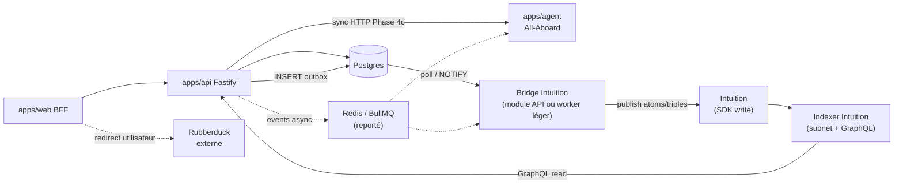

# ADR 0004 — Architecture Agent All-Aboard & Intuition (Phase 4)

## Statut

Accepté — 2026-06-01 (cadrage backlog [#37](https://github.com/AllAboard-THP/All-Aboard/issues/37) validé ; révisé 2026-05-27 — **indexer Intuition**, pas de `apps/indexer` maison ; révisé 2026-06-02 — **`apps/agent` ≠ Rubberduck** (Rubberduck = service externe) ; implémentation Phase 4 [#66](https://github.com/AllAboard-THP/All-Aboard/issues/66)–[#69](https://github.com/AllAboard-THP/All-Aboard/issues/69) peut démarrer).

## Contexte

All-Aboard décrit un parcours produit où **Rubberduck** (IA, **service externe**, autre équipe) peut aider rapidement sur des demandes simples ([moc-parcours-utilisateur.md](../moc-parcours-utilisateur.md) étapes 4–5 : redirection utilisateur), et où la couche **Intuition** (blockchain / graphe de connaissance) alimente la vision long terme ([dataflow-architecture.md](../dataflow-architecture.md), [intuition-documentation-index.md](../intuition-documentation-index.md)).

À terme, All-Aboard expose son **propre agent** in-app (`apps/agent`) ; pour certaines tâches, l’agent (ou l’API via lui) propose un **handoff** vers Rubberduck plutôt qu’une réponse locale.

**État du dépôt (Phase 2 livrée)** :

| Composant | État | Emplacement actuel |
|-----------|------|-------------------|
| Heuristique handoff Rubberduck | **Stub** — titre ≤ 6 mots → `hints.rubberduckEligible` | [`apps/api/src/app.ts`](../../apps/api/src/app.ts) (`POST /help-requests`) |
| UI handoff Rubberduck | **Stub** — message informatif, pas de redirect externe | [`apps/web/components/features/help-request-form.tsx`](../../apps/web/components/features/help-request-form.tsx) |
| `apps/agent` | **Scaffold** (#66) — agent All-Aboard interne | [`apps/agent`](../../apps/agent/README.md) |
| Rubberduck (produit externe) | **Hors dépôt** | Intégration URL / contrat à définir avec l’équipe Rubberduck |
| Indexation Intuition | **Absent** | Lecture cible : GraphQL Intuition ; écriture : SDK / contrats |
| `apps/indexer` | **Non retenu** | `Dockerfile.indexer` = placeholder historique bootstrap — **hors scope Phase 4** |
| Déploiement Dokploy | Agent **désactivé** ; placeholder Indexer **à retirer** | [deploiement-dokploy-instance-allaboard.md](../deploiement-dokploy-instance-allaboard.md) |

**Décision produit (2026-05-27)** : utiliser l’**indexer du réseau Intuition** (subnet Rust + API GraphQL documentés), pas un service d’indexation maison dans le monorepo. All-Aboard **publie** des primitives Intuition ; Intuition **indexe** et **expose** le graphe.

**Décision produit (2026-06-02)** : **`apps/agent` = agent All-Aboard** (orchestration IA interne). **Rubberduck n’est pas `apps/agent`** — c’est un service tiers ; All-Aboard ne fait que décider du handoff et rediriger l’utilisateur.

L’epic [#37](https://github.com/AllAboard-THP/All-Aboard/issues/37) exige une **ADR** avant tout développement Phase 4. Ce document cadrage le découpage services, les frontières avec l’API Fastify existante et le backlog d’implémentation.

## Décision

### 1. Rôle de `apps/agent` (agent All-Aboard)

Service **HTTP interne** dédié à l’**orchestration IA All-Aboard** — **hors** processus Fastify API et **distinct** de Rubberduck.

| Responsabilité | `apps/agent` (All-Aboard) | API Fastify | Rubberduck (externe) |
|----------------|---------------------------|-------------|----------------------|
| Évaluation / routage (dont redirect Rubberduck ?) | Oui (`POST /routing/evaluate`) | Appelle l’agent ou fallback | Non |
| Orchestration IA in-app future (LLM, prompts) | Oui (hors scaffold #66) | Non — délègue | Non |
| Réponses conversationnelles Rubberduck | Non | Non | Oui (équipe Rubberduck) |
| Session / UI Rubberduck | Non | Hint + redirect web | Oui (produit externe) |
| Persistance demande d’aide | Non | Oui (Postgres via Drizzle) | Non |
| Auth utilisateur (JWT) | Non | Oui | Non |
| Exposition publique | **Non** — réseau interne / BFF uniquement | Oui (REST Phase 2) | Oui (produit séparé) |

**Contrat MVP Phase 4a** (scaffold #66) :

- `GET /health` — healthcheck Dokploy (port **4100**).
- `POST /routing/evaluate` — entrée : `{ title, tags?, authorId? }` ; sortie : `{ suggestRubberduckRedirect: boolean, reason?: string }` — l’agent décide si l’utilisateur doit être **redirigé** vers Rubberduck (stub règle ≤ 6 mots, puis modèle configurable). En [#68](https://github.com/AllAboard-THP/All-Aboard/issues/68), l’API mappe `suggestRubberduckRedirect` → `hints.rubberduckEligible`.

Pas de route « respond » sur `apps/agent` : répondre à l’utilisateur sur Rubberduck relève du **service externe**, pas de cet agent.

**Évolution** : workflows multi-étapes (tools, safety, streaming) pour l’agent All-Aboard restent dans `apps/agent` ; l’API ne transporte que le résultat métier vers le client (via BFF). L’URL et le contrat **Rubberduck** vivent côté web/config (hors monorepo).

### 2. Intuition — indexer réseau + bridge All-Aboard

**Indexer Intuition (infra réseau — consommé, pas développé)** :

- Couche d’indexation **Rust (subnet Intuition)** — voir [Intuition Network](https://www.docs.intuition.systems/docs/intuition-network).
- **GraphQL** comme interface principale de **lecture** sur le graphe — voir [GraphQL API](https://www.docs.intuition.systems/docs/graphql-api/overview).
- All-Aboard **ne réimplémente pas** cette brique.

**Bridge All-Aboard (à développer — issue #67)** :

Module ou worker léger qui **mappe le métier Postgres → primitives Intuition** (atoms, triples, signals — mapping détaillé en spike #67) et **gère la fiabilité d’écriture** (retry, idempotence).

| Responsabilité | Indexer Intuition (réseau) | Bridge All-Aboard | API Fastify |
|----------------|---------------------------|-------------------|-------------|
| Indexer données on-chain | Oui | Non | Non |
| Exposer GraphQL de lecture | Oui | Non | Non (consomme en client serveur) |
| Publier vers Intuition (SDK / contrats) | Non | Oui | Émet outbox ou délègue |
| Feed communautaire Phase 2 (Postgres) | Non | Non | Oui (`GET /feed`) |
| Healthcheck ops All-Aboard | N/A | Optionnel si worker séparé | `GET /health` |

**Périmètre MVP Phase 4b** (#67) :

- Outbox Postgres (`outbox_events`) : événements `help_request.created` (et ultérieurement réponses, signaux).
- **Publisher stub** : consomme l’outbox, log + métriques ; puis SDK Intuition testnet sans bloquer le merge initial.
- Idempotence par `helpRequestId` + statut `intuition_published_at` (ou table `intuition_publish_jobs`).
- **Lecture** : spike requête GraphQL Intuition (ex. claims liés à une demande) — pas de duplication dans Postgres sauf cache explicite.

**Emplacement du bridge** (choix en impl #67, ordre de préférence) :

1. Module `packages/blockchain` ou `apps/api/src/intuition/` + worker outbox **dans le processus API** (MVP simple).
2. Service Node minimal **sans** logique d’indexation — uniquement publish + retry — si isolation secrets/rate-limit requise.

**Pas de `apps/indexer`** : le nom prêt dans le bootstrap Turborepo/Dokploy désignait à tort un indexer maison ; il ne sera pas implémenté.

### 3. Files d’attente et communication inter-services

**Décision MVP** : pattern **hybride progressif**.


```mermaid
flowchart LR
  Web["apps/web BFF"]
  API["apps/api Fastify"]
  Agent["apps/agent<br/>All-Aboard"]
  RD["Rubberduck<br/>externe"]
  Bridge["Bridge Intuition<br/>(module API ou worker léger)"]
  PG[("Postgres")]
  Intuition["Intuition<br/>(SDK write)"]
  Idx["Indexer Intuition<br/>(subnet + GraphQL)"]
  Q["Redis / BullMQ<br/>(reporté)"]

  Web --> API
  Web -.->|"redirect utilisateur"| RD
  API --> PG
  API -->|"sync HTTP Phase 4c"| Agent
  API -->|"INSERT outbox"| PG
  PG -->|"poll / NOTIFY"| Bridge
  Bridge -->|"publish atoms/triples"| Intuition
  Intuition --> Idx
  Idx -->|"GraphQL read"| API
  API -.->|"events async"| Q
  Q -.-> Bridge
  Q -.-> Agent
```

| Phase | Agent ↔ API | Intuition ↔ All-Aboard |
|-------|-------------|------------------------|
| **4a** (scaffold agent) | Aucune — service isolé + health | Aucune |
| **4b** (bridge) | — | Outbox + publisher stub ; spike GraphQL lecture |
| **4c** (routage agent) | HTTP sync `POST /routing/evaluate` | Publisher réel testnet (non bloquant création demande) |
| **4d+** (charge) | Redis + BullMQ pour jobs IA longs | BullMQ optionnel pour publish batch ; indexer reste Intuition |

**Redis/BullMQ** : **reporté** au-delà des scaffolds (#66, #67) ; outbox Postgres suffit pour le premier incrément publisher.

### 4. Frontière avec l’API Fastify

L’API reste le **point d’entrée unique** pour le web (BFF) et le contrat REST versionné ([openapi.yaml](../../apps/api/openapi.yaml)).

| Flux | Mécanisme | Notes |
|------|-----------|-------|
| Création demande + hint `rubberduckEligible` | API appelle `POST /routing/evaluate` (sync) ou fallback ; mappe `suggestRubberduckRedirect` | [#68](https://github.com/AllAboard-THP/All-Aboard/issues/68) |
| Redirect Rubberduck | Web — URL/config produit externe | Hors `apps/agent` ; réponses = équipe Rubberduck |
| Publication Intuition post-création | API insère outbox ; bridge publish | Async — ne bloque pas `201` |
| Lecture enrichie (graphe, certifications) | API ou BFF interroge **GraphQL Intuition** | Complète Postgres, ne le remplace pas en Phase 4b |
| Auth | JWT validé **uniquement** dans API/BFF | Secrets Intuition / LLM hors Web |

**Événements outbox** (forme cible) :

```typescript
// packages/types — évolution Phase 4
type OutboxEvent =
  | { type: "help_request.created"; payload: { id: string; title: string; authorId: string } }
  | { type: "help_request.rubberduck_handoff"; payload: { id: string; title: string } };
```

Pas de breaking change sur `CreateHelpRequestResponse` Phase 2 : `hints.rubberduckEligible` reste (sémantique : **éligible au handoff Rubberduck**) ; la **source** du booléen change (Agent au lieu de `wordCount`).

### 5. Déploiement Dokploy

Aligné sur [matrice](../matrice-deploiement-dokploy-coolify.md) et [instance](../deploiement-dokploy-instance-allaboard.md).

| Service | Image | Port | Exposition | Activation |
|---------|-------|------|------------|------------|
| Agent All-Aboard | `infra/docker/Dockerfile.agent` | 4100 | **Interne** | Après #66 + CI #69 |
| Bridge Intuition | *Aucune image dédiée MVP* — module API ou worker partagé | — | Interne | Avec #67 |
| Indexer (placeholder Dokploy) | `Dockerfile.indexer` **legacy** | 4200 | — | **Ne pas réactiver** — retirer du projet Dokploy (#69) |
| Indexer Intuition | Infra réseau Intuition | — | Endpoints GraphQL publics / RPC | Hors Dokploy All-Aboard |
| Rubberduck | Produit externe | — | URL publique équipe Rubberduck | Hors monorepo All-Aboard |

**Règles ops** :

1. Garder **Agent** désactivé jusqu’au scaffold #66 et job CI #69.
2. **Supprimer ou laisser désactivé** le placeholder Dokploy « Indexer » All-Aboard — il ne correspond plus à l’architecture.
3. Variables bridge : `INTUITION_*` (RPC, clés wallet publish, network id) — voir [Network Details](https://www.docs.intuition.systems/docs/quick-start/network-details) ; secrets LLM **uniquement** sur Agent All-Aboard.
4. `pnpm verify` reste hors agent tant que non implémenté ; pas de gate `apps/indexer`.

### 6. Découpage backlog (issues enfants #37)

| Issue | Titre | Livrable | Dépendances |
|-------|-------|----------|-------------|
| [#66](https://github.com/AllAboard-THP/All-Aboard/issues/66) | Scaffold `apps/agent` | Package Turbo, `GET /health`, stub `POST /routing/evaluate`, tests, Dockerfile build OK | ADR 0004 |
| [#67](https://github.com/AllAboard-THP/All-Aboard/issues/67) | Bridge Intuition (publisher + GraphQL) | Outbox, publisher stub → SDK testnet, spike lecture GraphQL, idempotence | ADR 0004 |
| [#68](https://github.com/AllAboard-THP/All-Aboard/issues/68) | Intégration API — handoff Rubberduck via agent | Heuristique API → Agent handoff ; BFF agent in-app ; redirect Rubberduck côté web | #66 |
| [#69](https://github.com/AllAboard-THP/All-Aboard/issues/69) | CI/Dokploy Agent + nettoyage placeholder Indexer | Build image Agent ; doc retrait Indexer Dokploy | #66 |

L’epic **#37 reste ouverte** (Project : Triage/Todo) jusqu’à priorisation post-staging ; aucune de ces tâches ne bloque le MVP Phase 2.

## Conséquences

- **Positives** : pas de 4ᵉ service indexer à opérer ; alignement avec l’écosystème Intuition ; séparation claire agent All-Aboard / Rubberduck externe ; séparation IA (agent) / publish (bridge) / REST (API).
- **Négatives** : dépendance réseau Intuition (latence, dispo testnet/mainnet) ; contrat handoff Rubberduck à coordonner avec l’équipe externe ; mapping métier → primitives à concevoir.
- **Risques** : double source de vérité Postgres vs graphe — mitiger par statuts outbox et requêtes GraphQL explicites ; clés publish en prod — revue ADR sécurité avant mainnet.
- **Hors scope Phase 4 MVP** : `apps/indexer` maison, implémentation Rubberduck dans le monorepo, GraphQL All-Aboard public, mobile, codegen client Agent, Intuition mainnet sans spike testnet.

## Alternatives non retenues

| Alternative | Raison du rejet |
|-------------|-----------------|
| **`apps/agent` = Rubberduck** | Rubberduck est un service externe ; confond les responsabilités et le déploiement |
| Routes `/rubberduck/*` ou `/respond` sur `apps/agent` | Suggère que l’agent All-Aboard *est* Rubberduck ou qu’il répond à sa place |
| **`apps/indexer` maison** (worker Node port 4200) | Duplique l’indexer Intuition déjà fourni (subnet + GraphQL) |
| LLM inline dans `apps/api` | Couplage latence + secrets ; difficile à scaler |
| Agent appelé directement depuis le navigateur | Expose clés API ; casse modèle BFF |
| Indexer fusionné dans API avec logique d’indexation graphe | Confond publish et index ; responsabilités Intuition |
| Redis obligatoire dès le scaffold | Outbox Postgres suffit pour publish initial |
| Implémentation immédiate sans ADR | Explicitement interdit par #37 |

## Liens

- [Epic #37](https://github.com/AllAboard-THP/All-Aboard/issues/37) · [Doc tâche](../tasks/37-agent-indexer/)
- [Parcours MOC](../moc-parcours-utilisateur.md) · [Dataflow cible](../dataflow-architecture.md)
- [Index doc Intuition](../intuition-documentation-index.md) · [Intuition Network](https://www.docs.intuition.systems/docs/intuition-network)
- [Instance Dokploy](../deploiement-dokploy-instance-allaboard.md)
- Stub actuel : [`apps/api/src/app.ts`](../../apps/api/src/app.ts) · [`help-request-form.tsx`](../../apps/web/components/features/help-request-form.tsx)
