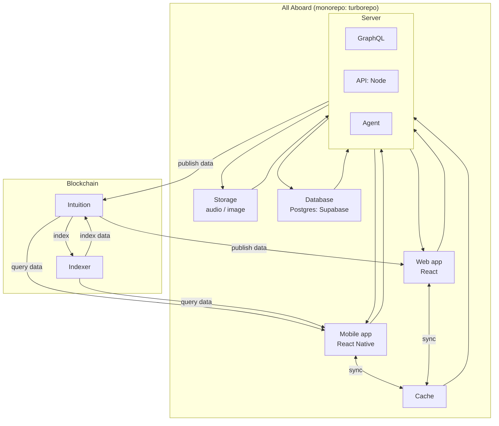

# Dataflow & architecture — All-Aboard

**Canonical documentation** (timeline: current MVP vs phases, TanStack): [README.md](../README.md). Vision index (target stack, dataflow): [vision/README.md](../vision/README.md). This MOC describes the **target** multi-service view; the repository currently follows **Next + Fastify REST** (Phases 0–1), then auth and client data per the timeline.

## Purpose

Document the technical architecture view of All-Aboard (Turborepo monorepo), main components, and data flows between applications, backend, indexer, and blockchain.

## Scope

- Client applications: mobile (React Native) and web (React).
- Backend: GraphQL, Node API, Agent.
- Storage: Postgres database (Supabase), media storage (audio/image), cache.
- Data infra: indexer and blockchain layer.

## Mermaid diagram (dataflow)

## Quick flow reading

1. Mobile and web apps consume backend services via GraphQL/API.
2. Backend relies on cache, Postgres (Supabase), and media storage.
3. Useful data is published to the Intuition layer (blockchain/data layer).
4. The indexer maintains an index to speed up data consultation/aggregation.
5. Clients then retrieve data via both backend and indexed flows.

## MOC assumptions

- The diagram focuses on data circulation, not security/auth (implemented in **Phase 2** — [README.md](../README.md)).
- Arrow directions are simplified for mixed product/technical reading.
- Protocol details (events, jobs, batch) will be specified in a detailed technical version.
- **Short-term MVP**: the "API: Node" block may be **Fastify REST**; the GraphQL illustration remains valid for the **target** documented in [vision/technical-stack-proposal-2026.md](../vision/technical-stack-proposal-2026.md).
- **Indexer (Blockchain subgraph)**: **Intuition network** indexer (subnet + GraphQL) — not an All-Aboard `apps/indexer` service. All-Aboard **publishes** via a bridge (outbox → SDK); see [ADR 0004](../adr/0004-agent-indexer-architecture.md).
