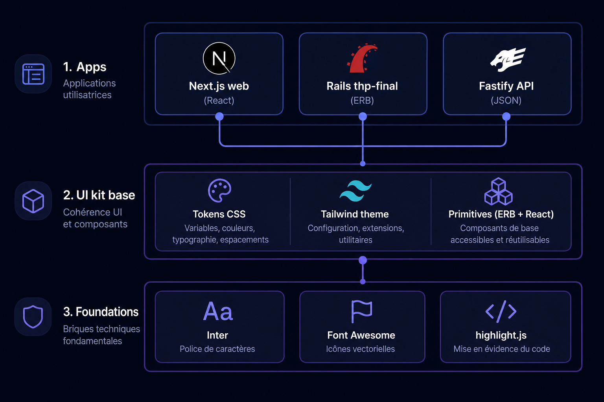
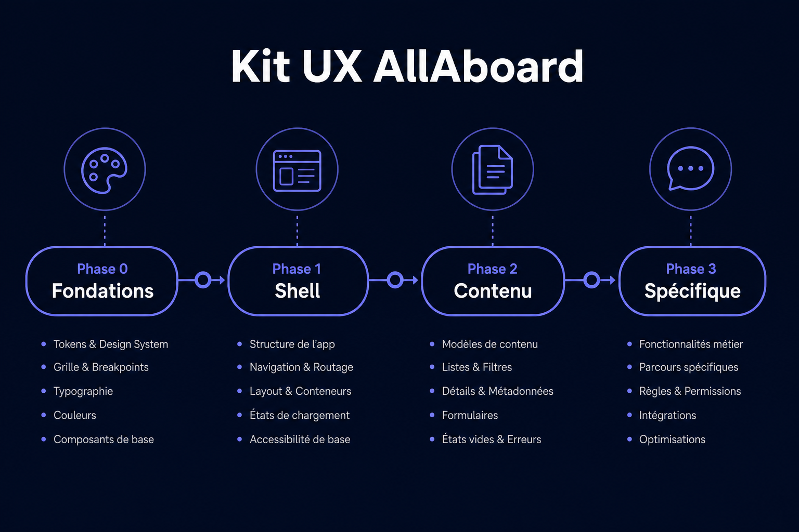

<!-- markdownlint-disable MD033 MD041 -->

# Audit — kit UX AllAboard

**Inventaire §8 · ADN · risques · critères §11**

> [!TIP]
> **Audit** = *quoi* : **§8** inventaire, **§9** phasage stratégique, **§11** succès. **Plan v1.1** = *comment / quand* : **G0/G1**, phases **0–4**, **V/T/M/S/P**, **R1–R6** + **Playwright (D4 actif)**, [exécution agent autonome](plan-integration-kit-ux-allaboard.md#execution-agent-autonome), [Décommission `thp-final`](plan-integration-kit-ux-allaboard.md#decom-thp-final), [procédure agent](plan-integration-kit-ux-allaboard.md#procédure-dexécution-agent), [Décision build](plan-integration-kit-ux-allaboard.md#13-décision-build). Chaque PR kit cite **§8.x** et suit les gates du plan.

**Version** : 1.7 · **Date** : 2026-05-13  
**Périmètre** : monorepo All-Aboard — **kit UX cible `apps/web`** (Next 15) ; `apps/api` sans UI ; **`apps/thp-final` (Rails)** = **obsolète** — **abandon définitif** ; retirer du dépôt et de la CI selon le [plan — Décommission](plan-integration-kit-ux-allaboard.md#decom-thp-final) (plus d’option de travail sur Rails).

**Décisions déjà posées** : **Tailwind** seule stack utilitaire côté web ; **shadcn/ui** + **`cn`** ; **Storybook** dans `apps/web` ; charte **AllAboard** (tokens `--sl-*` / équivalent CSS) — pas de kit tiers imposé hors cette stack ; pas de fidélité à un gabarit externe type « Grenoble Roller ».

---

## Sommaire

1. [Résumé exécutif](#1-résumé-exécutif)  
2. [Visualisations](#2-visualisations)  
3. [Contexte technique](#3-contexte-technique)  
4. [ADN visuel et tokens](#4-adn-visuel-et-tokens)  
5. [Parcours et surfaces](#5-parcours-et-surfaces)  
6. [Écarts (gaps)](#6-écarts-gaps)  
7. [Définition du kit cible](#7-définition-du-kit-cible)  
8. [Inventaire canonique](#8-inventaire-canonique)  
9. [Phasage et plan](#9-phasage-et-plan)  
10. [Risques](#10-risques)  
11. [Critères de succès §11](#11-critères-de-succès)  
12. [Liens](#12-liens)  
13. [Annexes chemins](#13-annexes-chemins)  

---

## 1. Résumé exécutif

> [!NOTE]
> AllAboard a déjà une **direction visuelle cohérente** (dark UI, Inter, indigo / violet / rose, glass, feed / auth / chat). Le kit **formalise** tokens, primitives, doc et règles sur **`apps/web`** — **Tailwind**, **shadcn/ui**, **Storybook**. Toute capture du rendu legacy (screenshots, dernier commit) doit être faite **avant** suppression de `apps/thp-final` ; ensuite la seule vérité UI est **`apps/web`**.

**Livrables audit** : cadre **kit de base**, **trois** figures (§2), inventaire **§8**, phasage **§9**, risques **§10**, critères **§11**. L’**exécution** (cases `- [ ]`, `pnpm verify`, **T** Storybook, **P** Playwright, **R1–R6**) : [plan d’intégration v1.1](plan-integration-kit-ux-allaboard.md).

---

## 2. Visualisations

<strong>§2.1 Couches</strong> — apps → kit → fondations

Illustration des **couches** : applications, socle kit, dépendances transverses.

<strong>§2.2 Roadmap phases</strong> (détail textuel §9 + plan)

Vue synthétique des **phases** (alignée [§9](#9-phasage-et-plan)).

### §2.3 Planche kit complet (familles 0 → 10)

  

> [!IMPORTANT]
> La **liste canonique** détaillée est en [**§8**](#8-inventaire-canonique) ; l’image et le texte doivent rester **alignés** à chaque évolution. Les figures §2 sont **indicatives** ; les décisions normatives sont les sections textuelles et l’annexe **§13**.

---

## 3. Contexte technique

> **v1.7** : la cible d’implémentation du kit est **`apps/web`** uniquement. Tant que `apps/thp-final/` existe encore dans le dépôt, il s’agit de **legacy à retirer** ([Décommission](plan-integration-kit-ux-allaboard.md#decom-thp-final)) — pas d’option de maintenance parallèle.

| Surface | Rôle UX | Stack UI |
|---------|---------|-----------|
| **`apps/web`** | **Cible kit** : pages Next, BFF feed, futur shell produit | **Tailwind** (à finaliser selon [plan v1.1](plan-integration-kit-ux-allaboard.md)), React 19, React Query ; **shadcn/ui** + **Storybook** + **Playwright** (plan) |
| **`apps/thp-final`** | **Obsolète** (Rails) — à supprimer du monorepo | N/A après [Décommission](plan-integration-kit-ux-allaboard.md#decom-thp-final) |
| **`apps/api`** | Pas d’UI | N/A |

**Constat** : après décommission, la vérité visuelle et les parcours vivent **uniquement** sur **`apps/web`**, avec tokens partagés (**D2**, **D3**) et le [plan Web/API](plan-mise-en-place-web-api-donnees.md).

**Fichiers de référence (implémentation)** :

- `apps/web/app/` — routes et layouts App Router  
- `apps/web/package.json` — scripts et dépendances UI  

**Référence historique (avant suppression du dossier)** — utile pour copier couleurs / espacements une dernière fois : chemins sous `apps/thp-final/` listés en **§8.4** (colonnes « référence historique »). Après décommission, retirer ces chemins de l’annexe **§13**.

---

## 4. ADN visuel et tokens

### 4.1 Palette et surfaces

| Rôle | Valeur / pattern | Source |
|------|------------------|--------|
| Primary | `#6366f1` | `--sl-primary`, Tailwind `primary` |
| Secondary | `#8b5cf6` | `--sl-secondary` |
| Accent | `#ec4899` | `--sl-accent` |
| Fonds | `#020617`, `#0f172a` | `--sl-darker`, `--sl-dark` |
| Surface cartes | `#1e293b`, overlays | `--sl-surface`, `.glass` |
| Texte | hiérarchie slate / blanc | Tailwind + composants |

### 4.2 Typographie et icônes

- **Inter** (Google Fonts), 300–800.  
- **Font Awesome 6**.  
- **highlight.js** (atom-one-dark).

### 4.3 Motion

- Animations : `fade-in`, `slide-up`, `pulse-slow`.  
- Hover cartes : `.post-card`, `.glass-hover`.  
- Toasts flash.

### 4.4 Contrainte dynamique

- **Matière** : `subject.accent_color` en inline — le kit expose un **slot sémantique** (variable CSS ou utilitaire), pas une couleur figée.

---

## 5. Parcours et surfaces

Aligné sur [moc-parcours-utilisateur.md](moc-parcours-utilisateur.md) et les routes.

| Zone | Besoins kit |
|------|-------------|
| **Pré-auth** | Formulaires, flash, liens, layout auth / grille |
| **Auth (compte)** | Mêmes **primitives** que landing (pages Next ; plus « Devise » comme stack cible) |
| **Gate CGU** | Modal, checkbox + CTA disabled / actif |
| **Shell connecté** | Nav glass, menu compte, badges, mobile, footer |
| **Feed** | Cartes, listes, sidebars, CTA, scroll |
| **Messages** | Master-detail + React ; bulles CSS |
| **Rôles** | Mentor (emerald), admin (jaune), destructif (rouge) |
| **Mails** | Hors runtime ; option tableau tokens → HTML email |

---

## 6. Écarts (gaps)

| Gap | Description | Impact |
|-----|-------------|--------|
| **Tokens dispersés** | `:root`, Tailwind inline, hex ERB / Next | Thème clair et maintenance difficiles |
| **Tailwind CDN (Rails)** | Pas de purge build côté historique | Hors périmètre legacy ; **interdit** sur `apps/web` (plan [phase 0 — 0.6](plan-integration-kit-ux-allaboard.md#phase-0-fondations)) |
| **Formulaires dupliqués** | Anciennement home vs Devise Rails | À unifier en **composants** `apps/web` |
| **Pas d’inventaire doc** | Pas « composant → story » | Onboarding coûteux — **D1** Storybook |
| **Legacy Rails** | Tant que `apps/thp-final` existe | [Décommission](plan-integration-kit-ux-allaboard.md#decom-thp-final) — **D2** / **D3** pour éviter toute dépendance au legacy |
| **Tests UI** | Playwright = preuve merge sous **D4** | [Plan v1.1](plan-integration-kit-ux-allaboard.md) : **V**, **T** (Storybook), **P** (E2E), **M/S** optionnels |

---

## 7. Définition du kit cible

Ensemble **contractuel** sur **`apps/web`** :

1. **Tokens** — sémantique stable → variables CSS + `tailwind.config` / `@theme` (selon [Décision build](plan-integration-kit-ux-allaboard.md#13-décision-build)).  
2. **Primitives** — `Button`, `Input`, `Card`, `Dialog`, `Badge`, navigation, toasts… via **shadcn/ui** (Radix) + Tailwind + **`cn`**.  
3. **Règles** — `glass` vs `bg-surface`, typo, **WCAG** sur glass.  
4. **Vitrine** — **Storybook** dans `apps/web` (**D1**), stories alignées **§8**.  
5. **Package** (optionnel) — `packages/ui-tokens` consommé par **`apps/web`**.

---

## 8. Inventaire canonique

Checklist **fonctionnelle** : une ligne **§8.x** ≈ une **primitive documentée** (composant React + story Storybook, ou page App Router). **Suivi PR** : [plan v1.1](plan-integration-kit-ux-allaboard.md).

### Alignement audit ↔ plan (référence)

| Famille **§8** | Phase **plan** (principale) |
|----------------|----------------------------|
| **§8.0** | P0 Fondations |
| **§8.1**, **§8.3–8.5**, **§8.7** (partie shell) | P1 Shell et auth |
| **§8.2**, **§8.6**, **§8.7** (contenu) | P2 Contenu et messages |
| **§8.8–8.10**, **§8.9** | P3 Dense et spécifique |
| Couverture **§8.0–8.10** ou **WONTFIX** | P4 Clôture |

<strong>Développer l’inventaire §8.0 à §8.11</strong> (tables complètes)

### 8.0 Fondations

| Élément | Contenu attendu |
|---------|-----------------|
| **Tokens** | Couleurs, rayons, ombres, espacements, `z-index`, **focus ring** |
| **Typographie** | display, h1–h3, body, small, overline ; graisses ; `line-height` |
| **Grille** | `max-w-7xl`, gutters, `main` / sidebar, **safe areas** |
| **Thème** | **Dark** prioritaire ; **light** optionnel (même token set) |
| **Motion** | Durées / easing (carte, modale, toast) |

### 8.1 Chrome global

| Élément | Rôle |
|---------|------|
| **App shell** | `nav` + `main` + `footer` + marges |
| **Header** | Glass, logo, liens |
| **Footer** | Légal, secondaires, version |
| **Nav** | État actif feed / explore / ressources / événements / messages |
| **Nav mobile** | Barre ou drawer, icônes + labels |
| **Menu user** | Avatar, dropdown profil / posts / bookmarks / mentor / admin / déconnexion |
| **Badges** | Messages non lus, pending mentor |
| **Bandeau** | CGU, alertes, maintenance |
| **Scroll to top** | FAB feed |

### 8.2 Navigation de page

| Élément | Usage |
|---------|--------|
| **Breadcrumbs** | explore → matière → post, admin |
| **Onglets** | Segmentation écran |
| **Pills** | Filtres statut, matière |
| **Page heading** | Titre + actions |
| **Split view** | Liste conversations + détail |

### 8.3 Formulaires

| Élément | Variantes |
|---------|-----------|
| **Label** | `required`, hint |
| **Input** | default, focus, erreur, disabled, read-only |
| **Textarea** | resize, compteur (optionnel) |
| **Select** | Dark cohérent |
| **Checkbox / radio** | CGU, groupes |
| **Switch** | Notifications |
| **File** | Avatar, PJ |
| **Champ code** | + **highlight.js** |
| **Search** | Messages, explore |
| **Grille champs** | ex. inscription 2 col |
| **Actions** | Primaire, secondaire, annuler |
| **Erreurs** | Équivalent messages d’erreur auth (composant partagé, cf. `_error_messages` Rails) |

### 8.4 Auth et compte

**Cible implémentation** : routes et composants sous **`apps/web/app/`** (convention App Router à figer dans le README `web`). Colonnes « référence historique » = anciennes vues Rails — **obsolètes** après [Décommission](plan-integration-kit-ux-allaboard.md#decom-thp-final) ; conserver captures ou lien commit si besoin avant suppression.

| Écran | Cible `apps/web` (à créer) | Référence historique Rails |
|-------|---------------------------|---------------------------|
| Connexion | ex. `app/(auth)/login/page.tsx` *(nom à normaliser)* | `devise/sessions/new.html.erb` |
| Inscription | ex. `app/(auth)/register/page.tsx` | `devise/registrations/new.html.erb` |
| Édition compte | ex. `app/(app)/account/page.tsx` | `devise/registrations/edit.html.erb` |
| MDP oublié | ex. route auth dédiée | `devise/passwords/new.html.erb` |
| Reset MDP | ex. route auth dédiée | `devise/passwords/edit.html.erb` |
| Confirmation | ex. route auth dédiée | `devise/confirmations/new.html.erb` |
| Déblocage | ex. route auth dédiée | `devise/unlocks/new.html.erb` |
| Liens | composant partagé auth | `devise/shared/_links.html.erb` |
| Landing | `app/page.tsx` ou segment marketing | `home/index.html.erb` |
| **Mails** | preview Storybook / react-email / templates Next | `devise/mailer/*.html.erb` |

### 8.5 Boutons

| Élément | Détail |
|---------|--------|
| **Button** | primary, secondary, ghost, danger, link |
| **Tailles** | sm, md, lg, icon-only |
| **États** | default, hover, active, disabled, **loading** |
| **Button group** | Annuler / Enregistrer |
| **Icon button** | Fermer, menu, retour mobile |

### 8.6 Contenu et listes

| Élément | Usage |
|---------|--------|
| **Card** | Post, ressource, événement, sidebar |
| **Card interactive** | Hover, lien |
| **List row** | Conversation, modération |
| **Media object** | Avatar + meta |
| **Badge** | Statut, urgence, compteur |
| **Badge matière** | **`accent_color`** |
| **Tag / chip** | Sujets, filtres |
| **Empty** | Liste vide + CTA |
| **Skeleton** | Feed (optionnel) |

### 8.7 Overlays

| Élément | Note |
|---------|------|
| **Alert inline** | Succès / erreur |
| **Flash / toast** | Pile, variants |
| **Modal** | CGU, post, matière, confirmations |
| **Drawer** | Mobile (optionnel) |
| **Tooltip** | Optionnel, a11y |
| **Progress** | Upload |
| **Spinner** | Rare ; pas de dépendance Turbo côté Next |

### 8.8 Admin et données denses

| Élément | Usage |
|---------|--------|
| **Table** | Modération, users, ressources |
| **Table** | Tri, pagination, actions ligne |
| **KPI** | Dashboard admin / mentor |
| **Filtres** | Barre recherche + dropdowns |

### 8.9 Spécifique produit

| Élément | Note |
|---------|------|
| **Bulles chat** | own / other — tokens + CSS module ou fichier dédié `apps/web` |
| **Bloc code** | Commentaires + hljs |
| **Carte post** | Likes, bookmarks, meta, urgence |
| **Profil** | Bannière, avatar, mentor |

### 8.10 Légal

| Élément | Usage |
|---------|--------|
| **Page texte** | CGU, confidentialité, mentions |
| **Link** | Interne, externe, mailto |

### 8.11 Priorité MVP

Livrer d’abord : **tokens** + **grille** ; **boutons** + **champs** + **erreurs** ; **carte** + **badge matière** ; **shell** ; **modal CGU** + **toast** ; **nav actif**. Puis **§8.0–8.10** par extensions.

**Documentation** : ce fichier + [plan](plan-integration-kit-ux-allaboard.md) + **README kit** (futur).

---

## 9. Phasage et plan

> [!NOTE]
> **§9** = vue **stratégique** (tableau ci‑dessous). **Plan v1.1** = livrables numérotés, **G0/G1**, **V/T/M/S/P**, **R1–R6** + **P** Playwright, [exécution agent autonome](plan-integration-kit-ux-allaboard.md#execution-agent-autonome), [Décommission `thp-final`](plan-integration-kit-ux-allaboard.md#decom-thp-final), procédure **agent**, **Mermaid**, **Décision build**, **phase 4** clôture.

| Phase | Contenu | Critère de fin |
|-------|---------|----------------|
| **G0** *(plan)* | **Décommission** `apps/thp-final` : CI, Turbo, Docker, doc | Checklist plan cochée ; `pnpm verify` sans Rails |
| **0** | Tokens + Tailwind build + **shadcn** + **Storybook** + pas de CDN sur Next | `pnpm verify` + **T** + **M** R1 |
| **1** | Nav, footer, menu, **CGU**, auth (App Router), primitives shadcn | **R1–R3** ; stories §8.1 / §8.3–8.5 |
| **2** | Cartes, listes, feed, messages, navigation de page | **R4** / **R5** ; données via plan Web/API |
| **3** | Chat React, admin/mentor, mails, légal | **R5** / **R6** ; pas de stack temps réel legacy |
| **4** *(plan)* | **D1** tableau stories, **D3**, **WONTFIX §8**, **§11** | Merge `Dev` |

Les figures **§2** couvrent surtout les phases **0–3** ; la **phase 4** est détaillée dans le [plan](plan-integration-kit-ux-allaboard.md) (schéma Mermaid inclus).

---

## 10. Risques

| Risque | Mitigation |
|--------|------------|
| SSR / client « use client » | PR petites ; stories Storybook pour états ; plan : **V**, **T**, **M** |
| Tailwind vs CSS custom | Primitives = Tailwind ; exceptions documentées dans le README kit |
| Double stack | Pas Bootstrap / second framework parallèle sur `web` |
| Legacy `thp-final` encore présent | Exécuter [Décommission](plan-integration-kit-ux-allaboard.md#decom-thp-final) avant d’étendre le kit en prod |
| Auth non finalisée | Placeholders + lien [plan Web/API](plan-mise-en-place-web-api-donnees.md) ; **WONTFIX** daté si blocage |

---

## 11. Critères de succès

> Le [plan](plan-integration-kit-ux-allaboard.md) opérationnalise ces points (tâches + **R1–R6**).

- [ ] Document **tokens** validé et reflété dans le code.  
- [ ] **Aucune** dépendance UI majeure non validée (Tailwind + shadcn + Storybook selon plan).  
- [ ] **Trois** parcours sans régression majeure : landing + login, CGU, feed + post.  
- [ ] **Accessibilité** : focus, labels, CGU disabled, contrastes `glass`.  
- [ ] `pnpm verify` vert — [AGENTS.md](../AGENTS.md), [CI](../../.github/workflows/ci.yml).

---

## 12. Liens

| Ressource | Lien |
|-----------|------|
| **Plan d’intégration v1.1** (agent, autonome **D4**, G0/G1, phases 0–4, V/T/M/S/P, Mermaid) | [plan-integration-kit-ux-allaboard.md](plan-integration-kit-ux-allaboard.md) |
| Parcours produit | [moc-parcours-utilisateur.md](moc-parcours-utilisateur.md) |
| Protocole agent / PR | [AGENTS.md](../AGENTS.md) |
| Carte de la doc | [map-of-content.md](map-of-content.md) |
| Workflow CI | [`.github/workflows/ci.yml`](../../.github/workflows/ci.yml) |

---

## 13. Annexes chemins

**Cible `apps/web`** : `apps/web/app/` (App Router), futurs `apps/web/components/ui` (shadcn), `apps/web/.storybook/`, `*.stories.tsx`.

**Après [Décommission `thp-final`](plan-integration-kit-ux-allaboard.md#decom-thp-final)** : ne plus lister de chemins sous `apps/thp-final/` ici. Avant suppression du dossier, les chemins utiles étaient notamment `app/assets/stylesheets/application.css` et `app/views/layouts/application.html.erb` (voir §8.4 pour la correspondance écrans).

*Fin du document d’audit.*
