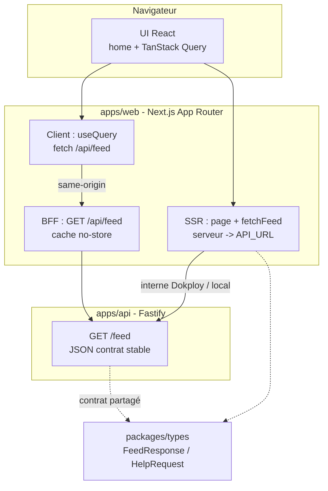
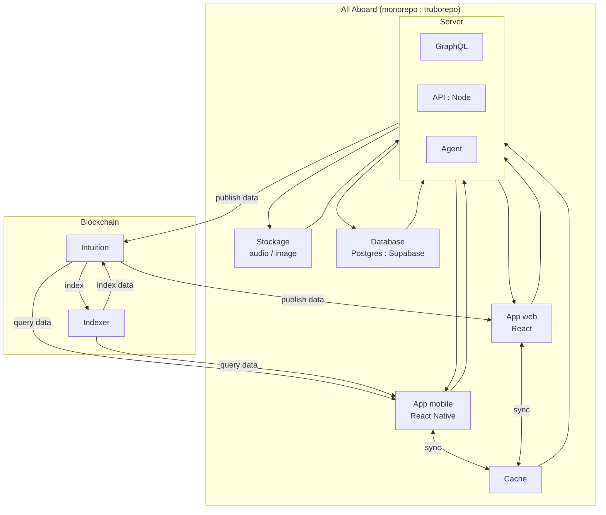

# MOC - Dataflow et architecture All-Aboard

**Documentation canonique** (timeline : MVP actuel vs phases, TanStack) : [README.md](README.md). Index vision (stack cible, dataflow) : [vision/README.md](vision/README.md). Ce MOC décrit la **cible** multi-services ; le dépôt suit d’abord **Next + Fastify REST** (Phases 0–1), puis auth et client data selon la timeline.

## Objectif

Documenter la vue d'architecture technique de All-Aboard (monorepo Truborepo), les composants principaux, et les flux de donnees entre applications, backend, indexeur et blockchain.

## Perimetre

- Applications clientes: mobile (React Native) et web (React).
- Backend: GraphQL, API Node, Agent.
- Stockage: base Postgres (Supabase), stockage media (audio/image), cache.
- Infra data: indexeur et couche blockchain.

## Schéma MVP actuel (Web + API — dépôt)

Flux alignés sur [plan-mise-en-place-web-api-donnees.md](plan-mise-en-place-web-api-donnees.md) : **SSR** avec `API_URL` vers l’API ; **client** via BFF same-origin `GET /api/feed` et TanStack Query (`invalidateQueries`).

**Lecture** : (1) le **premier rendu** du feed vient du **SSR** (`API_URL`, pas d’appel cross-origin navigateur vers l’API). (2) le **rafraîchissement** navigateur passe par le **BFF** `/api/feed` puis l’API. (3) les types vivent dans **`packages/types`** — une seule source pour web + api.

## Diagramme cible (dataflow long terme)

## Lecture rapide des flux

### MVP Web + API (ci-dessus)

1. Donnée initiale feed : **serveur Next** → **Fastify** (`API_URL`).
2. Donnée client / invalidation : **navigateur** → **BFF Next** → **Fastify** (évite CORS pour ce flux).
3. Contrat et types : **`packages/types`** — garder api + web alignés à chaque changement.

### Vision multi-services (diagramme suivant)

1. Les apps mobile et web consomment les services backend via GraphQL/API.
2. Le backend s'appuie sur un cache, une base Postgres (Supabase) et un stockage media.
3. Les donnees utiles sont publiees vers la couche Intuition (blockchain/data layer).
4. L'indexeur maintient un index pour accelerer la consultation/aggregation des donnees.
5. Les clients recuperent ensuite des donnees a la fois via le backend et les flux indexes.

## Hypotheses MOC

- Le diagramme se concentre sur la circulation de la donnee, pas sur la securite/auth (implémentée en **Phase 2** — [README.md](README.md)).
- Les directions de fleches sont simplifiees pour une lecture produit/technique mixte.
- Les details protocolaires (events, jobs, batch) seront precises dans une version technique detaillee.
- **MVP court terme** : la brique « API : Node » peut être **REST Fastify** ; l’illustration GraphQL reste valable pour la **cible** documentée dans [proposition-stack-technique-monorepo-2026.md](proposition-stack-technique-monorepo-2026.md).
