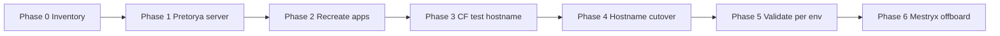

# Pretorya migration plan (Mestryx → Pretorya)

High-level phases. Operational detail lives in phase runbooks; **binding decisions** in [DECISIONS.md](./DECISIONS.md).

## Phase 0 — backup & inventory

- **Done (partial):** Dokploy env exports, Vaultwarden notes, Cloudflare inventory ([phase0-artifacts.md](./phase0-artifacts.md)).
- **Skipped by decision:** Postgres `pg_dump` from Mestryx — see [DECISIONS.md](./DECISIONS.md#postgres-empty-databases-on-pretorya-all-environments).

## Phase 1 — Pretorya Dokploy + GitHub

- Remote server, API key, GitHub App on `AllAboard-THP` ([phase1-runbook.md](./phase1-runbook.md)).

## Phase 2 — recreate workloads on Pretorya (parallel to Mestryx)

| Sub-phase | Scope | Postgres data |
|-----------|--------|----------------|
| 2a | MVP **dev** (Postgres, API, Web, Storybook) | Empty + migrations + seed |
| 2b | MVP **staging** + **production** | Empty + migrations + seed (staging); prod per ADR 0003 |
| 2c | Rails **website** ([phase2c-runbook.md](./phase2c-runbook.md)); Infra **cloudflared** is Phase 3 | Empty Rails DB when created; new tunnel token |

**Not in scope for 2a/2b:** Agent, Indexer.

## Phase 3 — validate via Cloudflare (no full prod cutover yet)

- Deploy **cloudflared** on Pretorya; add **test** public hostname → Pretorya Traefik.
- Run HTTPS smokes (`pnpm smoke:dev`, staging runbook) against Pretorya — **no dump prerequisite**.

## Phase 4 — Cloudflare hostname migration

- Reassign public hostnames env-by-env (dev → staging → prod) to Pretorya tunnel.
- Keep Mestryx tunnel rollback until stable.

## Phase 5 — per-environment validation

- Checklist per env after DNS points to Pretorya (builds, auth, critical journeys).

## Phase 6 — docs, Pretorya MCP, Mestryx hold

- **2026-10-07:** [dokploy-instance.md](../dokploy-instance.md) describes org Pretorya. MCP `user-dokploy-mcp` is `https://app.dokploy.com/api` (verified). Public hostnames are on tunnel `allaboard-pretorya`.
- **2026-10-07:** tunnel `dockploy Mestryx` deleted (`2026-10-07T13:44:59Z`). Public DNS stays on `allaboard-pretorya`. Old Dokploy projects on the Mestryx host were not stopped (no API key, no SSH). Runbook: [phase6-runbook.md](./phase6-runbook.md).
- **2026-10-07 offboarding:** Mestryx GitHub App `dokploy-2026-05-04-1cfoiq` uninstalled. Pretorya deploy app is `dokploy-2026-10-06-jvxt9b`. App secrets rotated on Pretorya (values stay in the gitignored password file, not in Git). `M3stryX` and `MestryxBot` were removed from the org. Log: [phase6-artifacts.md](./phase6-artifacts.md).

## Agent checklist (read first)

1. Read [DECISIONS.md](./DECISIONS.md) before suggesting Postgres restore.
2. Phase 0 dumps are **not** a gate for Phase 3+.
3. Use [README.md](./README.md) for runbook links and scripts.
