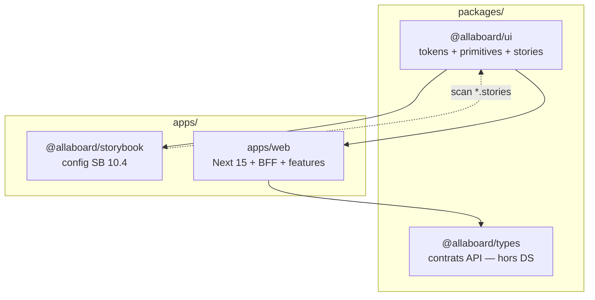
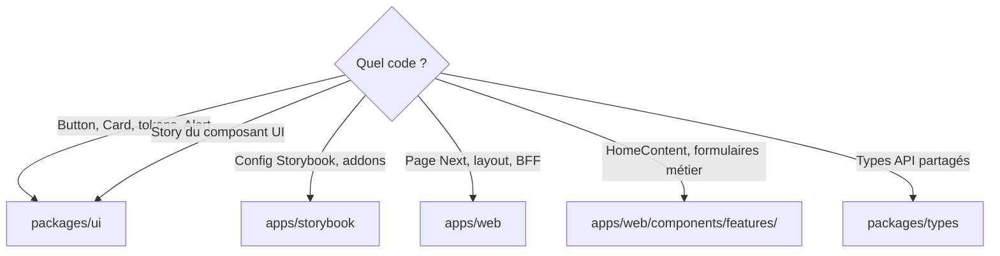

# Architecture — design system monorepo

**Audience** : développeurs et agents qui doivent comprendre *où* placer du code UI.  
**Décision formelle** : [ADR 0002](../adr/0002-design-system-monorepo.md).

---

## Vue d’ensemble

Séparation **totale** : le design system ne vit pas dans l’app Next déployée ; Storybook n’est pas dans l’image Docker `web`.

---

## Responsabilités par couche

| Couche | Package / app | Contient | N’y mettre surtout pas |
|--------|---------------|--------|----------------------|
| Design system | `packages/ui` | `globals.css`, tokens `@theme inline`, primitives shadcn, `*.stories.tsx`, Vitest (`cn`, Button) | Types métier, routes, BFF, config Storybook |
| Catalogue | `apps/storybook` | `.storybook/main.ts`, `preview.tsx`, PostCSS réexport | Composants métier, pages Next |
| Produit | `apps/web` | `app/`, `components/features/`, `components/blocks/`, API routes | `components/ui/` (régression), primitives dupliquées |
| Contrats | `packages/types` | `FeedResponse`, etc. | Styles, composants visuels |

---

## Règle de placement (arbre de décision)

---

## Tailwind v4 et consommation web

- **Source de tokens** : `packages/ui/src/styles/globals.css` (`@import "tailwindcss"`, `@theme inline`).
- **Web** : `apps/web/app/globals.css` importe le CSS UI et déclare `@source` vers `packages/ui` et les dossiers web (purge correcte en prod).
- **Next** : `transpilePackages: ["@allaboard/ui"]` dans `next.config.ts`.
- **Pas** de `tailwind.config` exporté par le package UI (anti-pattern v4).

---

## Storybook 10.4

- Framework : `@storybook/react-vite`.
- Stories : glob `packages/ui/src/**/*.stories.@(ts|tsx)`.
- Addons installés : `docs`, `a11y`, `themes` (pas de paquets `addon-essentials` / `addon-interactions` séparés en 10.4 — inclus dans le core).
- Build : `pnpm build:storybook` → `apps/storybook/storybook-static/`.
- **Déploiement** : image nginx statique — `infra/docker/Dockerfile.storybook` (port **8080**), hors image `web`.

---

## Turbo et cache

- Tâche racine `build` : inputs excluent `**/*.stories.*` pour ne pas invalider le build Next.
- Tâche `build:storybook` : outputs `storybook-static/**`.
- `pnpm dev` MVP exclut `thp-final` ; `pnpm dev:ui` lance Storybook seul.

---

## AppShell (#25)

- Route group `app/(app)/` : chrome commun (header + nav).
- `/health` reste **hors** `(app)`.
- `MarketingPageShell` : contenu centré **à l’intérieur** des pages (home, help) — voir [app-shell.md](app-shell.md).

---

## Anti-patterns documentés

| Anti-pattern | Pourquoi c’est rejeté |
|--------------|----------------------|
| Storybook dans `apps/web` | Deps doc en prod, coupling build |
| `components/ui/` dans web | Contourne le package partagé |
| `@allaboard/types` dans `ui` | Mélange contrats API et présentation |
| Import `apps/storybook` depuis web | Frontière prod/doc cassée |
| Merge wholesale branche `feature/ui-tailwind-foundation` | Mélange Tailwind v3/v4 |
