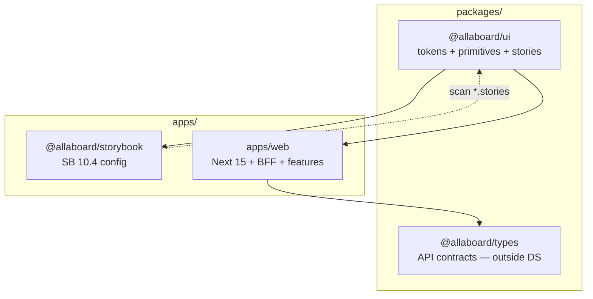
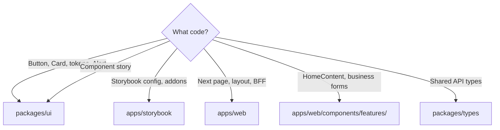

# Architecture — design system monorepo

**Audience:** developers and agents who need to understand *where* to place UI code.  
**Formal decision:** [ADR 0002](../adr/0002-design-system-monorepo.md).

---

## Overview

```mermaid
flowchart TB
  subgraph packages["packages/"]
    UI["@allaboard/ui<br/>tokens + primitives + stories"]
    TYPES["@allaboard/types<br/>API contracts — outside DS"]
  end

  subgraph apps["apps/"]
    SB["@allaboard/storybook<br/>SB 10.4 config"]
    WEB["apps/web<br/>Next 15 + BFF + features"]
  end

  UI --> WEB
  UI --> SB
  WEB --> TYPES
  SB -.->|"scan *.stories"| UI
```

**Total separation:** design system does not live in deployed Next app; Storybook is not in Docker `web` image.

---

## Responsibilities by layer

| Layer | Package / app | Contains | Do not put here |
|--------|---------------|----------|-----------------|
| Design system | `packages/ui` | `globals.css`, `@theme inline` tokens, shadcn primitives, `*.stories.tsx`, Vitest (`cn`, Button) | Business types, routes, BFF, Storybook config |
| Catalogue | `apps/storybook` | `.storybook/main.ts`, `preview.tsx`, PostCSS re-export | Business components, Next pages |
| Product | `apps/web` | `app/`, `components/features/`, `components/blocks/`, API routes | `components/ui/` (regression), duplicated primitives |
| Contracts | `packages/types` | `FeedResponse`, etc. | Styles, visual components |

---

## Placement rule (decision tree)

```mermaid
flowchart TD
  Q{"What code?"}
  Q -->|"Button, Card, tokens, Alert"| UI["packages/ui"]
  Q -->|"Component story"| UI
  Q -->|"Storybook config, addons"| SB["apps/storybook"]
  Q -->|"Next page, layout, BFF"| WEB["apps/web"]
  Q -->|"HomeContent, business forms"| FEAT["apps/web/components/features/"]
  Q -->|"Shared API types"| TYPES["packages/types"]
```

---

## Tailwind v4 and web consumption

- **Token source:** `packages/ui/src/styles/globals.css` (`@import "tailwindcss"`, `@theme inline`).
- **Web:** `apps/web/app/globals.css` imports UI CSS and declares `@source` towards `packages/ui` and web folders (correct prod purge).
- **Next:** `transpilePackages: ["@allaboard/ui"]` in `next.config.ts`.
- **No** `tailwind.config` exported by UI package (v4 anti-pattern).

---

## Storybook 10.4

- Framework: `@storybook/react-vite`.
- Stories: glob `packages/ui/src/**/*.stories.@(ts|tsx)`.
- Installed addons: `docs`, `a11y`, `themes` (no separate `addon-essentials` / `addon-interactions` packages in 10.4 — included in core).
- Build: `pnpm build:storybook` → `apps/storybook/storybook-static/`.
- **Deploy:** static nginx image — `infra/docker/Dockerfile.storybook` (port **8080**), outside `web` image.

---

## Turbo and cache

- Root `build` task: inputs exclude `**/*.stories.*` to avoid invalidating Next build.
- `build:storybook` task: outputs `storybook-static/**`.
- `pnpm dev` MVP excludes `thp-final`; `pnpm dev:ui` runs Storybook only.

---

## AppShell (#25)

- Route group `app/(app)/`: shared chrome (header + nav).
- `/health` stays **outside** `(app)`.
- `MarketingPageShell`: centred content **inside** pages (home, help) — see [app-shell.md](app-shell.md).

---

## Documented anti-patterns

| Anti-pattern | Why rejected |
|--------------|--------------|
| Storybook in `apps/web` | Doc deps in prod, build coupling |
| `components/ui/` in web | Bypasses shared package |
| `@allaboard/types` in `ui` | Mixes API contracts and presentation |
| Import `apps/storybook` from web | Broken prod/doc boundary |
| Wholesale merge `feature/ui-tailwind-foundation` branch | Mixes Tailwind v3/v4 |
