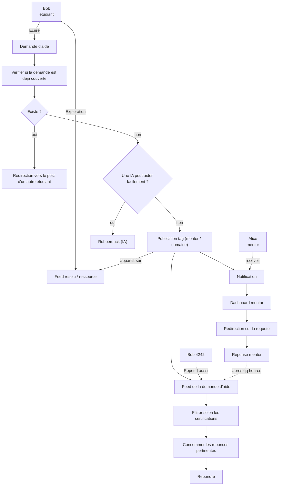

# MOC - Parcours utilisateur All-Aboard

**Implémentation** : ordre des travaux techniques (web, API, auth, TanStack Query) — [README documentation canonique](README.md).

## Objectif

Décrire le parcours principal d'une demande d'aide sur All-Aboard, depuis sa création par un etudiant jusqu'a la reponse finale via IA, pair, ou mentor.

## Acteurs

- **Bob (etudiant)**: cree une demande, explore le feed, consomme et publie des reponses.
- **Alice (mentor)**: recoit des notifications ciblees, traite les demandes, publie des reponses expertes.
- **Bob 4242 (autre etudiant)**: peut repondre a une demande dans le feed.
- **Rubberduck (IA)**: propose une aide rapide quand la demande est jugee simple.

## Parcours utilisateur (version MOC)

1. L'etudiant cree une **demande d'aide** ou explore le **feed resolu / ressource**.
2. Le systeme verifie si la demande existe deja.
3. Si oui, l'utilisateur est redirige vers un post deja existant.
4. Si non, le systeme evalue si une IA peut aider rapidement.
5. Si oui, l'utilisateur est redirige vers le **Rubberduck**.
6. Si non, la demande est publiee avec tags (mentor / domaine) puis notifie les mentors.
7. En parallele, la demande apparait dans le feed communautaire, ou d'autres etudiants peuvent repondre.
8. Les reponses sont filtrees selon les certifications/pertinence.
9. L'etudiant consomme les reponses pertinentes puis publie sa reponse finale.
10. Le mentor peut aussi repondre apres consultation de son dashboard.

## Diagramme Mermaid

## Notes de cadrage MOC

- Cette version est volontairement simple et orientee flux produit.
- Les etapes de moderation, SLA, scoring qualite et anti-spam pourront etre ajoutees ensuite.
- Les termes affiches reprennent au plus proche ceux du schema source.
- **Etape 8 (livré #83)** : filtre mentor sur fiche demande — `users.certification_tags`, overlap avec `help_requests.tags`, demandeur toujours visible. Doc : [tasks/83-response-filtering/README.md](tasks/83-response-filtering/README.md).
- Voir aussi la vue technique: [MOC - Dataflow et architecture](dataflow-architecture.md).
