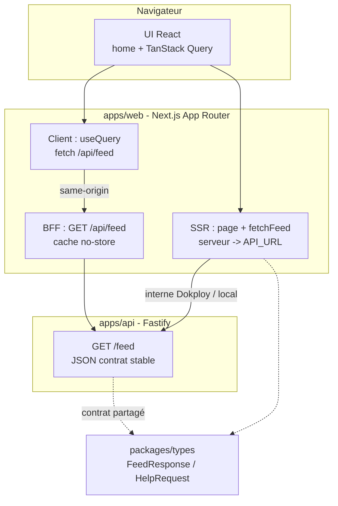
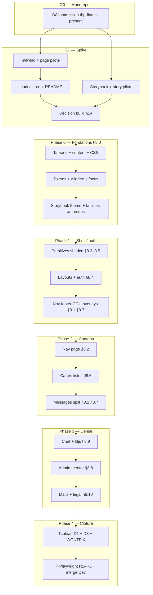

<!-- markdownlint-disable MD033 MD041 -->
<div align="center">

# Plan d’intégration — kit UX AllAboard

**Exécution · gates · phases · merge `Dev`**

[](./plan-integration-kit-ux-allaboard.md)
[](../../apps/web)
[](../AGENTS.md)

</div>

**Version** : **2.0** · **Date** : 2026-05-14  
**v2.0** : restructuration **agent-first** — [§0](#0-chemin-dexécution-autonome-ordre-strict) (ordre strict + arbre de décision), blocs **Prérequis / Sortie** sur chaque gate et phase, règles d’exécution regroupées en [§2](#procédure-dexécution-agent) ; **ancres existantes conservées** pour les liens depuis l’audit et `apps/web`.  
**v1.3** : Node / Storybook (D1, §14) ; **v1.2** : Storybook avant Tailwind/shadcn + réalignement.

**Objectif** : livrer le kit sur **`apps/web`** (Next 15, React 19) avec **Tailwind**, **shadcn/ui** (Radix + **`cn`**), **Storybook** et **preuve parcours automatisée** (**Playwright**, **D4** actif). **Données, auth métier, BFF, `/feed`** : [plan Web/API](plan-mise-en-place-web-api-donnees.md) — le kit ne les remplace pas. **Inventaire familles §8.x** : [audit](audit-integration-kit-ux-allaboard.md) (**v1.7**). **Qualité** : [AGENTS.md](../AGENTS.md) — après chaque lot pertinent : `pnpm verify` à la racine.

---

## Sommaire

0. [Chemin d’exécution autonome (ordre strict)](#0-chemin-dexécution-autonome-ordre-strict)  
1. [Rôle et périmètre](#1-rôle-et-périmètre)  
2. [Règles d’exécution (agent)](#procédure-dexécution-agent)  
3. [Jalons V / T / M / S / P](#jalons-de-test-v--t--m--s--p)  
4. [G0 — Décommission `thp-final`](#decom-thp-final)  
5. [Décisions MVP (D1–D6)](#décisions-mvp-d1d6)  
6. [G1 — Spike technique](#gate-g1--spike-technique)  
7. [Phase 0 — Fondations](#phase-0--fondations)  
8. [Phase 1 — Shell et auth](#phase-1--shell-et-auth)  
9. [Phase 2 — Contenu et messages](#phase-2--contenu-et-messages)  
10. [Phase 3 — Dense et spécifique](#phase-3--dense-et-spécifique)  
11. [Phase 4 — Clôture](#phase-4--clôture)  
12. [Recette R1–R6](#recette-manuelle-r1--r6)  
13. [Merge vers `Dev`](#merge-vers-dev)  
14. [Décision build et pipeline](#13-décision-build)  
15. [Dataflow Web + API](#dataflow-web-api)  
16. [Schéma d’ensemble](#schéma-densemble)  
17. [Référence visuelle](#référence-visuelle)  
18. [Liens](#liens)

---

<a id="0-chemin-dexécution-autonome-ordre-strict"></a>

## 0. Chemin d’exécution autonome (ordre strict)

> Un agent **ne démarre pas** l’étape **N+1** tant que les **critères de sortie** de **N** ne sont pas remplis **ou** explicitement **WONTFIX** (voir [§2 — WONTFIX](#wontfix)).

### 0.1 Séquence globale (une ligne = une étape logique)

| Ordre | ID | Contenu | Bloque |
|:-----:|----|----------|--------|
| 1 | **Lire** | [AGENTS.md](../AGENTS.md) ; [audit §8 + §11](audit-integration-kit-ux-allaboard.md) ; si pages feed/API : [plan Web/API](plan-mise-en-place-web-api-donnees.md) | Tout travail incohérent |
| 2 | **G0** | [§4](#decom-thp-final) — uniquement si `apps/thp-final` existe ; sinon **N/A** (documenter date) | Extension kit **en production** ; merge `Dev` « propre » monorepo |
| 3 | **G1** | [§6](#gate-g1--spike-technique) — spike Tailwind, shadcn, Storybook, décision §14 | **Phase 0** |
| 4 | **P0** | [§7](#phase-0--fondations) | **Phase 1** |
| 5 | **P1** | [§8](#phase-1--shell-et-auth) | **Phase 2** |
| 6 | **P2** | [§9](#phase-2--contenu-et-messages) | **Phase 3** |
| 7 | **P3** | [§10](#phase-3--dense-et-spécifique) | **Phase 4** |
| 8 | **P4** | [§11](#phase-4--clôture) | **Merge `Dev`** selon [§13](#merge-vers-dev) |

### 0.2 Arbre de décision (agent)

```
apps/thp-final existe ?
├─ OUI → Exécuter G0 EN PREMIER (ou issue REPORT-G0-YYYY-MM-DD + ne pas merger kit prod sans résolution)
└─ NON → G0 = N/A ; noter la date dans §4

Storybook (.storybook/) déjà présent avant G1-a/b ?
├─ OUI → G1-e/f peuvent être considérés partiellement faits ; OBLIGATION après G1-a+b : réaligner preview/CSS (sans relancer storybook init) jusqu'à build-storybook OK
└─ NON → Ordre par défaut G1-a → … → G1-f

Page consomme le feed ?
└─ OUI → Contrat uniquement via packages/types + plan Web/API (D3) ; pas de types parallèles
```

### 0.3 Commandes de vérification standard (référence)

| Jalon | Commande (racine monorepo sauf mention) |
|:-----:|----------------------------------------|
| **V** | `pnpm verify` |
| **T** | `pnpm --filter web build-storybook` |
| **P** | `pnpm --filter web run test:e2e` (voir [`apps/web/README.md`](../../apps/web/README.md)) |

---

## 1. Rôle et périmètre

| Zone | Rôle |
|------|------|
| **`apps/web`** | Seule cible du kit : App Router, composants, Storybook, BFF feed côté Next si prévu. |
| **`apps/api`** | Pas d’UI ; contrat JSON (ex. `GET /feed`) aligné avec [plan Web/API](plan-mise-en-place-web-api-donnees.md). |
| **`apps/thp-final` (Rails)** | **Obsolète** — n’est plus une option de travail. Retrait monorepo + CI : [G0](#decom-thp-final). |

**Règle d’or** : une **phase à la fois** ; pas de phase **N+1** tant que les jalons de **N** ne sont pas cochés ou **WONTFIX** (issue + trace dans l’audit ou ce plan).

---

<a id="procédure-dexécution-agent"></a>

## 2. Règles d’exécution (agent)

### 2.1 Avant la première PR « kit »

1. Lire [AGENTS.md](../AGENTS.md) (hooks, `pnpm verify`).  
2. Lire audit **§8** (inventaire) et **§11** (succès).  
3. Si une page touche API ou BFF : [plan Web/API](plan-mise-en-place-web-api-donnees.md).  
4. Si `apps/thp-final/` est encore présent : exécuter [G0](#decom-thp-final) **en premier** **ou** créer une issue **REPORT-G0-AAAA-MM-JJ** (report daté) ; ne pas étendre le kit **en production** tant que G0 n’est pas **N/A** ou **terminé**.

### 2.2 Règles de travail

| Règle | Détail |
|-------|--------|
| **Racine** | Commandes `pnpm …` depuis la racine du dépôt, sauf mention contraire. |
| **Vérification** | Après chaque lot : `pnpm verify`. |
| **Storybook** | Après toute modif de `.storybook/` ou `*.stories.*` sous `apps/web` : `pnpm --filter web build-storybook` (**T**). |
| **`thp-final`** | Interdit : correctif fonctionnel, nouvelle dépendance, PR « sauvetage » — uniquement [G0](#decom-thp-final) ou issue. |
| **Secrets** | Ne pas committer `.env` ; noms d’env documentés dans le plan Web/API. |
| **Blocage** | Wizard bloquant, arbitrage produit absent, CI non trivial → **issue** + pause de la phase ; pas de `git commit --no-verify` sans accord humain ([AGENTS.md](../AGENTS.md)). |

<a id="wontfix"></a>

### 2.3 WONTFIX (obligatoire si livrable sauté)

Pour toute case de livrable ou jalon non fait : **issue** avec titre du type `WONTFIX kit UX — <phase> — <id>` ; corps : raison, périmètre, date, responsable ; **lien** dans la PR et, si utile, une ligne dans l’audit ou ce plan. Sans cela, la phase n’est **pas** considérée comme complète.

<a id="wizards-kit"></a>

### 2.4 Wizards (shadcn, Storybook)

Effectuer **`shadcn init`** et **`storybook init`** dans une **session dédiée** (idéalement humain en local), commit des fichiers générés, puis documenter dans [`apps/web/README.md`](../../apps/web/README.md) les choix (Next, `app/`, framework Storybook). Les PR suivantes **ne relancent pas** les wizards : uniquement `shadcn add …` ou édition de config.

> **Storybook avant Tailwind/shadcn** : si `storybook init` est fait **en premier**, les PR suivantes **ajustent** uniquement la config (preview, PostCSS / Tailwind, alias, globals) quand G1‑a/b sont verts — **sans** relancer le wizard. Tracer la passe de réalignement dans la PR ou une issue courte.

**Node / Storybook** : la CLI **Storybook 10+** exige Node **20.19+**. En **20.18.x**, pin **Storybook 8.4.x** et `pnpm dlx storybook@8.4.x init` — détail [D1](#décisions-mvp-d1d6) et [`apps/web/README.md`](../../apps/web/README.md).

<a id="execution-agent-autonome"></a>

### 2.5 Exécution agent autonome (**D4** actif)

> Objectif : un agent (ou la CI) peut prouver les parcours **R1–R6** **sans** recette manuelle obligatoire, via **Playwright** sur `apps/web`.

| Élément | Attendu |
|--------|---------|
| **D4** | Suite **E2E** sous `apps/web` (`e2e/`) ; `pnpm --filter web run test:e2e` — détail [`apps/web/README.md`](../../apps/web/README.md), [`apps/web/e2e/README.md`](../../apps/web/e2e/README.md). |
| **Couverture** | Une spec (ou groupe) par **R1–R6** lorsque la route existe ; **skip** ou **WONTFIX** + issue si parcours non livré. |
| **Données** | **Mocks** (`page.route` / `route.fulfill`), **MSW**, ou **API + seed** — documenter la source ; aligner sur **`packages/types`** pour le feed. |
| **Auth en test** | Mécanisme **non produit** uniquement ; jamais en déploiement utilisateur ; décrit dans [plan Web/API](plan-mise-en-place-web-api-donnees.md) ou ADR. |
| **CI** | Dès que la suite est stable : **`playwright test`** dans [`.github/workflows/ci.yml`](../../.github/workflows/ci.yml). |
| **M / S** | **Optionnelles** ; ne **remplacent** pas **P** pour merge `Dev` tant que D4 reste actif. |

### 2.6 Gabarit de fin de PR (copier dans la description)

```text
[ ] Livrables : cases phase cochées ou WONTFIX + lien issue
[ ] pnpm verify (racine)
[ ] pnpm --filter web build-storybook (si .storybook/ ou *.stories.* modifiés)
[ ] Playwright : pnpm --filter web run test:e2e (si specs e2e / parcours R* touchés)
[ ] Décommission G0 : terminée ou N/A (dossier absent + CI sans Ruby/Rails)
```

---

<a id="jalons-de-test-v--t--m--s--p"></a>

## 3. Jalons de test (V / T / M / S / P)

| Marque | Signification | Quand | Action |
|:------:|---------------|-------|--------|
| **V** | *Verify* monorepo | Chaque PR | `pnpm verify` — [CI](../../.github/workflows/ci.yml) |
| **T** | Storybook compile | Si stories ou `.storybook/` touchés | `pnpm --filter web build-storybook` ; en **CI** dès [§14](#13-décision-build) cochée |
| **M** | Recette **locale** humaine | **Optionnel** | `pnpm --filter web dev` — angles non couverts par **P** |
| **S** | **Staging** | **Optionnel** | Ne remplace pas **P** pour merge `Dev` |
| **P** | E2E automatisé | **D4 actif** | `pnpm --filter web run test:e2e` |

**Mémo PR** : `V | T si stories | P (Playwright R*) | M/S si besoin exploratoire`.

> [!NOTE]
> Merge `Dev` : preuve parcours = **P** (D4). **T** = catalogue Storybook. **M/S** = complément.

---

<a id="decom-thp-final"></a>

## 4. G0 — Décommission `apps/thp-final` (Rails)

> L’app Rails est **abandonnée** ; elle ne doit plus figurer dans le monorepo, la CI ni la doc comme option de travail.

> [!CAUTION]
> Sauvegarder si besoin (tag, export). À la fin : **`pnpm verify` vert**.

### Agent — prérequis

- Exécuter depuis la racine : `test -d apps/thp-final` (ou équivalent). **Vrai** → G0 **applicable**. **Faux** → cocher **N/A**, renseigner **Date** en fin de §4, passer à G1.

### Checklist G0

- [ ] **Trace** : issue ou ADR « abandon `thp-final` » (lien dans [Docs/README](README.md) ou ici).  
- [ ] **Turbo / scripts racine** : aucune tâche obligatoire liée à `thp-final`, `bundle` ou `rails`.  
- [ ] **CI** : [`.github/workflows/ci.yml`](../../.github/workflows/ci.yml) — retirer Setup Ruby, `rails db:test:prepare`, toute étape `apps/thp-final`.  
- [ ] **Docker / infra** : images ou services Rails supprimés ou marqués **obsolètes** ; Dokploy aligné.  
- [ ] **Code** : suppression du répertoire **`apps/thp-final/`** (ou archive externe **documentée**).  
- [ ] **Lockfile** : `pnpm install` racine ; commit `pnpm-lock.yaml`.  
- [ ] **Documentation** : recherche `thp-final`, `bin/rails`, `Rails` dans README, `Docs/` ; retirer ou marquer obsolète.

### Agent — sortie

- `pnpm verify` → exit **0**.  
- Absence du dossier **`apps/thp-final/`** **ou** archive documentée + CI sans Ruby/Rails pour ce chemin.

**État G0** : ☐ en cours · ☐ terminée / **N/A** — **Date** : …

---

<a id="décisions-mvp-d1d6"></a>

## 5. Décisions MVP (D1–D6)

> Valeurs **de démarrage**. Les modifier = **issue** + mise à jour de ce tableau + date.

| ID | Sujet | Décision MVP (plan v2.0) |
|:---:|--------|--------------------------|
| **D1** | Storybook dans `apps/web` + couverture ↔ §8 (phase 4) | Storybook **obligatoire** ; tableau primitif → story en phase 4. **`build-storybook` en CI** dès G1 vert (étape workflow). Si CI Storybook **avant** [décision Tailwind §14](#13-décision-build) finale, **revoir** l’étape après choix A/B. **Node** : CLI **Storybook 10+** → Node **20.19+** ; en **20.18.x** → pin **8.4.x** + `pnpm dlx storybook@8.4.x init` — [`apps/web/README.md`](../../apps/web/README.md). |
| **D2** | Tokens | **Phase 0** : variables CSS + table token → classe dans `apps/web` (ou doc). `packages/ui-tokens` = **option post-MVP** (issue). |
| **D3** | Types / BFF / SSR | Toute page feed : **`packages/types`** + BFF/SSR selon [plan Web/API](plan-mise-en-place-web-api-donnees.md) — pas de contrat parallèle. |
| **D4** | E2E Playwright | **Actif** ; merge `Dev` exige **P** sur **R1–R6** applicables. **M/S** = optionnel. |
| **D5** | Thème light | **MVP dark uniquement** ; light = issue datée post-merge si besoin. |
| **D6** | Accessibilité MVP | **Focus visible**, **tabulation** shell + auth, **labels** + CGU non contournable ; **P** couvre au minimum **navigation clavier** sur les parcours testés. |

---

<a id="gate-g1--spike-technique"></a>

## 6. G1 — Spike technique

> **Gate** : aucune [Phase 0](#phase-0--fondations) tant que **toutes** les tâches G1 ci‑dessous et la [Décision build](#13-décision-build) (options + **Décision** + **Date**) ne sont pas à jour. **G0** doit être **N/A** ou **terminée** avant livraison kit **en production**.

### Agent — prérequis

- G0 : **N/A** ou checklist §4 complète (pour travail « prod-ready »).  
- `node -v` : noter la version ; choisir chaîne Storybook conformément [D1](#décisions-mvp-d1d6).

### Ordre des tâches G1

- **Défaut** : **G1‑a** → **G1‑b** → **G1‑c** / **G1‑d** → **G1‑e** → **G1‑f**.  
- **Alternatif** : **G1‑e** / **G1‑f** avant **G1‑a/b** autorisé ; après **G1‑a** et **G1‑b**, **réalignement obligatoire** `.storybook/` + stories jusqu’à `build-storybook` **exit 0** ([§2.4](#wizards-kit)).

### Tâches G1

- [ ] **G1‑a** — Sous `apps/web` : **Tailwind** opérationnel ; **une page pilote** avec classes compilées (smoke `pnpm --filter web dev`).  
- [ ] **G1‑b** — **shadcn/ui** : `components.json`, **`cn`** (`clsx` + `tailwind-merge`) ; README `apps/web` mis à jour.  
- [ ] **G1‑c** — README `apps/web` : `dev`, `build`, chaîne CSS → renvoi [§14](#13-décision-build).  
- [ ] **G1‑d** — [§14](#13-décision-build) : options A/B/C/D cochées, **Décision** + **Date**.  
- [ ] **G1‑e** — **Storybook** : scripts `storybook` et `build-storybook` ; `.storybook/` versionné ; emplacement des stories documenté.  
- [ ] **G1‑f** — Au moins **une story pilote** ; `pnpm --filter web build-storybook` **exit 0**.

### Jalons G1

- [ ] **V** — `pnpm verify`  
- [ ] **T** — `pnpm --filter web build-storybook`

### Agent — sortie

- Toutes les cases **G1‑a** … **G1‑f** cochées **ou** WONTFIX + issue.  
- **V** + **T** verts.

---

<a id="phase-0--fondations"></a>

<a id="phase-0-fondations"></a>

## 7. Phase 0 — Fondations

> Réf. audit **§8.0**. **Gate phase 1** : **V** + **T** + **P** (**R1** dès que la landing est livrée). **M/S** = optionnel.

**Objectif** : tokens, focus, z-index ; build Tailwind reproductible ; **pas de CDN Tailwind** sur les routes Next livrées ; Storybook prêt.

### Agent — prérequis

- [G1](#gate-g1--spike-technique) entièrement **vert** (ou WONTFIX documenté pour tâche équivalente validée par humain — éviter sauf exception).

### Livrables

- [ ] **0.1** — Config Tailwind + `content` (`app/`, `components/`, `packages/*` si importés).  
- [ ] **0.2** — CSS global : variables **§8.0**, `@layer` si utilisé.  
- [ ] **0.3** — Pipeline aligné [§14](#13-décision-build) ; CI Storybook / Playwright si étapes existent dans le workflow.  
- [ ] **0.4** — Table token → CSS → classe (amorce) ; lien **D2**.  
- [ ] **0.5** — Focus ring + **z-index** (modales, nav, toasts).  
- [ ] **0.6** — Aucune URL **`cdn.tailwindcss.com`** sur les routes Next livrées (grep ou test).  
- [ ] **0.7** — Pas de second framework utilitaire (Bootstrap, MUI parallèle, etc.).  
- [ ] **0.8** — Preview Storybook : globals / thème ; ≥ 1 story par famille **amorcée** pour phase 1. Si Storybook était **avant** G1‑a/b : valider ici que preview = chaîne Tailwind/tokens **réelle**.

### Jalons fin phase 0

- [ ] **V** — `pnpm verify`  
- [ ] **T** — `pnpm --filter web build-storybook`  
- [ ] **R+** *(recommandé)* — `pnpm --filter web build` OK ; page pilote **200** sans CDN Tailwind.  
- [ ] **P** — Playwright **R1** vert ([§12](#recette-manuelle-r1--r6)).  
- [ ] **M** — *Optionnel* : **R1** manuel.  
- [ ] **S** — *Optionnel* : **R1** staging.

### Agent — sortie

- Tous les jalons phase 0 requis (**V**, **T**, **P** pour **R1**) cochés ou WONTFIX + issue ; **R+** fortement recommandé avant phase 1.

---

<a id="phase-1--shell-et-auth"></a>

## 8. Phase 1 — Shell et auth

> Réf. audit **§8.1**, **§8.3**, **§8.4**, **§8.7**. **Gate phase 2** : **P** (**R1–R3**) ou **WONTFIX** + issue.

**Objectif** : shell, auth, CGU sur **App Router** ; primitives shadcn + stories ; auth alignée [plan Web/API](plan-mise-en-place-web-api-donnees.md).

### Agent — prérequis

- [Phase 0](#phase-0--fondations) : sortie validée (section **Agent — sortie** du [§7](#phase-0--fondations)).

### Livrables

- [ ] **1.1** — Boutons, champs, labels, erreurs (§8.3, §8.5) + stories.  
- [ ] **1.2** — Layout shell + pages auth (§8.4) — pas de stack auth hors plan Web/API / ADR.  
- [ ] **1.3** — Nav desktop & mobile, footer, menu utilisateur, badges.  
- [ ] **1.4** — Modale CGU, toasts / bannières.  
- [ ] **1.5** — Écarts **D4 / D5 / D6** : uniquement via **issue** + [§5](#décisions-mvp-d1d6).

### Jalons

- [ ] **V** — `pnpm verify`  
- [ ] **T** — si stories §8.1 / §8.3–8.5 modifiées.  
- [ ] **P** — **R1**, **R2**, **R3** (skip documenté si route absente).  
- [ ] **M** — *Optionnel*.

### Agent — sortie

- **P** pour R1–R3 (ou WONTFIX par ID) ; **V** vert.

---

<a id="phase-2--contenu-et-messages"></a>

## 9. Phase 2 — Contenu et messages

> Réf. audit **§8.2**, **§8.6**, **§8.7**. **Gate phase 3** : **P** (**R4–R5** applicables) ou **WONTFIX** + issue.

**Objectif** : navigation de page, cartes, listes, messages ; données via [plan Web/API](plan-mise-en-place-web-api-donnees.md).

### Agent — prérequis

- [Phase 1](#phase-1--shell-et-auth) : sortie validée.

### Livrables

- [ ] **2.1** — Breadcrumbs, tabs, page heading (§8.2) + stories.  
- [ ] **2.2** — Cartes feed / explore / ressources / événements ; list rows ; empty states.  
- [ ] **2.3** — Badges, tags, modales métier.  
- [ ] **2.4** — Split view messages + responsive.

### Jalons

- [ ] **V** — `pnpm verify`  
- [ ] **T** — si stories §8.2 / §8.6 touchées.  
- [ ] **R+** — `GET` feed ou **`/api/feed`** : **200** (mock documenté si besoin).  
- [ ] **P** — **R4**, **R5** (selon routes).  
- [ ] **M** — *Optionnel*  
- [ ] **S** — *Optionnel* : **R4** déploiement.

### Agent — sortie

- **P** R4–R5 applicables ou WONTFIX ; **V** vert ; **R+** si feed livré.

---

<a id="phase-3--dense-et-spécifique"></a>

## 10. Phase 3 — Dense et spécifique

> Réf. audit **§8.8** à **§8.10**, **§8.9**. **Gate phase 4** : **P** (**R5–R6** applicables) ou **WONTFIX** + issue.

**Objectif** : chat React, tables denses, mails, légal — **sans** Turbo / Action Cable. Temps réel : **ADR** ou [plan Web/API](plan-mise-en-place-web-api-donnees.md) ; sinon UI **sans** promesse temps réel (issue).

### Agent — prérequis

- [Phase 2](#phase-2--contenu-et-messages) : sortie validée.

### Livrables

- [ ] **3.1** — Chat React + styles kit ; clavier / focus.  
- [ ] **3.2** — Blocs code + **highlight.js** (ou équivalent).  
- [ ] **3.3** — Tables admin / mentor (+ filtres si prévus).  
- [ ] **3.4** — Mails (preview Storybook, react-email, ou capture) + pages légales §8.10.

### Jalons

- [ ] **V** — `pnpm verify`  
- [ ] **T** — si stories §8.8–8.10 modifiées.  
- [ ] **R+** — Routes mentor / admin → **200** si existantes (fixture documentée).  
- [ ] **P** — **R5**, **R6** (selon routes).  
- [ ] **M** — *Optionnel*  
- [ ] **S** — *Optionnel*.

### Agent — sortie

- **P** R5–R6 applicables ou WONTFIX ; **V** vert.

---

<a id="phase-4--clôture"></a>

## 11. Phase 4 — Clôture

### Agent — prérequis

- [Phase 3](#phase-3--dense-et-spécifique) : sortie validée.

### Livrables

- [ ] **4.1** — Tableau **D1** : primitive / §8 → story → statut (fait / WONTFIX + issue).  
- [ ] **4.2** — **D3** : revue imports `packages/types` et appels BFF/API des pages livrées.  
- [ ] **4.3** — §8.0–8.10 : couverture ou **WONTFIX** (audit ou issue par famille).  
- [ ] **4.4** — README kit ou index primitives (`Docs/` ou `apps/web`).  
- [ ] **4.5** — Relecture [audit §11](audit-integration-kit-ux-allaboard.md#11-critères-de-succès).  
- [ ] **4.6** — **P** : **R1–R6** complets (ou **skip** / **WONTFIX** par ID) ; **M/S** optionnels.  
- [ ] **4.7** — `pnpm verify` sur la branche qui merge vers **`Dev`**.

### Jalons

- [ ] **V** / **T** / **P** — selon [§3](#jalons-de-test-v--t--m--s--p) ; **M/S** optionnels.

### Agent — sortie

- [§13 Merge `Dev`](#merge-vers-dev) : toutes les cases applicables satisfaites.

---

<a id="recette-manuelle-r1--r6"></a>

## 12. Recette manuelle (R1–R6)

> Grille **humaine** ; avec **D4**, reproduire en **Playwright** ([§2.5](#execution-agent-autonome)).

> `pnpm --filter web dev` ou URL déployée ; adapter aux routes App Router.

| ID | Parcours | À vérifier |
|:---:|----------|------------|
| **R1** | Visiteur | Landing ; liens auth ; pas d’erreur console bloquante |
| **R2** | Auth | Erreurs formulaire ; session ou état connecté |
| **R3** | CGU | Modale → case → validation → suite |
| **R4** | Feed | Liste, sidebar, CTA, ouverture post / détail |
| **R5** | Messages | Liste + conversation + chat React *(si route livrée)* |
| **R6** | Mentor / admin | Menus, dashboard sans **500** *(si routes livrées)* |

---

<a id="merge-vers-dev"></a>

## 13. Merge vers `Dev`

- [ ] Gates des phases touchées : cochées ou **WONTFIX** + issue.  
- [ ] §8.0–8.10 : couverture ou **WONTFIX**.  
- [ ] **D1–D6** : alignés [§5](#décisions-mvp-d1d6) ou décision documentée (issue + date).  
- [ ] [Décision build](#13-décision-build) à jour.  
- [ ] **G0** : terminée ou **N/A** (pas de dossier `apps/thp-final` + CI sans Ruby/Rails).  
- [ ] Audit **§11** relu.  
- [ ] `pnpm verify` vert.  
- [ ] **T** vert (CI ou mention PR si CI Storybook pas mergée).  
- [ ] **P** vert : `pnpm --filter web run test:e2e` ; **CI** Playwright lorsque l’étape existe.

---

<a id="13-décision-build"></a>

## 14. Décision build et pipeline

> À compléter **pendant / juste après** G1. Tant que cette section n’est pas datée, la phase 0 reste **provisoire** sur la toolchain.

**Storybook / Node** : aligner **Storybook** sur **Node** dev/CI. Node **20.18.x** (sans 20.19+) → ne pas viser CLI **10+** sans upgrade Node ; **8.4.x** — [`apps/web/README.md`](../../apps/web/README.md). Après **Node 20.19+** : réévaluer montée (issue + D1 + lockfile).

| Option | Coché | Notes |
|--------|:-----:|-------|
| **A** — Tailwind (PostCSS classique) + Next | [ ] | Défaut MVP si pas de contrainte v4. |
| **B** — Tailwind **v4** + pipeline doc Next | [ ] | Choisir seulement si spike validé. |
| **C** — **shadcn/ui** + CLI `add` | [ ] | Recommandé. |
| **D** — Autre (décrire) | [ ] | |

**Décision** : … — **Date** : …

**Storybook en CI** : cocher quand `pnpm --filter web build-storybook` est dans [`.github/workflows/ci.yml`](../../.github/workflows/ci.yml) — **Date** : …

Si l’étape CI a été ajoutée **avant** options **A/B** et **Décision** figées, **revérifier** après choix final (preview, deps, cache) — [D1](#décisions-mvp-d1d6), [G1](#gate-g1--spike-technique).

**Playwright en CI** : cocher quand `playwright test` est dans [`.github/workflows/ci.yml`](../../.github/workflows/ci.yml) — **Date** : …

**D2 (rappel)** : chemins fichiers des tokens consommés par `apps/web`.

---

<a id="dataflow-web-api"></a>

## 15. Dataflow Web + API (types)

> Détail : [plan Web/API](plan-mise-en-place-web-api-donnees.md). Schéma : [dataflow-architecture.md](dataflow-architecture.md).



**Lecture** : premier rendu feed = **SSR** via **`API_URL`** ; rafraîchissement = **BFF** `/api/feed` → **`GET /feed`** ; types = **`packages/types`**.

---

<a id="schéma-densemble"></a>

## 16. Schéma d’ensemble

<details>
<summary><strong>Ouvrir / fermer</strong> (G0 → G1 → Phases 0–4)</summary>



</details>

---

<a id="référence-visuelle"></a>

## 17. Référence visuelle

<p align="center">
  
</p>

Les zones correspondent aux **§8.x** de l’audit. L’implémentation cible est **`apps/web`**.

---

<a id="liens"></a>

## 18. Liens

| Ressource | Lien |
|-----------|------|
| Audit kit UX | [audit-integration-kit-ux-allaboard.md](audit-integration-kit-ux-allaboard.md) |
| Parcours utilisateur | [moc-parcours-utilisateur.md](moc-parcours-utilisateur.md) |
| Carte de la doc | [map-of-content.md](map-of-content.md) |
| README racine | [README.md](../README.md) |
| README `Docs/` | [README.md](README.md) |
| Plan Web/API | [plan-mise-en-place-web-api-donnees.md](plan-mise-en-place-web-api-donnees.md) |
| Dataflow | [dataflow-architecture.md](dataflow-architecture.md) |
| CI | [`.github/workflows/ci.yml`](../../.github/workflows/ci.yml) |
| shadcn/ui | [https://ui.shadcn.com](https://ui.shadcn.com) |
| Storybook + Next | [https://storybook.js.org/docs/get-started/frameworks/nextjs](https://storybook.js.org/docs/get-started/frameworks/nextjs) |
