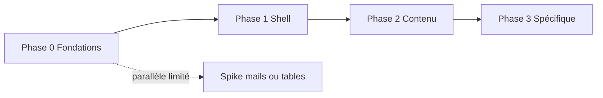

# Plan d’intégration — kit UX AllAboard (niveau cadrage + backlog opérationnel)

**Version** : 1.0 — 2026-05-12  
**Document lié** : [audit-integration-kit-ux-allaboard.md](audit-integration-kit-ux-allaboard.md) (état des lieux, inventaire canonique **§8**, risques, critères de succès).  
**Protocole PR** : [AGENTS.md](../AGENTS.md) — `pnpm verify` avant merge.

Ce document fait deux choses : (1) un **plan d’intégration** par phases aligné sur l’audit ; (2) la couche **vision → backlog** : découpage livrable, dépendances, critères d’acceptation, stratégie de PR et de recette.

---

## 1. Objectifs & périmètre

| Objectif | Mesure |
|----------|--------|
| Une **seule** stack utilitaire (**Tailwind**), build **npm** sur `thp-final` (fin du **CDN**) | Plus de `<script src="cdn.tailwindcss.com">` en prod ; `tailwind.config` versionné ; CSS généré dans le pipeline d’assets |
| **Tokens** et primitives **documentés** | Table de correspondance token ↔ classe ↔ partial ; réduction des hex « magiques » dans ERB |
| **Pas de régression** sur les parcours critiques | Checklist §7 exécutée à chaque merge de lot UI |
| **Alignement** futur `apps/web` | Décision sur package partagé ou fichier tokens dupliqué documenté (§6) |

**Hors périmètre immédiat** (sauf décision explicite en §6) : refonte fonctionnelle des features ; changement de stack Rails / Next ; intégration d’un kit tiers (Bootstrap, etc.).

---

## 2. Principes d’exécution

1. **PRs petites** : idéalement une **primitive** ou un **lot cohérent** (ex. « tous les champs formulaire auth »), pas la refonte de 40 vues d’un coup.  
2. **Toujours vert** : chaque PR passe `pnpm verify` (hooks / CI).  
3. **Règle CSS** : primitives en **Tailwind** ; `application.css` réservé aux cas **non expressibles** proprement en utilitaires (bulles chat, animations flash) — commentaire « pourquoi » obligatoire si nouveau bloc custom.  
4. **Traçabilité** : chaque story référence une ligne de l’**inventaire audit §8.x** (ex. « 8.5 — Button loading »).  
5. **Branche** : travail sur branche dédiée (ex. `feature/ui-tailwind-foundation` ou successeur), merge vers **`Dev`** selon gouvernance équipe.

---

## 3. De la vision au backlog (méthode)

### 3.1 Chaîne de décomposition

```text
Vision (audit)     →  Outcome mesurable (phase)  →  Epic (lot métier)
     →  Story (livrable revue)  →  Tâches techniques  →  PR(s)
```

| Niveau | Durée indicative | Contenu |
|--------|-------------------|---------|
| **Outcome** | Phase 0–3 | Ex. « Build Tailwind npm + tokens uniques » |
| **Epic** | 1–3 sprints | Ex. « Formulaires auth unifiés » |
| **Story** | 0,5–3 jours | Ex. « Partial `_input.html.erb` + états erreur » |
| **Tâche** | &lt; 1 jour | Ex. « Retirer CDN du layout » ; « Ajouter `content` paths ERB » |

### 3.2 Définition of Ready (DoR) — une story peut démarrer si

- [ ] Référence **§8.x** de l’audit renseignée.  
- [ ] Maquette ou **exemple existant** dans le code pointé (ou capture **§2.3** audit — planche kit complet).  
- [ ] **Pas de conflit** avec une story en cours sur les mêmes fichiers layout.  
- [ ] Spikes techniques terminés si la story dépend d’eux (ex. pipeline Tailwind validé en Phase 0).

### 3.3 Définition of Done (DoD) — une story est finie si

- [ ] Code mergé + **`pnpm verify` vert**.  
- [ ] **Critères d’acceptation** (Gherkin ou liste) cochés.  
- [ ] **Régression** : lignes applicables de la **matrice recette §7** passées (ou écart documenté).  
- [ ] Si primitive réutilisable : **ligne ajoutée** dans le futur `README` kit ou table des partials (même un stub Markdown dans `Docs/` acceptable au début).

### 3.4 Modèle de story (copier-coller dans tickets)

```markdown
## Story : [Titre court]
**Epic** : … | **Phase** : 0–3 | **Audit** : §8.x …

### Contexte
…

### Tâches techniques
- [ ] …
- [ ] …

### Critères d’acceptation
- [ ] …
- [ ] …

### Fichiers / zones
- `apps/thp-final/…`

### Recette (§7)
- [ ] Parcours : …
```

---

## 4. Carte des phases (alignée audit §9)

| Phase | Outcome principal | Epics types |
|-------|-------------------|-------------|
| **0 — Fondations** | Build Tailwind npm + tokens alignés `:root` / config | Pipeline assets ; `content` paths ; suppression CDN ; doc tokens |
| **1 — Shell** | Chrome + auth + CGU sans régression | Nav, footer, mobile nav, menu user, modales CGU, partials formulaires auth |
| **2 — Contenu** | Feed / explore / ressources / événements sur primitives | Cards, listes, badges, headings, empty states |
| **3 — Spécifique** | Chat, admin/mentor, mails | Bulles + React ; tables ; templates mail |

---

## 5. Dépendances entre phases (ordre logique)



- **Phase 1** ne doit pas démarrer avant : **CSS Tailwind généré** et importé dans le layout (sinon double charge ou styles cassés).  
- **Phase 2** peut préparer des **partials** en parallèle de fin de Phase 1 **seulement** si les tokens stables sont mergés (éviter les rebases de classes).  
- **Phase 3** (chat) peut nécessiter des **tokens de couleur** pour bulles ; dépend surtout de **P0** ; chevauchement partiel avec **P2** possible avec coordination.

---

## 6. Décisions à trancher (registre — remplir en atelier)

| ID | Sujet | Options | Décision | Date |
|----|--------|---------|----------|------|
| D1 | Showcase primitives | Page Rails `/ui` protégée ; Storybook ; doc Markdown + captures dans `Docs/` | | |
| D2 | Package tokens partagé `packages/ui-tokens` | Oui / Non / Plus tard | | |
| D3 | Alignement **Next** `apps/web` | Même phase que P2 ; phase dédiée ; hors scope court terme | | |
| D4 | Tests visuels | Playwright screenshots ; Applitools ; manuel seulement | | |
| D5 | Thème **light** | Jamais ; plus tard sans bloquer P0–P1 | | |

Tant qu’une décision bloque une story, la story reste en **« blocked by D# »** dans le backlog.

---

## 7. Matrice de recette (minimum par merge de lot UI)

| # | Parcours | Étapes clés |
|---|----------|-------------|
| R1 | **Visiteur** | Landing `home#index` → login inline ou lien inscription → pas d’erreur console |
| R2 | **Devise session** | `/users/sign_in` → soumission invalide → erreurs affichées ; valide → redirect feed |
| R3 | **CGU** | Utilisateur sans `cgu_accepted_at` → modale → case → submit → accès feed |
| R4 | **Feed** | Liste posts + sidebar + scroll FAB + ouverture d’un post |
| R5 | **Messages** | Liste + ouverture conversation + **React** chat affiché |
| R6 | **Mentor / admin** | Si compte dispo : menu + dashboard sans 500 |

**Automatisé aujourd’hui** : `pnpm verify` (lint, tests unitaires packages, Rails tests, build). **Complément** : exécuter R1–R6 manuellement (ou scripter plus tard selon **D4**).

---

## 8. Séquence de PRs suggérée (exemple — adapter au rythme)

| Ordre | Titre PR (exemple) | Dépend de | Audit § |
|-------|---------------------|-----------|---------|
| 1 | chore(thp-final): Tailwind postcss + config + build script | — | 8.0 |
| 2 | chore(thp-final): retirer CDN + lier CSS compilé layout | 1 | 8.0 |
| 3 | docs: table tokens + mapping Tailwind | 2 | 8.0 |
| 4 | feat(ui): partials boutons + états | 3 | 8.5 |
| 5 | feat(ui): partials champs formulaire + erreurs | 3 | 8.3 |
| 6 | refactor(ui): auth home + devise sessions alignés | 5 | 8.4 |
| 7 | refactor(ui): nav + footer sur primitives | 4 | 8.1 |
| 8 | refactor(ui): modal CGU + toasts | 4 | 8.7, 8.1 |
| … | Enchaîner cartes feed, listes, etc. | 7+ | 8.6, 8.2 |

Chaque PR = une **story** ou un **sous-ensemble** cohérent ; éviter les PR « tout Phase 2 ».

---

## 9. Backlog opérationnel — Phase 0 (WBS détaillé)

Copier les lignes suivantes dans votre outil de suivi (Linear, GitHub Projects, etc.) en tant que **tâches** ou **sub-issues**.

### 9.1 Spike / setup build

- [ ] **T0.1** — Choisir intégration : `cssbundling-rails` + `tailwindcss` **ou** build npm existant dans `apps/thp-final` déjà câblé ; documenter le choix dans ce fichier (annexe « Décision build »).  
- [ ] **T0.2** — Ajouter `tailwind.config` (JS/TS) avec `content` incluant `app/views/**/*.erb`, `app/helpers/**/*.rb`, `app/javascript/**/*.{js,jsx}`, etc.  
- [ ] **T0.3** — Fichier d’entrée CSS (ex. `application.tailwind.css`) avec directives Tailwind + `@layer` si besoin.  
- [ ] **T0.4** — Script `package.json` / `bin/dev` : commande `build:css` (ou équivalent) documentée dans README `thp-final`.  
- [ ] **T0.5** — Retirer `<script src="https://cdn.tailwindcss.com">` et le bloc `tailwind.config = …` inline du layout ; importer la feuille compilée via `stylesheet_link_tag`.  
- [ ] **T0.6** — Reporter `theme.extend` (couleurs, fonts, keyframes) du layout vers `tailwind.config`.  
- [ ] **T0.7** — Vérifier que les classes existantes des vues **recompilent** (aucune classe purgée par erreur de `content`).  
- [ ] **T0.8** — `pnpm verify` + smoke manuel R1–R2.

### 9.2 Tokens

- [ ] **T0.9** — Table unique (Markdown ou JSON) : token sémantique → variable CSS → clé Tailwind.  
- [ ] **T0.10** — Aligner `:root` dans `application.css` avec la table (ou source unique importée).  
- [ ] **T0.11** — Documenter **focus ring** et **z-index** dans la même table.

---

## 10. Backlog — Phases 1 à 3 (stories types)

### Phase 1 — Shell (extraits ; compléter avec §8.1 / 8.4 / 8.7)

| ID | Story | Critères d’acceptation (résumé) |
|----|--------|----------------------------------|
| S1.1 | Partial **header** réutilisable | Même rendu visuel qu’avant ; états actifs nav inchangés |
| S1.2 | **Footer** sur tokens | Liens légaux cliquables ; contrastes OK |
| S1.3 | **Menu utilisateur** dropdown | Fermeture clic extérieur conservée ; badges compteurs |
| S1.4 | **Modale CGU** | Checkbox + disabled CTA jusqu’à coché ; focus trap basique |
| S1.5 | Unifier **home** + `devise/sessions` forms | Mêmes classes partials champs/boutons |

### Phase 2 — Contenu

| ID | Story | Critères |
|----|--------|----------|
| S2.1 | Partial **card** post + sidebar | Hover ; badge `accent_color` |
| S2.2 | **Page heading** + CTA créer post | Aligné tokens |
| S2.3 | **Empty state** + liste ressources / événements | CTA présent |

### Phase 3 — Spécifique

| ID | Story | Critères |
|----|--------|----------|
| S3.1 | **Chat** bulles + zone React | Bulles own/other visuellement équivalent ; pas de FOUC |
| S3.2 | **Table** admin modération | Tri/pagination si déjà en place ; pas de régression |
| S3.3 | **Mails** alignés charte | Tableau équivalence couleurs ; 1 mail modèle validé |

---

## 11. Traçabilité audit ↔ backlog

| Section audit | Utilisation dans ce plan |
|----------------|----------------------------|
| **§8.0–8.10** | Catalogue des **stories** possibles ; chaque ticket cite `§8.x` |
| **§8.11 MVP** | Priorité **tôt** dans Phase 0–1 |
| **§9 phasage** | Colonnes ou **milestones** du board projet |
| **§10 risques** | Critères non-fonctionnels sur PR (checklist reviewer) |
| **§11 succès** | Conditions de **release** du premier increment « kit acceptable » |

---

## 12. Suivi des jalons (template)

| Jalon | Date cible | État | Notes |
|-------|------------|------|-------|
| Fin Phase 0 | | | CDN retiré ; verify vert |
| Fin Phase 1 | | | R1–R4 OK |
| Fin Phase 2 | | | R4 + cartes ; moins de hex inline |
| Fin Phase 3 | | | R5–R6 ; mails cartographiés |

---

## 13. Liens rapides

- Audit : [audit-integration-kit-ux-allaboard.md](audit-integration-kit-ux-allaboard.md)  
- Parcours produit : [moc-parcours-utilisateur.md](moc-parcours-utilisateur.md)  
- MoC : [map-of-content.md](map-of-content.md)  

*Fin du plan d’intégration.*
