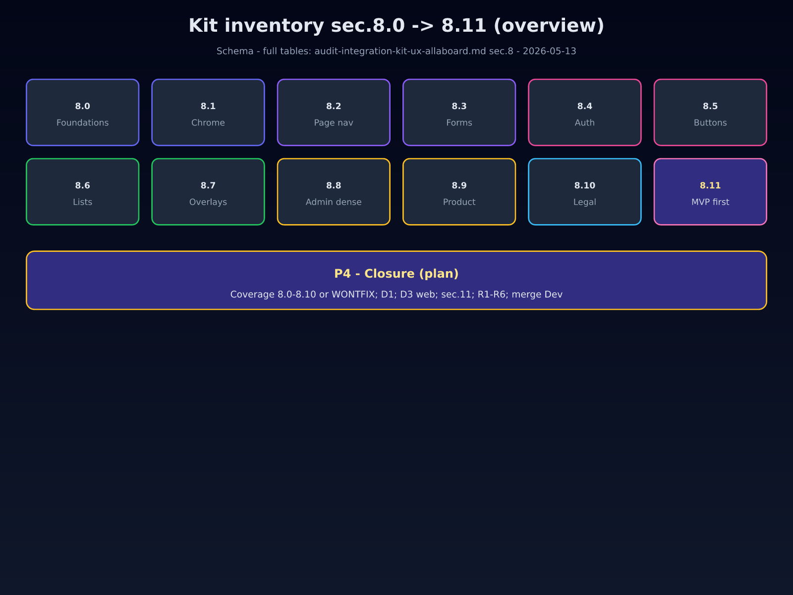
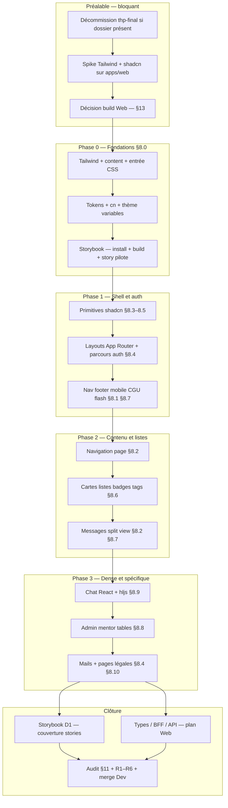
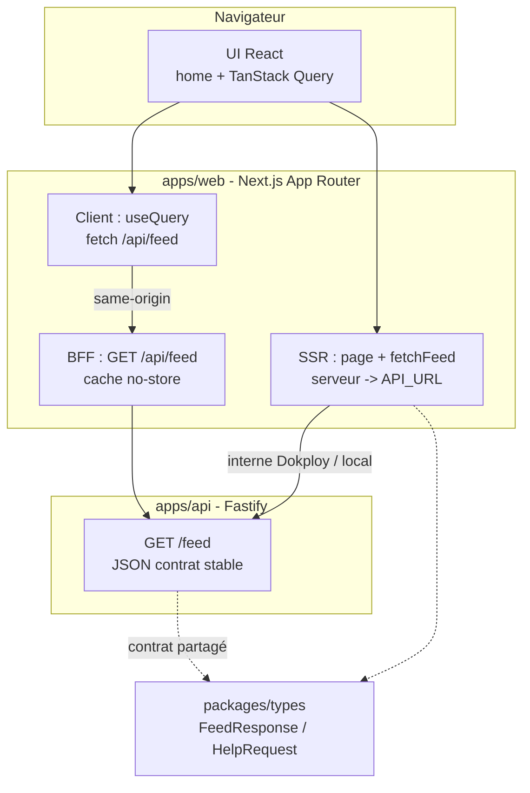

<!-- markdownlint-disable MD033 MD041 -->
<div align="center">

# Plan d’intégration — kit UX AllAboard

**Phases · tests · merge `Dev`**

[](./plan-integration-kit-ux-allaboard.md)
[](../../apps/web)
[](../AGENTS.md)

</div>

> [!TIP]
> Lire d’abord [**Procédure d’exécution (agent)**](#procédure-dexécution-agent), la [**Décommission `thp-final`**](#decom-thp-final) si le dossier existe encore, le [**sommaire**](#sommaire), puis la **légende des tests** §3. Le détail « quoi livrer » reste dans l’[**audit §8**](audit-integration-kit-ux-allaboard.md) (**v1.7**).

**Version** : 6.1 · **Date** : 2026-05-13  
**Audit** : [audit-integration-kit-ux-allaboard.md](audit-integration-kit-ux-allaboard.md) (**v1.7**) — inventaire **§8**, phasage **§9**, succès **§11** · **Qualité** : [AGENTS.md](../AGENTS.md) (`pnpm verify` avant merge)

**Objectif** : livrer le kit sur **`apps/web`** (Next 15, React 19) par phases — **Tailwind**, **shadcn/ui** (Radix + utilitaire **`cn`**), **Storybook** ; chaque phase se clôt par des **jalons test** cochés. Les cases `- [ ]` ci‑dessous sont **cliquables sur GitHub**. **`apps/thp-final` (Rails)** : **abandon définitif** — ce n’est **plus** une option de travail ; exécuter la [checklist Décommission](#decom-thp-final) puis retirer le code et la CI associés. **Données, auth métier, contrat `/feed`** : [plan Web/API](plan-mise-en-place-web-api-donnees.md) — le kit ne les remplace pas.

---

## Procédure d’exécution (agent)

> Objectif : un agent (ou un humain) peut **enchaîner sans ambiguïté** après une seule lecture de cette section + §3 (et **Décommission** si `apps/thp-final/` est encore présent).

### Avant la première PR

1. Si le répertoire **`apps/thp-final/`** est encore présent : traiter la [checklist Décommission](#decom-thp-final) **en priorité** (ou ouvrir une **issue** de report daté — sans traiter le kit comme coexistant avec une app Rails encore « vivante » dans la CI).
2. Lire [AGENTS.md](../AGENTS.md) (hooks, `pnpm verify`).
3. Lire l’[audit](audit-integration-kit-ux-allaboard.md) **§8** (inventaire) et **§11** (succès).
4. Si une page consomme l’API ou le BFF : lire [plan Web/API](plan-mise-en-place-web-api-donnees.md) (env, `/feed`, chemins code).

### Règles de travail

| Règle | Détail |
|-------|--------|
| **Une phase à la fois** | Ne pas commencer la phase **N+1** tant que les **jalons** de la phase **N** ne sont pas tous cochés **ou** qu’un **WONTFIX** n’est pas documenté (issue + ligne dans l’audit). |
| **Racine monorepo** | Toutes les commandes `pnpm …` ci‑dessous s’exécutent depuis la **racine** du dépôt (`allaboard/`), sauf mention contraire. |
| **Vérification obligatoire** | Après chaque lot de changements : `pnpm verify`. |
| **Storybook** | Dès **P‑05** fait : après toute modification de `.storybook/` ou de `*.stories.*` sous `apps/web` : `pnpm --filter web build-storybook` (**T**). |
| **`thp-final` / Rails** | **Interdit** : pas de correctif fonctionnel, pas de nouvelle dépendance, pas de PR « sauvetage » — seule la [Décommission](#decom-thp-final) ou une issue de report. |
| **Secrets** | Ne pas committer de `.env` ; ne pas inventer de valeurs Dokploy — utiliser les noms documentés dans le plan Web/API. |
| **Blocage** | Wizard interactif (CLI), choix produit non tranché, ou échec CI non trivial → issue + arrêt de la phase concernée ; ne pas `--no-verify` sans accord humain. |

### Fin de PR (checklist copiable)

```text
[ ] Livrables de la phase : cases cochées ou WONTFIX + lien issue
[ ] pnpm verify   (racine)
[ ] pnpm --filter web build-storybook   (si Storybook présent et stories / config touchés)
[ ] pnpm --filter web storybook   (smoke manuel si changement majeur UI — optionnel mais recommandé)
[ ] Décommission thp-final : checklist § dédiée cochée — ou **N/A** (dossier déjà absent + CI sans Ruby)
```

<a id="decom-thp-final"></a>

## Décommission `apps/thp-final` (Rails — abandon définitif)

> **Décision** : l’application Rails sous `apps/thp-final` est **obsolète** ; elle ne doit plus être une option de travail, une cible de déploiement ni une étape des PR kit. Cette section est la **checklist agent** pour retirer le legacy du monorepo.

> [!CAUTION]
> Ne pas supprimer le dossier sans **sauvegarde** si besoin (captures, dernier tag Git, export). Cocher les items au fur et à mesure ; **`pnpm verify`** doit rester **vert** à la fin.

### Checklist

- [ ] **Trace décisionnelle** : issue ou **ADR** « abandon `thp-final` » (lien collé ici ou dans [Docs/README](README.md)).
- [ ] **Turbo / scripts racine** : [turbo.json](../../turbo.json), [package.json](../../package.json) — aucune tâche obligatoire qui dépend de `thp-final`, `bundle` ou `rails`.
- [ ] **CI** : [`.github/workflows/ci.yml`](../../.github/workflows/ci.yml) — retirer **Setup Ruby**, **`rails db:test:prepare`** et toute étape liée à `apps/thp-final`.
- [ ] **Docker / infra** : [apps/thp-final/Dockerfile](../../apps/thp-final/Dockerfile), [infra/docker/](../../infra/docker/), docs Dokploy — supprimer ou marquer **obsolète** les images / services Rails.
- [ ] **Suppression code** : supprimer le répertoire **`apps/thp-final/`** (ou le remplacer par une **archive externe** documentée — éviter l’ambiguïté « encore dans le dépôt mais mort »).
- [ ] **Lockfile** : `pnpm install` à la racine après suppression ; commit du `pnpm-lock.yaml` mis à jour.
- [ ] **Vérification** : `pnpm verify` vert sur la branche.
- [ ] **Documentation** : [README.md](../../README.md) (racine), [Docs/README.md](README.md), [map-of-content.md](map-of-content.md), [audit](audit-integration-kit-ux-allaboard.md), ce plan — **grep** `thp-final`, `bin/rails`, `Rails` et retirer ou marquer **obsolète** toute mention qui suggère une option de travail.

**État** : ☐ en cours · ☐ terminée — **Date de fin** : …

---

## Sommaire

0. [Procédure d’exécution (agent)](#procédure-dexécution-agent)  
0.5 [Décommission `thp-final`](#decom-thp-final)  
1. [Planche visuelle](#1-planche-visuelle--référence-design)  
2. [Schéma Mermaid](#2-schéma-dintégration-mermaid)  
2.5 [Dataflow Web + API](#dataflow-web-api)  
3. [Légende tests V / T / M / S / P](#3-légende-des-tests-v--t--m--s--p)  
4. [Décisions D1–D6](#4-décisions-atelier-d1d6)  
5. [Préalables (spike)](#5-préalables--spike--décision-build)  
6. [Phase 0 Fondations](#phase-0-fondations)  
7. [Phase 1 Shell et auth](#phase-1-shell-et-auth)  
8. [Phase 2 Contenu et messages](#phase-2-contenu-et-messages)  
9. [Phase 3 Dense et spécifique](#phase-3-dense-et-spécifique)  
10. [Phase 4 Clôture](#phase-4-clôture)  
11. [Recette R1–R6](#11-recette-manuelle-r1--r6)  
12. [Merge Dev](#12-merge-vers-dev)  
13. [Décision build](#13-décision-build)  
14. [Liens](#14-liens)

---

## 1. Planche visuelle — référence design

<p align="center">
  
</p>

> [!NOTE]
> Chaque zone de la planche correspond aux **§8.x** de l’audit. Les livrables phase par phase en découlent. Les **chemins ERB** dans l’audit = **référence visuelle** (ou archive avant décommission) ; l’implémentation cible est **`apps/web`**.

---

## 2. Schéma d’intégration (Mermaid)

<details>
<summary><strong>Ouvrir / fermer le schéma</strong> (flux Préalable → Phases 0–3 → Clôture)</summary>



</details>

> [!IMPORTANT]
> **`apps/api`**, **`API_URL`**, **`/feed`**, BFF : [plan Web/API](plan-mise-en-place-web-api-donnees.md). **`apps/thp-final`** : **obsolète** — retirer du dépôt et de la CI via [Décommission](#decom-thp-final). Aucune marque de test **Rails** dans les jalons kit (**§3** = **V / T / M / S / P** uniquement).

<a id="dataflow-web-api"></a>

## 2.5 Dataflow Web + API (types)

> [!NOTE]
> Même schéma que la section **« Schéma MVP actuel »** dans [dataflow-architecture.md](dataflow-architecture.md). Détail des variables, chemins code et journal : [plan Web/API](plan-mise-en-place-web-api-donnees.md).



**Lecture** : (1) premier rendu feed = **SSR** via **`API_URL`** (pas d’appel navigateur direct vers l’API pour ce flux) ; (2) rafraîchissement = **BFF** `/api/feed` → **`GET /feed`** ; (3) contrat partagé = **`packages/types`**.

---

## 3. Légende des tests (V / T / M / S / P)

Les **marques** ci‑dessous sont des **codes de jalon** : une case **V** dans une phase signifie « exécuter la ligne **V** du tableau ». Lecture rapide :

| Marque | Se lit | Rôle en une phrase |
|:------:|--------|---------------------|
| **V** | *Verify* | Tout le monorepo est sain (lint, types, tests, build). |
| **T** | **Storybook** (catalogue de stories) | La vitrine de composants compile sans erreur. |
| **M** | *Manuel* | Un humain ou un agent valide les parcours §11 en local. |
| **S** | *Staging* | Même recette §11 sur un **déploiement** (préprod / prod de test). |
| **P** | *Programmé* (automatisé) | Navigateur piloté (ex. Playwright) si **D4** l’exige. |

### Tableau détaillé (quand / quoi lancer)

| Marque | Libellé | Quand | Commande ou action |
|:------:|---------|-------|---------------------|
| **V** | Monorepo **verify** | Chaque PR monorepo | `pnpm verify` (racine) — [`.github/workflows/ci.yml`](../../.github/workflows/ci.yml) |
| **T** | **Storybook** build | Après changement `.storybook/` ou `*.stories.*` sous `apps/web` | `pnpm --filter web build-storybook` — **hors** `pnpm verify` par défaut ; CI si **D1** ([§13](#13-décision-build)) |
| **M** | Recette **manuelle** (local) | Fin de phase, ou avant merge si pas de **P** | [**§11**](#11-recette-manuelle-r1--r6) **R1–R6** sur `pnpm --filter web dev` (ou URL locale équivalente) |
| **S** | Recette sur **déploiement** | Avant merge `Dev`, ou CSP / chat / réseau | Même **§11** sur **environnement déployé** (comptes hors doc) |
| **P** | Tests **E2E** auto | Uniquement si **D4** = suite active | Playwright (ou équivalent) ciblant `apps/web` — sinon *n/a* |

### Mémo copier-coller (description de PR)

```text
Jalons : V = pnpm verify | T = build-storybook si .storybook/ ou *.stories.*
         M = §11 local | S = §11 déployé | P = E2E si D4
```

> [!NOTE]
> **`pnpm verify`** enchaîne lint, typecheck, test, build Turbo : le package **`web`** est inclus si ses tâches sont définies dans le pipeline.

> [!WARNING]
> Sans **P** (**D4**), la preuve « parcours complet produit » repose sur **M** et **S**. **T** garantit surtout que les **primitives** et leurs états se **voient** correctement dans Storybook, pas qu’un parcours E2E passe.

---

## 4. Décisions atelier (D1–D6)

| ID | Sujet | Note |
|:---:|--------|------|
| **D1** | **Storybook** obligatoire dans `apps/web` + tableau de couverture stories ↔ §8 (phase 4) | |
| **D2** | `packages/ui-tokens` + consommation **`apps/web`** | |
| **D3** | Cohérence **`packages/types`**, BFF, fetch SSR avec [plan Web/API](plan-mise-en-place-web-api-donnees.md) dès qu’une page consomme l’API | |
| **D4** | Tests E2E automatisés (`apps/web`) | |
| **D5** | Thème light | |
| **D6** | Cible accessibilité MVP | |

---

## 5. Préalables — spike & décision build

> **Gate** : aucune phase numérotée avant **P‑01** … **P‑06** et **§13** complété (au minimum options cochées + date). Si `apps/thp-final/` existe encore : [Décommission](#decom-thp-final) **bloquante** avant livraison kit en production.

### Tâches (ordre recommandé)

- [ ] **P‑01** — Depuis la racine : branche Git ; sous `apps/web` : **Tailwind** installé et **une page pilote** rend des classes utilitaires compilées (`pnpm --filter web dev` smoke).
- [ ] **P‑02** — **shadcn/ui** : `pnpm dlx shadcn@latest init` (répondre au wizard pour Next / `app/`) ; présence de `components.json` et de `cn` (`clsx` + `tailwind-merge`) ; README `apps/web` mis à jour.
- [ ] **P‑03** — Documenter `pnpm --filter web dev`, `build`, et build CSS dans [§13](#13-décision-build) + README `apps/web`.
- [ ] **P‑04** — [§13](#13-décision-build) : options **A/B/C/D** cochées + **Décision** + **Date**.
- [ ] **P‑05** — **Storybook** : `pnpm dlx storybook@latest init` avec `cwd` = `apps/web` ; scripts `storybook` et `build-storybook` dans `apps/web/package.json` ; emplacement des stories documenté.
- [ ] **P‑06** — Au moins une story pilote ; commande **`pnpm --filter web build-storybook`** retourne **0** (**T**).

### Jalon test (préalables)

- [ ] **V** — `pnpm verify`
- [ ] **T** — `pnpm --filter web build-storybook`

---

## Phase 0 Fondations

> Ref. audit **§8.0**.

> [!NOTE]
> **Gate phase 1** : **V** + **T** + **M** (aperçu **R1**) cochés ci‑dessous.

**Objectif** : tokens, focus, z-index ; build Tailwind reproductible ; **pas de CDN Tailwind** sur les pages Next livrées ; Storybook prêt.

### Livrables

- [ ] **0.1** — Config Tailwind + `content` (`app/`, `components/`, `packages/*` si importés).
- [ ] **0.2** — Feuille(s) CSS globale(s) : variables **§8.0**, couches `@layer` si utilisées.
- [ ] **0.3** — Pipeline décrit dans [§13](#13-décision-build) ; si **T** ajouté à la CI : mettre à jour `.github/workflows/ci.yml` et §13.
- [ ] **0.4** — Table token → CSS → classe (amorce) ; lien **D2** si package tokens.
- [ ] **0.5** — Focus ring + **z-index** (modales, nav, toasts).
- [ ] **0.6** — Aucune URL **`cdn.tailwindcss.com`** dans le HTML des routes Next livrées (grep ou test).
- [ ] **0.7** — Pas de second framework utilitaire (Bootstrap, MUI parallèle, etc.).
- [ ] **0.8** — `.storybook/` versionné ; preview importe les **globals** / thème ; ≥ 1 story par **famille** amorcée pour la phase 1.

### Ordre d’implémentation (agent)

1. Tailwind + CSS globaux → smoke `pnpm --filter web dev`.  
2. shadcn + `cn` → ajouter un composant pilote (ex. `Button`).  
3. Storybook + story pilote → **T**.  
4. `pnpm verify`.

### Jalon test (fin phase 0)

- [ ] **V** — `pnpm verify`
- [ ] **T** — `pnpm --filter web build-storybook`
- [ ] **R+** *(recommandé)* — `pnpm --filter web build` réussit ; page d’accueil ou pilote **200** sans CDN Tailwind.
- [ ] **M** — **R1** (§11) en local.
- [ ] **S** — Si déployé : **R1** sur staging.

---

## Phase 1 Shell et auth

> Ref. audit **§8.1**, **§8.3**, **§8.4**, **§8.7**.

> [!NOTE]
> **Gate phase 2** : **R1–R3** (§11) ou **WONTFIX** + issue.

**Objectif** : shell + auth + CGU sur **App Router** ; primitives **shadcn** + **stories** ; alignement auth = [plan Web/API](plan-mise-en-place-web-api-donnees.md) (placeholders OK si ADR auth absent).

### Livrables

- [ ] **1.1** — Boutons, champs, labels, messages d’erreur (§8.3, §8.5) + stories.
- [ ] **1.2** — Layout shell + pages auth (§8.4) — **pas** d’auth serveur ou de stack hors [plan Web/API](plan-mise-en-place-web-api-donnees.md) / ADR à venir.
- [ ] **1.3** — Nav desktop & mobile, footer, menu utilisateur, badges.
- [ ] **1.4** — Modale CGU, toasts / bannières.
- [ ] **1.5** — **D4 / D5 / D6** tranchés ou report daté dans le tableau §4.

### Ordre d’implémentation (agent)

1. Composants §8.3 dans `components/ui` (ou convention du repo) + stories.  
2. Layouts `app/(…)/layout.tsx` + routes auth.  
3. Shell + overlays.  
4. `pnpm verify` puis **T** si stories touchées.

### Jalon test

- [ ] **V** — `pnpm verify`
- [ ] **T** — `build-storybook` si stories §8.1 / §8.3–8.5 modifiées.
- [ ] **M** — **R1**, **R2**, **R3**
- [ ] **P** — Si **D4** actif.

---

## Phase 2 Contenu et messages

> Ref. audit **§8.2**, **§8.6**, **§8.7**.

**Objectif** : navigation de page, cartes, listes, messages ; données feed via API / BFF selon [plan Web/API](plan-mise-en-place-web-api-donnees.md).

### Livrables

- [ ] **2.1** — Breadcrumbs, tabs, page heading (§8.2) + stories ciblées.
- [ ] **2.2** — Cartes feed / explore / ressources / événements ; list rows ; empty states.
- [ ] **2.3** — Badges, tags, modales métier.
- [ ] **2.4** — Split view messages + responsive.

### Ordre d’implémentation (agent)

1. Composants « liste / carte » + stories.  
2. Brancher les pages sur les routes et données réelles ou mocks documentés.  
3. `pnpm verify` + **T** + **M**/**S** pour **R4**.

### Jalon test

- [ ] **V** — `pnpm verify`
- [ ] **T** — si stories §8.2 / §8.6 touchées.
- [ ] **R+** *(recommandé)* — `GET` (navigateur ou test) sur la route feed ou **`/api/feed`** : **200** avec mock documenté.
- [ ] **M** — **R4**, **R5** (selon routes livrées).
- [ ] **S** — **R4** sur déploiement si disponible.

---

## Phase 3 Dense et spécifique

> Ref. audit **§8.8** à **§8.10**, **§8.9**.

**Objectif** : chat React, tables denses, mails, légal — **sans** stack temps réel héritée (Turbo / Action Cable). Temps réel : ADR ou plan Web (hors ce document si non encore posé).

### Livrables

- [ ] **3.1** — Chat **React** + styles kit ; clavier / focus utilisables.
- [ ] **3.2** — Blocs code + **highlight.js** (ou équivalent).
- [ ] **3.3** — Tables admin / mentor (+ filtres si prévus).
- [ ] **3.4** — Mails (preview Storybook, **react-email**, ou capture) + pages légales §8.10.

### Ordre d’implémentation (agent)

1. Zones denses + stories isolées pour états limites.  
2. Mails / légal en dernier (dépendances copy).  
3. `pnpm verify` + **T** + **M**/**S** **R5**, **R6**.

### Jalon test

- [ ] **V** — `pnpm verify`
- [ ] **T** — si stories §8.8–8.10 ajoutées ou modifiées.
- [ ] **R+** *(recommandé)* — Routes dashboard **mentor** / **admin** → **200** lorsque ces routes existent (rôle simulé ou fixture documentée).
- [ ] **M** — **R5**, **R6**
- [ ] **S** — **R5**, **R6** + CSP si applicable.

---

## Phase 4 Clôture

### Tâches

- [ ] **4.1** — **D1** : tableau **primitive / §8 → fichier story → statut** (fait / WONTFIX + lien issue).
- [ ] **4.2** — **D3** : revue des imports `packages/types` et appels BFF/API pour les pages livrées.
- [ ] **4.3** — §8.0–8.10 : couverture ou **WONTFIX** dans l’audit ou une issue par famille.
- [ ] **4.4** — README kit ou index primitives (`Docs/` ou `apps/web`).
- [ ] **4.5** — Relecture [audit §11](audit-integration-kit-ux-allaboard.md#11-critères-de-succès).
- [ ] **4.6** — **R1–R6** complet : local puis **S** staging.
- [ ] **4.7** — `pnpm verify` sur la branche qui merge vers **`Dev`**.

### Jalon test

- [ ] **V** / **T** / **M** / **S** / **P** — Selon [§3](#3-légende-des-tests-v--t--m--s--p) et **D4**.

---

## 11. Recette manuelle (R1–R6)

> Exécuter sur **`apps/web`** (`pnpm --filter web dev` ou URL déployée). Adapter les **chemins** aux routes App Router réelles.

| ID | Parcours | À vérifier |
|:---:|----------|------------|
| **R1** | Visiteur | Landing ; liens auth ; pas d’erreur console bloquante |
| **R2** | Auth | Erreurs formulaire ; session ou état connecté selon implémentation |
| **R3** | CGU | Modale → case → validation → suite |
| **R4** | Feed | Liste, sidebar, CTA, ouverture post / détail |
| **R5** | Messages | Liste + conversation + chat React *(si route livrée)* |
| **R6** | Mentor / admin | Menus, dashboard sans **500** *(si routes livrées)* |

---

## 12. Merge vers Dev

- [ ] Gates des phases touchées : cochées **ou** lien issue.
- [ ] §8.0–8.10 : couverture ou **WONTFIX**.
- [ ] **D1–D6** : rempli ou report daté ([§4](#4-décisions-atelier-d1d6)).
- [ ] [§13 Décision build](#13-décision-build) complétée.
- [ ] **Décommission `thp-final`** : [checklist](#decom-thp-final) **terminée** ou **N/A** (dossier absent + CI sans Ruby / Rails).
- [ ] **Audit §11** relu.
- [ ] `pnpm verify` vert.
- [ ] **T** vert si Storybook en CI ; sinon **T** exécuté localement et mentionné dans la PR.

---

## 13. Décision build

> [!CAUTION]
> Remplir **après** le spike (§5). Sans date et cases cochées, la phase 0 reste **provisoire**.

| Option | Coché | Notes |
|--------|:-----:|-------|
| **A** — Tailwind (postcss classique) + Next | [ ] | |
| **B** — Tailwind **v4** + pipeline doc Next | [ ] | |
| **C** — **shadcn/ui** + CLI `add` | [ ] | Recommandé |
| **D** — Autre (décrire) | [ ] | |

**Décision** : … — **Date** : …

*(**D2** : décrire la consommation des tokens dans `apps/web`.)*

**Storybook + CI** : par défaut **T** est **hors** `pnpm verify`. Noter ici si `pnpm --filter web build-storybook` est ajouté au workflow — **Date** : …

---

## 14. Liens

| Ressource | Lien |
|-----------|------|
| Audit kit UX | [audit-integration-kit-ux-allaboard.md](audit-integration-kit-ux-allaboard.md) |
| Parcours utilisateur | [moc-parcours-utilisateur.md](moc-parcours-utilisateur.md) |
| Carte de la doc | [map-of-content.md](map-of-content.md) |
| README racine dépôt | [README.md](../README.md) |
| README doc (`Docs/`) | [README.md](README.md) |
| Plan Web/API/données | [plan-mise-en-place-web-api-donnees.md](plan-mise-en-place-web-api-donnees.md) |
| Dataflow (MVP + cible) | [dataflow-architecture.md](dataflow-architecture.md) |
| CI | [`.github/workflows/ci.yml`](../../.github/workflows/ci.yml) |
| shadcn/ui | [https://ui.shadcn.com](https://ui.shadcn.com) |
| Storybook + Next | [https://storybook.js.org/docs/get-started/frameworks/nextjs](https://storybook.js.org/docs/get-started/frameworks/nextjs) |
