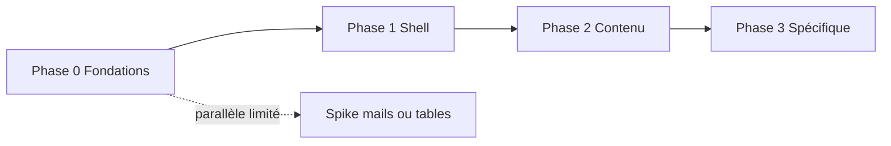

# Plan d’intégration — kit UX AllAboard (**intégration complète opérationnelle**)

**Version** : 2.0 — 2026-05-12  
**Document lié** : [audit-integration-kit-ux-allaboard.md](audit-integration-kit-ux-allaboard.md) (inventaire canonique **§8.0–8.10**, risques, critères de succès **§11**).  
**Protocole dépôt** : [AGENTS.md](../AGENTS.md) — `pnpm verify` avant commit / push ; pas de `--no-verify` sans accord explicite.  
**Cartographie doc** : [README.md](README.md), [map-of-content.md](map-of-content.md) — éviter les doublons de vérité avec les autres plans (ex. Web/API).

Ce document décrit une **intégration complète opérationnelle** du kit UX AllAboard : **toutes les familles §8.0 à §8.10** de l’audit couvertes ou **explicitement hors scope** (justification écrite), sur **`apps/thp-final`** en priorité, avec **merge cible `Dev`** une fois la branche feature validée. Il conserve la méthode **vision → backlog** (DoR/DoD, PRs, recette).

---

## 1. Objectifs & périmètre

### 1.1 Conformité All-Aboard (non négociable)

| Exigence | Application |
|----------|-------------|
| **Monorepo** | `pnpm verify` à la racine ; changements `thp-final` inclus dans Turbo / hooks. |
| **Surface produit** | **`apps/thp-final`** = source de vérité UI ; `apps/web` selon **D3** (alignement tokens / charte, pas de double stack). |
| **Stack UI** | **Tailwind uniquement** (build **npm** cible — fin du CDN) ; **pas** Bootstrap ni second framework utilitaire. |
| **CSS existant** | `application.css` : conserver ou migrer **bulles chat**, **flash**, animations **documentées** ; tout nouveau bloc custom = commentaire « pourquoi » (audit §10 risques). |
| **Rails** | Hotwire (Turbo, Stimulus), vues **ERB**, îlot **React** (`ChatApp`) — pas de régression chargement / Action Cable. |
| **Charte** | Tokens `--sl-*` / thème **indigo · violet · rose**, dark-first, **Inter**, **Font Awesome**, **highlight.js** ; **badges matière** avec `accent_color` conservés. |
| **Accessibilité** | Focus visible, labels formulaires, état disabled CGU, contrastes sur `glass` (audit §11). |
| **Langue & parcours** | UI **français** ; recette alignée [moc-parcours-utilisateur.md](moc-parcours-utilisateur.md) + matrice **§7** ci-dessous. |
| **Git** | Travail sur **branche feature** ; push autorisés tant que `verify` passe ; **merge vers `Dev`** selon gouvernance équipe + PR si requis. |

### 1.2 Définition : intégration **complète**

L’intégration est **complète** lorsque **toutes** les conditions suivantes sont vraies :

1. **Phase 0** : tâches **T0.1–T0.11** réalisées ; CDN absent ; table tokens publiée.  
2. **Phase 1** : tâches **T1.1–T1.12** (ou équivalent) — shell + **tous** les écrans **§8.4** Devise + home + liens + erreurs ; **§8.7** toasts / modale CGU ; **§8.1** chrome.  
3. **Phase 2** : tâches **T2.1–T2.11** — **§8.6** cartes / listes / badges / empty / skeleton si retenu ; **§8.2** navigation page ; **§8.3** champs hors auth si encore dupliqués.  
4. **Phase 3** : tâches **T3.1–T3.8** (+ **T3.9–T3.10** si retenus) — **§8.9** chat + code ; **§8.8** admin dense ; **§8.4** mails Devise + **§8.10** pages légales revues pour cohérence typo/liens.  
5. **§8.0** fondations : motion, thème (D5), z-index documentés dans la table tokens.  
6. **Registre §6** : **D1–D5** renseignés (ou « reporté » avec date).  
7. **Documentation** : `README` kit ou `Docs/` avec **table primitive → partial / classe** (couverture **§8**).  
8. **Recette** : **R1–R6** passés après le dernier lot ; **§11** audit revu.  
9. **`pnpm verify`** vert sur la branche au moment du merge vers `Dev`.

*Si une ligne §8 est volontairement non traitée* : créer un ticket « **WONTFIX kit** » avec raison (ex. skeleton repoussé) — évite les trous silencieux.

### 1.3 Objectifs mesurables (rappel)

| Objectif | Mesure |
|----------|--------|
| **Tailwind build npm** sur `thp-final` | Plus de CDN ; `tailwind.config` versionné ; CSS compilé dans le pipeline d’assets |
| **Tokens & primitives documentés** | Table token ↔ classe ↔ partial ; couverture **§8** traçable |
| **Pas de régression** | **§7** à chaque merge UI ; **§11** à la fin |
| **Alignement `apps/web`** | Décision **D3** exécutée ou reportée documentée |

**Hors périmètre** (sauf décision §6) : refonte fonctionnelle des features ; changement de stack Rails / Next ; kit tiers (Bootstrap, etc.).

---

## 2. Principes d’exécution

1. **PRs petites** : idéalement une **primitive** ou un **lot cohérent** (ex. « tous les champs formulaire auth »), pas la refonte de 40 vues d’un coup.  
2. **Toujours vert** : chaque PR passe `pnpm verify` (hooks / CI).  
3. **Règle CSS** : primitives en **Tailwind** ; `application.css` réservé aux cas **non expressibles** proprement en utilitaires (bulles chat, animations flash) — commentaire « pourquoi » obligatoire si nouveau bloc custom.  
4. **Traçabilité** : chaque story référence une ligne de l’**inventaire audit §8.x** (ex. « 8.5 — Button loading »).  
5. **Branche** : travail sur branche dédiée (ex. `feature/ui-tailwind-foundation` ou successeur), merge vers **`Dev`** selon gouvernance équipe.

---

## 3. De la vision au backlog (méthode)

### 3.1 Chaîne de décomposition

```text
Vision (audit)     →  Outcome mesurable (phase)  →  Epic (lot métier)
     →  Story (livrable revue)  →  Tâches techniques  →  PR(s)
```

| Niveau | Durée indicative | Contenu |
|--------|-------------------|---------|
| **Outcome** | Phase 0–3 | Ex. « Build Tailwind npm + tokens uniques » |
| **Epic** | 1–3 sprints | Ex. « Formulaires auth unifiés » |
| **Story** | 0,5–3 jours | Ex. « Partial `_input.html.erb` + états erreur » |
| **Tâche** | < 1 jour | Ex. « Retirer CDN du layout » ; « Ajouter `content` paths ERB » |

### 3.2 Définition of Ready (DoR) — une story peut démarrer si

- [ ] Référence **§8.x** de l’audit renseignée.  
- [ ] Maquette ou **exemple existant** dans le code pointé (ou capture **§2.3** audit — planche kit complet).  
- [ ] **Pas de conflit** avec une story en cours sur les mêmes fichiers layout.  
- [ ] Spikes techniques terminés si la story dépend d’eux (ex. pipeline Tailwind validé en Phase 0).

### 3.3 Définition of Done (DoD) — une story est finie si

- [ ] Code mergé + **`pnpm verify` vert**.  
- [ ] **Critères d’acceptation** (Gherkin ou liste) cochés.  
- [ ] **Régression** : lignes applicables de la **matrice recette §7** passées (ou écart documenté).  
- [ ] Si primitive réutilisable : **ligne ajoutée** dans le futur `README` kit ou table des partials (même un stub Markdown dans `Docs/` acceptable au début).

### 3.4 Modèle de story (copier-coller dans tickets)

```markdown
## Story : [Titre court]
**Epic** : … | **Phase** : 0–3 | **Audit** : §8.x …

### Contexte
…

### Tâches techniques
- [ ] …
- [ ] …

### Critères d’acceptation
- [ ] …
- [ ] …

### Fichiers / zones
- `apps/thp-final/…`

### Recette (§7)
- [ ] Parcours : …
```

---

## 4. Carte des phases (alignée audit §9)

| Phase | Outcome principal | Epics types |
|-------|-------------------|-------------|
| **0 — Fondations** | Build Tailwind npm + tokens alignés `:root` / config | Pipeline assets ; `content` paths ; suppression CDN ; doc tokens |
| **1 — Shell** | Chrome + auth + CGU sans régression | Nav, footer, mobile nav, menu user, modales CGU, partials formulaires auth |
| **2 — Contenu** | Feed / explore / ressources / événements sur primitives | Cards, listes, badges, headings, empty states |
| **3 — Spécifique** | Chat, admin/mentor, mails | Bulles + React ; tables ; templates mail |

---

## 5. Dépendances entre phases (ordre logique)



- **Phase 1** ne doit pas démarrer avant : **CSS Tailwind généré** et importé dans le layout (sinon double charge ou styles cassés).  
- **Phase 2** peut préparer des **partials** en parallèle de fin de Phase 1 **seulement** si les tokens stables sont mergés (éviter les rebases de classes).  
- **Phase 3** (chat) peut nécessiter des **tokens de couleur** pour bulles ; dépend surtout de **P0** ; chevauchement partiel avec **P2** possible avec coordination.

---

## 6. Décisions à trancher (registre — remplir en atelier)

| ID | Sujet | Options | Décision | Date |
|----|--------|---------|----------|------|
| D1 | Showcase primitives | Page Rails `/ui` protégée ; Storybook ; doc Markdown + captures dans `Docs/` | | |
| D2 | Package tokens partagé `packages/ui-tokens` | Oui / Non / Plus tard | | |
| D3 | Alignement **Next** `apps/web` | Même phase que P2 ; phase dédiée ; hors scope court terme | | |
| D4 | Tests visuels | Playwright screenshots ; Applitools ; manuel seulement | | |
| D5 | Thème **light** | Jamais ; plus tard sans bloquer P0–P1 | | |

Tant qu’une décision bloque une story, la story reste en **« blocked by D# »** dans le backlog.

---

## 7. Matrice de recette (minimum par merge de lot UI)

| # | Parcours | Étapes clés |
|---|----------|-------------|
| R1 | **Visiteur** | Landing `home#index` → login inline ou lien inscription → pas d’erreur console |
| R2 | **Devise session** | `/users/sign_in` → soumission invalide → erreurs affichées ; valide → redirect feed |
| R3 | **CGU** | Utilisateur sans `cgu_accepted_at` → modale → case → submit → accès feed |
| R4 | **Feed** | Liste posts + sidebar + scroll FAB + ouverture d’un post |
| R5 | **Messages** | Liste + ouverture conversation + **React** chat affiché |
| R6 | **Mentor / admin** | Si compte dispo : menu + dashboard sans 500 |

**Automatisé aujourd’hui** : `pnpm verify` (lint, tests unitaires packages, Rails tests, build). **Complément** : exécuter R1–R6 manuellement (ou scripter plus tard selon **D4**).

---

## 8. Séquence de PRs (intégration complète — ordre indicatif)

Adapter le découpage à la taille des PRs ; chaque ligne peut devenir **plusieurs** PRs si nécessaire. Toutes les PRs : **`pnpm verify` vert** + recette **§7** ciblée.

| Ordre | Lot (exemple de titre PR) | Phase | Audit § |
|-------|-----------------------------|-------|---------|
| 1 | `chore(thp-final)`: Tailwind PostCSS + `tailwind.config` + `content` | 0 | 8.0 |
| 2 | `chore(thp-final)`: entrée CSS + build + doc `bin/dev` | 0 | 8.0 |
| 3 | `chore(thp-final)`: retirer CDN + `stylesheet_link_tag` feuille compilée | 0 | 8.0 |
| 4 | `docs`: table tokens + mapping + focus/z-index | 0 | 8.0 |
| 5 | `feat(ui)`: partials **bouton** (variants §8.5) | 1 | 8.5 |
| 6 | `feat(ui)`: partials **champs** + erreurs (§8.3) | 1 | 8.3 |
| 7 | `refactor(ui)`: **home** + `devise/sessions` + `registrations` + passwords + confirmations + unlocks + `_links` | 1 | 8.4 |
| 8 | `refactor(ui)`: **nav** + footer + mobile nav + menu user + badges | 1 | 8.1 |
| 9 | `refactor(ui)`: **bannières** CGU / flash / scroll FAB | 1 | 8.1, 8.7 |
| 10 | `feat(ui)`: **breadcrumbs** + tabs + pills + page heading | 2 | 8.2 |
| 11 | `refactor(ui)`: **cartes** post / ressource / événement + sidebar + list rows | 2 | 8.6 |
| 12 | `refactor(ui)`: **badges** + tags + `accent_color` + empty states (+ skeleton si retenu) | 2 | 8.6 |
| 13 | `refactor(ui)`: **split** messages + polish liste conversations | 2 | 8.2, 8.1 |
| 14 | `refactor(ui)`: **modales** (création post, sujets, confirmations) + drawer/tooltip si retenus | 2 | 8.7 |
| 15 | `refactor(ui)`: **chat** CSS + cohérence îlot React | 3 | 8.9 |
| 16 | `refactor(ui)`: **blocs code** commentaires + conteneur hljs | 3 | 8.9 |
| 17 | `refactor(ui)`: **tables** admin / mentor + filtres + KPI | 3 | 8.8 |
| 18 | `chore(mailers)` ou `refactor(ui)`: **mails Devise** + harmonisation variables | 3 | 8.4 |
| 19 | `refactor(ui)`: pages **légales** CGU / privacy / mentions (§8.10) | 3 | 8.10 |
| 20 | `feat(web)` ou `docs`: alignement **Next** selon **D3** | 2–3 | D3, 8.0 |

Chaque PR = une **story** ou un **sous-ensemble** cohérent ; éviter les PR « tout en une » sans recette §7.

---

## 9. Backlog opérationnel — Phase 0 (WBS détaillé)

Copier les lignes suivantes dans votre outil de suivi (Linear, GitHub Projects, etc.) en tant que **tâches** ou **sub-issues**.

### 9.1 Spike / setup build

- [ ] **T0.1** — Choisir intégration : `cssbundling-rails` + `tailwindcss` **ou** build npm existant dans `apps/thp-final` déjà câblé ; documenter le choix dans ce fichier (annexe « Décision build »).  
- [ ] **T0.2** — Ajouter `tailwind.config` (JS/TS) avec `content` incluant `app/views/**/*.erb`, `app/helpers/**/*.rb`, `app/javascript/**/*.{js,jsx}`, etc.  
- [ ] **T0.3** — Fichier d’entrée CSS (ex. `application.tailwind.css`) avec directives Tailwind + `@layer` si besoin.  
- [ ] **T0.4** — Script `package.json` / `bin/dev` : commande `build:css` (ou équivalent) documentée dans README `thp-final`.  
- [ ] **T0.5** — Retirer `<script src="https://cdn.tailwindcss.com">` et le bloc `tailwind.config = …` inline du layout ; importer la feuille compilée via `stylesheet_link_tag`.  
- [ ] **T0.6** — Reporter `theme.extend` (couleurs, fonts, keyframes) du layout vers `tailwind.config`.  
- [ ] **T0.7** — Vérifier que les classes existantes des vues **recompilent** (aucune classe purgée par erreur de `content`).  
- [ ] **T0.8** — `pnpm verify` + smoke manuel R1–R2.

### 9.2 Tokens

- [ ] **T0.9** — Table unique (Markdown ou JSON) : token sémantique → variable CSS → clé Tailwind.  
- [ ] **T0.10** — Aligner `:root` dans `application.css` avec la table (ou source unique importée).  
- [ ] **T0.11** — Documenter **focus ring** et **z-index** dans la même table.

---

## 10. Backlog opérationnel — Phases 1 à 3 (WBS complet)

Copier les tâches dans l’outil de suivi ; cocher au fil de l’eau. Correspondance : **§1.2** (définition de fin) et **§8** audit.

### 10.1 Phase 1 — Shell, auth, retours (§8.1, §8.3–8.5, §8.7)

- [ ] **T1.1** — Partials **boutons** §8.5 (primary, secondary, ghost, danger, link ; tailles ; loading ; icon button ; groupes).  
- [ ] **T1.2** — Partials **champs** §8.3 (label, input, textarea, select, checkbox/radio, switch, file, autocomplete, groupe grille, résumé erreurs).  
- [ ] **T1.3** — `home/index.html.erb` : formulaires sur **T1.1 / T1.2**.  
- [ ] **T1.4** — `devise/sessions/new`, `registrations/new` + `edit`, `passwords/new` + `edit`, `confirmations/new`, `unlocks/new`, `shared/_links`, `shared/_error_messages`.  
- [ ] **T1.5** — `shared/_nav`, footer, mobile nav, menu utilisateur, badges compteurs (messages, mentor).  
- [ ] **T1.6** — Bannière / bandeau (CGU existante, alertes), **scroll FAB** feed.  
- [ ] **T1.7** — **Modale CGU** + **toasts / flash** (variants existants) + alertes inline simples.  
- [ ] **T1.8** — **Édition compte** : champs notifs, avatar, compétences mentor — sur primitives T1.2.  
- [ ] **T1.9** — Vérifier **Turbo** (modales, forms) et **Stimulus** (dropdown) après refactor.  
- [ ] **T1.10** — Recette **R1–R4** ; documenter primitives dans **README kit** (stub `Docs/` accepté).  
- [ ] **T1.11** — (Option) **Drawer / tooltip / progress / spinner** §8.7 si produit les exige — sinon **WONTFIX** documenté.  
- [ ] **T1.12** — Revue accessibilité §11 (focus, labels, CGU disabled).

### 10.2 Phase 2 — Navigation & contenu (§8.2, §8.6)

- [ ] **T2.1** — **Breadcrumbs** (explore, admin), **tabs**, **pills** filtres, **page heading** + CTA.  
- [ ] **T2.2** — **Carte** post (feed, show), carte ressource / événement, **card interactive** + hover.  
- [ ] **T2.3** — **List rows** (conversations, listes admin légères hors table dense).  
- [ ] **T2.4** — **Media object** (avatar + méta) aligné tokens.  
- [ ] **T2.5** — **Badges** statut / urgence / compteur + **badge matière** `accent_color`.  
- [ ] **T2.6** — **Tags / chips** sujets & filtres.  
- [ ] **T2.7** — **Empty states** + CTA (feed vide, listes, etc.).  
- [ ] **T2.8** — **Skeleton** (optionnel — sinon WONTFIX).  
- [ ] **T2.9** — **Split view** messages (liste + détail) cohérent avec tokens.  
- [ ] **T2.10** — **Modales** métier (création post, demande matière, confirmations destructives) + **§8.7** restants retenus.  
- [ ] **T2.11** — Recette **R4** renforcée (explore, ressources, événements touchés) ; hex inline réduits.

### 10.3 Phase 3 — Spécifique produit & dense (§8.8, §8.9, §8.10, mails)

- [ ] **T3.1** — **Bulles chat** + lignes `.chat-row` / `application.css` vs Tailwind — pas de régression **ChatApp** React.  
- [ ] **T3.2** — **Bloc code** commentaires + **highlight.js** (conteneur, contraste).  
- [ ] **T3.3** — **Carte post** riche (likes, bookmarks, urgence) sur primitives.  
- [ ] **T3.4** — **Profil** / bannière / compétences mentor.  
- [ ] **T3.5** — **Tables** admin (modération, users, ressources) + tri / pagination / actions ligne + **filtres bar** + **KPI pills**.  
- [ ] **T3.6** — **Mails Devise** (`devise/mailer/*.html.erb`) : tableau équivalence couleurs / typo ; tests **letter_opener** si utilisés.  
- [ ] **T3.7** — Pages **légales** (`legal#cgu` etc.) §8.10 : typo, ancres, liens internes/externes.  
- [ ] **T3.8** — Recette **R5–R6** ; `rails test` / system tests si couverts.

### 10.4 Fondations transverses (§8.0 — complément P0)

- [ ] **T3.9** — **Motion** (durées, easing) documentés dans table tokens §8.0.  
- [ ] **T3.10** — **Thème light** : soit implémentation minimale, soit **D5 = reporté** avec date (pas de trou documentaire).

---

## 11. Annexe — Décision build (T0.1)

*À remplir après spike ; une seule option cochée.*

| Option | Choix | Notes / liens |
|--------|-------|----------------|
| A | `cssbundling-rails` + `tailwindcss` npm | |
| B | Pipeline npm / script existant dans `apps/thp-final` | |
| C | Autre (décrire) | |

**Décision** : … — **Date** : … — **Signé** : …

---

## 12. Traçabilité audit ↔ backlog

| Section audit | Utilisation dans ce plan |
|----------------|----------------------------|
| **§8.0–8.10** | Couverture **T0.x – T3.x** ; chaque ticket cite `§8.x` |
| **§8.11 MVP** | Priorité d’**ordre** dans P0–P1 ; l’intégration **complète** va au-delà du MVP |
| **§9 phasage** | Jalons board |
| **§10 risques** | Revue PR (conflit Tailwind vs `application.css`) |
| **§11 succès** | Gate **§14.7** + **§1.2** (points 8–9) |

---

## 13. Suivi des jalons (template)

| Jalon | Date cible | État | Notes |
|-------|------------|------|-------|
| Fin Phase 0 | | | T0.1–T0.11 ; CDN retiré ; verify vert |
| Fin Phase 1 | | | T1.1–T1.12 ; R1–R4 |
| Fin Phase 2 | | | T2.1–T2.11 ; R4 étendu |
| Fin Phase 3 | | | T3.1–T3.8 (+ T3.9–T3.10 si retenus) ; R5–R6 |
| **Intégration complète** | | | **§1.2** tous points cochés ; merge `Dev` autorisé |

---

## 14. Synthèse — points à contrôler (pilotage)

Utiliser cette section en **revue de sprint**, avant merge d’une PR UI, ou à la **clôture d’une phase**. Les références détaillées restent dans les sections précédentes.

### 14.1 Avant de **démarrer** une story (DoR — §3.2)

| # | Contrôle | Réf. |
|---|-----------|------|
| C1 | La story cite une ligne **§8.x** de l’audit | §3.2 |
| C2 | Exemple visuel ou code de référence identifié (capture **§2.3** audit — planche kit complet — ou écran existant) | §3.2 |
| C3 | Pas de conflit de fichier avec une autre story « layout » en cours | §3.2 |
| C4 | Si story post–P0 : spike **T0.1** / pipeline Tailwind **validé** | §3.2, §9.1 |

### 14.2 Avant de **fermer** une story / merger une PR UI (DoD — §3.3)

| # | Contrôle | Réf. |
|---|-----------|------|
| C5 | `pnpm verify` vert sur la branche | §2, [AGENTS.md](../AGENTS.md) |
| C6 | Critères d’acceptation de la story **tous cochés** | §3.3 |
| C7 | Matrice **§7** : au minimum les parcours **touchés** par la PR (voir **§14.3**) | §3.3, §7 |
| C8 | Si nouvelle primitive : trace dans **README kit** ou table Markdown `Docs/` (même minimal) | §3.3 |

### 14.3 Après chaque **merge** touchant l’UI Rails (recette minimale §7)

Cocher les parcours **impactés** par le diff (tous si doute).

| # | Parcours | Contrôle rapide |
|---|----------|-----------------|
| R1 | Visiteur | Landing + login / inscription sans erreur console |
| R2 | Session Devise | Erreurs formulaire + login OK → feed |
| R3 | CGU | Modale → case → submit → feed |
| R4 | Feed | Liste, sidebar, FAB, ouverture post |
| R5 | Messages | Liste + conversation + React chat |
| R6 | Mentor / admin | Menu + dashboard sans 500 (si comptes test) |

### 14.4 **Gouvernance** : décisions à ne pas laisser pendre (§6)

À chaque atelier ou fin de phase : mettre à jour le **tableau §6** (D1–D5). Toute story bloquée doit porter le label **`blocked-by-D#`**.

| ID | Sujet | Contrôle |
|----|--------|----------|
| D1 | Où vit la vitrine des primitives ? | Option choisie + lien ou chemin doc |
| D2 | Package `packages/ui-tokens` ? | Oui / Non / Plus tard **écrit** |
| D3 | Quand aligner **Next** ? | Option choisie |
| D4 | Stratégie tests visuels ? | Option choisie |
| D5 | Scope thème **light** ? | Option choisie |

### 14.5 **Phase 0** : garde-fous techniques (§9.1)

| # | Contrôle | Bloquant si |
|---|-----------|-------------|
| P0-a | **T0.1** documenté (choix pipeline Tailwind Rails) | Non choisi → risque de refaire le travail |
| P0-b | CDN retiré **seulement après** CSS compilé branché (pas de « trou » visuel) | §5 |
| P0-c | `content` Tailwind couvre **ERB + helpers + JS/JSX** | Sinon classes purgées |
| P0-d | Thème (`theme.extend`) **reproductible** depuis `tailwind.config` | §9.1 T0.6 |

### 14.6 **Jalons** (§13)

| Jalon | Contrôle de fin |
|-------|-------------------|
| Fin P0 | CDN absent ; verify vert ; R1–R2 smoke ; table tokens amorcée (T0.9+) |
| Fin P1 | R1–R4 OK ; auth unifiée ; CGU ; nav/footer |
| Fin P2 | Cartes / listes sur primitives ; moins de hex inline |
| Fin P3 | R5–R6 ; mails cartographiés |
| **Intégration complète** | **§1.2** intégral ; ligne **§13** tableau jalons cochée |

### 14.7 **Alignement audit** (critères de succès §11 de l’audit)

À la **clôture d’intégration complète** (**§1.2**) ou à défaut en fin de premier increment majeur : revérifier la checklist **§11** de [audit-integration-kit-ux-allaboard.md](audit-integration-kit-ux-allaboard.md) (tokens validés, pas de dépendance UI majeure hors scope, parcours critiques, a11y de base, `pnpm verify`).

---

## 15. Liens rapides

- Audit : [audit-integration-kit-ux-allaboard.md](audit-integration-kit-ux-allaboard.md)  
- Parcours produit : [moc-parcours-utilisateur.md](moc-parcours-utilisateur.md)  
- MoC : [map-of-content.md](map-of-content.md)  

*Fin du plan d’intégration.*
