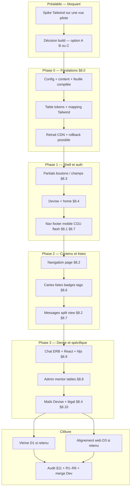

<!-- markdownlint-disable MD033 MD041 -->

# Plan d’intégration — kit UX AllAboard

**Phases · tests · merge `Dev`**

> [!TIP]
> Lire d’abord le [**sommaire**](#sommaire), puis la **légende des tests** ; le détail « quel fichier » reste dans l’[**audit §8**](audit-integration-kit-ux-allaboard.md) (**v1.5**).

**Version** : 5.1 · **Date** : 2026-05-13  
**Audit** : [audit-integration-kit-ux-allaboard.md](audit-integration-kit-ux-allaboard.md) (**v1.5**) — inventaire **§8**, phasage **§9**, succès **§11** · **Qualité** : [AGENTS.md](../AGENTS.md) (`pnpm verify` avant merge)

**Objectif** : livrer le kit sur `apps/thp-final` par phases ; chaque phase se clôt par des **jalons test** cochés. Les cases `- [ ]` ci‑dessous sont **cliquables sur GitHub** (fichier ou PR qui inclut cette checklist).

---

## Sommaire

1. [Planche visuelle](#1-planche-visuelle--référence-design)  
2. [Schéma Mermaid](#2-schéma-dintégration-mermaid)  
3. [Légende tests V / R / M / S / P](#3-légende-des-tests-v--r--m--s--p)  
4. [Décisions D1–D6](#4-décisions-atelier-d1d6)  
5. [Préalables (spike)](#5-préalables--spike--décision-build)  
6. [Phase 0 Fondations](#phase-0-fondations)  
7. [Phase 1 Shell et auth](#phase-1-shell-et-auth)  
8. [Phase 2 Contenu et messages](#phase-2-contenu-et-messages)  
9. [Phase 3 Dense et spécifique](#phase-3-dense-et-spécifique)  
10. [Phase 4 Clôture](#phase-4-clôture)  
11. [Recette R1–R6](#11-recette-manuelle-r1--r6)  
12. [Merge Dev](#12-merge-vers-dev)  
13. [Décision build](#13-décision-build)  
14. [Liens](#14-liens)

---

## 1. Planche visuelle — référence design

  

> [!NOTE]
> Chaque zone de la planche correspond aux **§8.x** de l’audit. Les livrables phase par phase ci‑dessous en découlent sans recopier l’inventaire ligne à ligne.

---

## 2. Schéma d’intégration (Mermaid)

<strong>Ouvrir / fermer le schéma</strong> (flux Préalable → Phases 0–3 → Clôture)

> [!IMPORTANT]
> Hors périmètre de ce flux : `apps/web`, `apps/api`, `/feed` — uniquement via **D3** et le [plan Web/API](plan-mise-en-place-web-api-donnees.md), pas mélangé aux PR kit Rails.

---

## 3. Légende des tests (V / R / M / S / P)

| Code | Quand | Commande ou action |
|:----:|-------|---------------------|
| **V** | Chaque PR monorepo | `pnpm verify` (racine) — aligné [`.github/workflows/ci.yml`](../../.github/workflows/ci.yml) |
| **R** | Après changement parcours / routes | `cd apps/thp-final && bin/rails test` |
| **M** | Fin de phase (local) | Recettes [**§11**](#11-recette-manuelle-r1--r6) **R1–R6** |
| **S** | CDN, chat, CSP, ou avant merge `Dev` | Même recette sur **environnement déployé** (comptes hors doc) |
| **P** | Si **D4** = automate | Playwright / autre — sinon *n/a* |

> [!WARNING]
> Il n’existe pas encore de `test/system` sous `thp-final`. Tant que **D4** n’ajoute pas Capybara / Playwright, la preuve « navigateur » repose sur **M** et **S**.

---

## 4. Décisions atelier (D1–D6)

| ID | Sujet | Note |
|:---:|--------|------|
| **D1** | Vitrine (Storybook, `/ui`, Markdown…) | |
| **D2** | `packages/ui-tokens` + conso Rails | |
| **D3** | Alignement `apps/web` | |
| **D4** | Tests visuels automatisés | |
| **D5** | Thème light | |
| **D6** | Cible accessibilité MVP | |

---

## 5. Préalables — spike & décision build

### Tâches

- [ ] **P‑01** — Branche technique ; une vue pilote compile Tailwind (option envisagée)
- [ ] **P‑02** — Documenter la commande de build CSS (README `thp-final` ou [§13 Décision build](#13-décision-build))
- [ ] **P‑03** — Table **Décision build** remplie (A, B ou C + date)

### Jalon test

- [ ] **V** — `pnpm verify`
- [ ] **R** — `cd apps/thp-final && bin/rails test`

---

## Phase 0 Fondations

> Ref. audit **§8.0**.

> [!NOTE]
> **Gate** : ne pas démarrer la phase 1 tant que **V** + **R** + **M** (R1 aperçu) ne sont pas cochés.

**Objectif** : une source de vérité couleurs / rayons / focus ; build reproductible ; CDN retiré **après** branchement feuille compilée.

### Livrables

- [ ] **0.1** — `tailwind.config` + `content` (ERB, helpers, JSX si concerné)
- [ ] **0.2** — Entrée CSS documentée (Tailwind + couches existantes)
- [ ] **0.3** — Pipeline documenté (aligné [Décision build](#13-décision-build)) ; CI à jour si besoin
- [ ] **0.4** — Table token → CSS → classe Tailwind (amorce §8.0)
- [ ] **0.5** — Focus ring & **z-index** (modales, nav, toasts)
- [ ] **0.6** — Retrait CDN ; `stylesheet_link_tag` vers build ; **rollback** testé
- [ ] **0.7** — Pas de seconde stack utilitaire (Bootstrap, etc.)

### Jalon test (fin phase 0)

- [ ] **V** — `pnpm verify`
- [ ] **R** — `bin/rails test` — 0 échec
- [ ] **R+** *(recommandé)* — Étendre `test/controllers/home_controller_test.rb` (ou équivalent) : `GET /` → `assert_response :success` **et** HTML sans `cdn.tailwindcss.com` ; assert sur le lien feuille build (adapter au pipeline)
- [ ] **M** — **R1** : accueil invité, pas d’erreur console bloquante
- [ ] **S** — Si déployé : **R1** sur staging

---

## Phase 1 Shell et auth

> Ref. audit **§8.1**, **§8.3**, **§8.4**, **§8.7**.

> [!NOTE]
> **Gate** : **R1–R3** obligatoires avant la phase 2 (feed).

**Objectif** : visiteur → compte → CGU → shell connecté (boutons, champs, modales).

### Livrables

- [ ] **1.1** — Partials boutons & champs (§8.3, §8.5)
- [ ] **1.2** — Home + vues Devise (§8.4) + erreurs formulaires
- [ ] **1.3** — Nav desktop & mobile, footer, menu utilisateur, badges
- [ ] **1.4** — Modale CGU, flash / toasts, bannières
- [ ] **1.5** — **D4 / D5 / D6** tranchés ou report daté

### Jalon test

- [ ] **V** — `pnpm verify` (chaque PR)
- [ ] **R** — `bin/rails test`
- [ ] **R+** *(recommandé)* — `GET` : `new_user_session_path`, `new_user_registration_path`, `root_path` invité → **200** (adapter aux routes Devise)
- [ ] **M** — **R1**, **R2**, **R3**
- [ ] **P** — Si D4 = automate : suite sur ce périmètre

---

## Phase 2 Contenu et messages

> Ref. audit **§8.2**, **§8.6**, **§8.7**.

**Objectif** : cartes, listes, badges, navigation de page ; split messages ; moins de hex en dur dans les ERB.

### Livrables

- [ ] **2.1** — Breadcrumbs, tabs, page heading (§8.2)
- [ ] **2.2** — Cartes feed / explore / ressources / événements ; list rows ; empty states
- [ ] **2.3** — Badges, tags, modales métier
- [ ] **2.4** — Split view messages + polish responsive

### Jalon test

- [ ] **V** — `pnpm verify`
- [ ] **R** — `bin/rails test`
- [ ] **R+** *(recommandé)* — `GET /feed` (ou route réelle) **200** avec user connecté (fixture + sign_in Devise)
- [ ] **M** — **R4**, **R5** (liste + ouverture thread)
- [ ] **S** — **R4** sur environnement déployé

---

## Phase 3 Dense et spécifique

> Ref. audit **§8.8** à **§8.10**, **§8.9**.

**Objectif** : chat + React ; tables admin/mentor ; mails ; pages légales.

### Livrables

- [ ] **3.1** — Chat CSS + React ; pas de régression Turbo / Action Cable
- [ ] **3.2** — Blocs code + highlight.js
- [ ] **3.3** — Tables admin / mentor (+ filtres si prévus)
- [ ] **3.4** — Mails Devise (snapshot ou preview) + pages légales (§8.10)

### Jalon test

- [ ] **V** — `pnpm verify` (inclut build JS `thp-final`)
- [ ] **R** — `bin/rails test`
- [ ] **R+** *(recommandé)* — `GET` dashboards mentor & admin avec fixtures **mentor** / **admin** → **200** (vérifier les helpers de route avec `bin/rails routes | grep dashboard`)
- [ ] **M** — **R5**, **R6**
- [ ] **S** — **R5**, **R6** + CSP / assets si applicable

---

## Phase 4 Clôture

### Tâches

- [ ] **4.1** — **D1** : vitrine primitives si retenu
- [ ] **4.2** — **D3** : PR `apps/web` si retenu
- [ ] **4.3** — Couverture §8.0–8.10 : fait ou **WONTFIX** documenté (issue / audit)
- [ ] **4.4** — README kit ou liste primitives dans `Docs/`
- [ ] **4.5** — Relecture **audit §11**
- [ ] **4.6** — **R1–R6** complet : local puis staging
- [ ] **4.7** — `pnpm verify` sur la branche de merge vers **`Dev`**

### Jalon test

- [ ] **V** / **R** / **M** / **S** / **P** — Selon tableau [§3](#3-légende-des-tests-v--r--m--s--p)

---

## 11. Recette manuelle (R1–R6)

| ID | Parcours | À vérifier |
|:---:|----------|------------|
| **R1** | Visiteur | Landing → inscription / login ; pas d’erreur console critique |
| **R2** | Devise | Erreurs formulaire ; login OK → feed |
| **R3** | CGU | Modale → case → validation → feed |
| **R4** | Feed | Liste, sidebar, FAB, ouverture post |
| **R5** | Messages | Liste, conversation, chat React |
| **R6** | Mentor / admin | Menus, dashboard sans **500** |

---

## 12. Merge vers Dev

- [ ] Gates des phases touchées : cochées **ou** lien issue de suivi
- [ ] §8.0–8.10 : couverture ou **WONTFIX**
- [ ] **D1–D6** : rempli ou report daté ([§4](#4-décisions-atelier-d1d6))
- [ ] [Décision build](#13-décision-build) complétée
- [ ] **Audit §11** relu
- [ ] `pnpm verify` vert

---

## 13. Décision build

> [!CAUTION]
> Remplir **après** le spike (§5). Tant que cette section est vide, la phase 0 reste **provisoire**.

| Option | Coché | Notes |
|--------|:-----:|-------|
| **A** — `cssbundling-rails` + `tailwindcss` npm | [ ] | |
| **B** — Pipeline / script npm dans `thp-final` | [ ] | |
| **C** — Autre | [ ] | |

**Décision** : … — **Date** : …

*(Si **D2** = package tokens : décrire ici ou dans README `thp-final` la consommation côté Rails.)*

---

## 14. Liens

| Ressource | Lien |
|-----------|------|
| Audit kit UX | [audit-integration-kit-ux-allaboard.md](audit-integration-kit-ux-allaboard.md) |
| Parcours utilisateur | [moc-parcours-utilisateur.md](moc-parcours-utilisateur.md) |
| Carte de la doc | [map-of-content.md](map-of-content.md) |
| README dépôt | [README.md](README.md) |
| Plan Web/API/données | [plan-mise-en-place-web-api-donnees.md](plan-mise-en-place-web-api-donnees.md) |
| CI | [`.github/workflows/ci.yml`](../../.github/workflows/ci.yml) |
