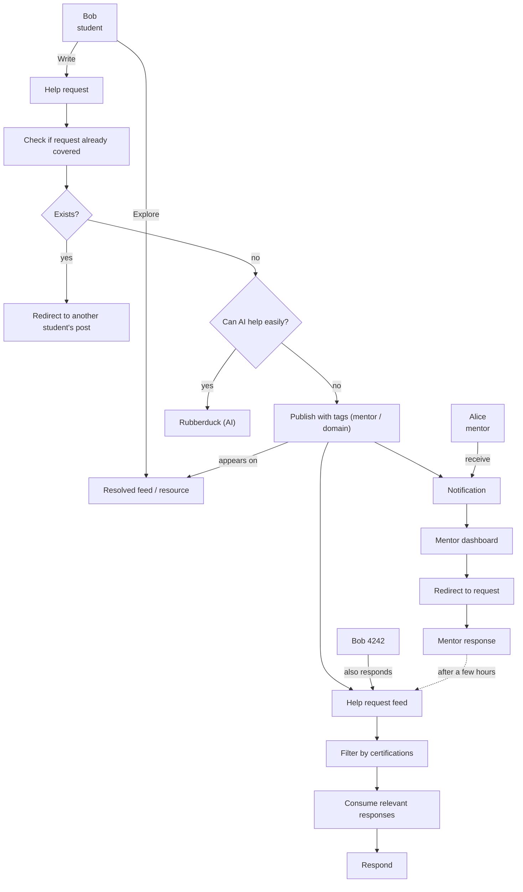

# MOC — All-Aboard user journeys

**Implementation:** technical work order (web, API, auth, TanStack Query) — [canonical documentation README](../README.md).

## Purpose

Describe the main help-request journey on All-Aboard, from student creation through final response via AI, peer, or mentor.

## Actors

- **Bob (student):** creates requests, explores the feed, consumes and publishes responses.
- **Alice (mentor):** receives targeted notifications, handles requests, publishes expert responses.
- **Bob 4242 (another student):** can respond to a request in the feed.
- **Rubberduck (AI):** offers quick help when the request is judged simple.

## User journey (MOC version)

1. The student creates a **help request** or explores the **resolved feed / resources**.
2. The system checks if the request already exists.
3. If yes, the user is redirected to an existing post.
4. If no, the system evaluates whether AI can help quickly.
5. If yes, the user is redirected to **Rubberduck**.
6. If no, the request is published with tags (mentor / domain) and mentors are notified.
7. In parallel, the request appears in the community feed where other students can respond.
8. Responses are filtered by certifications / relevance.
9. The student consumes relevant responses then publishes their final response.
10. The mentor can also respond after consulting their dashboard.

## Mermaid diagram

## MOC framing notes

- This version is intentionally simple and product-flow oriented.
- Moderation, SLA, quality scoring, and anti-spam steps can be added later.
- Display terms follow the source schema as closely as possible.
- **Steps 6–7 (shipped #82):** after tagged publication, `GET /mentor/feed` (mentor JWT) exposes `hasUnreadForMentor`; badges on `/mentor` dashboard and Mentor nav link. Doc: [tasks/82-mentor-notifications/README.md](../tasks/82-mentor-notifications/README.md).
- **Step 8 (shipped #83, PR #88):** mentor filter on request detail — `users.certification_tags`, overlap with `help_requests.tags`, requester always visible. Doc: [tasks/83-response-filtering/README.md](../tasks/83-response-filtering/README.md).
- **Phase 2b epic:** hub [tasks/78-phase2b-responses/README.md](../tasks/78-phase2b-responses/README.md) (PRs #84, #87, #88).
- **Rails API parity — Phase 1 (shipped, API):** enriched feed (`GET /feed`: `subject`/`tag`/`q` filters, pagination, `unanswered` widget), `GET /subjects` catalogue, request create/edit (body, code, subject, urgent), `POST …/help-mentor`, extended mentor feed (`mentorHelpRequested`). Doc: [tasks/api-rails-parity-phase1/README.md](../tasks/api-rails-parity-phase1/README.md); contract: [integration guide](../guides/web-api-integration.md#rails-parity-thp-final--api).
- **Rails API parity — Phase 2 (shipped, API):** likes/bookmarks (toggle + counters), `GET /me/help-requests` / `GET /me/bookmarks`, response edit/delete. Doc: [tasks/api-rails-parity-phase2/README.md](../tasks/api-rails-parity-phase2/README.md).
- **Rails API parity — Phase 3 (shipped, API):** `POST /auth/register`, `PATCH /users/me` profiles, legal, public profile `GET /users/:id`. Doc: [tasks/api-rails-parity-phase3/README.md](../tasks/api-rails-parity-phase3/README.md).
- **Rails API parity — Phase 4 (shipped, API):** resources, subject requests, mentor dashboard + approve. Doc: [tasks/api-rails-parity-phase4/README.md](../tasks/api-rails-parity-phase4/README.md).
- **Rails API parity — Phase 5 (shipped, API):** REST messaging (conversations, messages, read). Doc: [tasks/api-rails-parity-phase5/README.md](../tasks/api-rails-parity-phase5/README.md).
- **Rails API parity — Phase 5b (PR #104, API):** WebSocket `GET /conversations/:id/ws`, real-time push. Doc: [tasks/api-rails-parity-phase5b/README.md](../tasks/api-rails-parity-phase5b/README.md).
- **Rails API parity — Phase 6 (shipped, API):** admin moderation, denylist, roles. Doc: [tasks/api-rails-parity-phase6/README.md](../tasks/api-rails-parity-phase6/README.md).
- **Rails API parity — Lot A (PR #104, API):** soft delete `DELETE /help-requests/:id`, `POST /mentor/resources/:id/reject`. Doc: [tasks/api-parity-delete-reject/README.md](../tasks/api-parity-delete-reject/README.md).
- **Rails API parity — Phase 7 (PR #104, API):** `POST /help-requests/suggest-tags`, `ai_summary` on resolution. Doc: [tasks/api-rails-parity-phase7/README.md](../tasks/api-rails-parity-phase7/README.md).
- **Web parity P3 — Plan 6 (shipped, web):** admin UI + BFF (`/admin/*`, moderation, denylist, users, subject-requests). Doc: [tasks/web-parity-p3/README.md](../tasks/web-parity-p3/README.md).
- **Web parity P3 — Plan 7 (shipped, web):** help-request forms (body, code, subject, urgent), owner actions (resolve, help-mentor), AI summary display, suggest-tags button.
- **Web parity P3 — Plan 7b (shipped, web):** public landing `/` (marketing + login, auth redirect → `/feed`), subject pages `/subjects/[slug]`, admin nav badge.
- **Parity doc hub:** [tasks/api-rails-parity/README.md](../tasks/api-rails-parity/README.md); web closeout: [tasks/web-parity-p3/README.md](../tasks/web-parity-p3/README.md); contract: [integration guide](../guides/web-api-integration.md#rails-parity-thp-final--api).
- See also technical view: [Dataflow & architecture](../architecture/dataflow.md).
