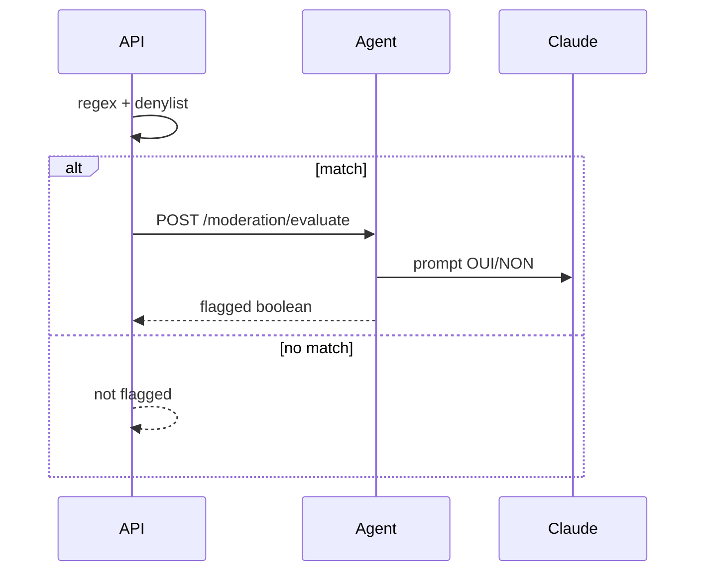

# Modération Claude (second avis agent)

**Branche** : `feat/api-claude-moderation`  
**OpenAPI** : `0.11.0` — [`apps/api/openapi.yaml`](../../../apps/api/openapi.yaml)  
**Référence Rails** : [`ai_moderation_service.rb`](../../../apps/thp-final/app/services/ai_moderation_service.rb)  
**Prérequis** : [Phase 6](../api-rails-parity-phase6/README.md) (regex + denylist + file admin)

## Objectif

Reproduire le flux Rails **regex/denylist → second avis Claude** sans changer la file admin ni la visibilité publique (`flagged_for_moderation`).



## Flux API

1. `matchesLocalModerationRules()` — regex hardcodée + patterns actifs (`denylist_patterns`).
2. Si pas de hit → `flaggedForModeration: false`.
3. Si hit et `MODERATION_CLAUDE_ENABLED` désactivé → flag (comportement phase 6).
4. Si hit et Claude activé → proxy `POST {AGENT_URL}/moderation/evaluate` (timeout 3 s).
5. Agent indisponible ou réponse invalide → **fallback conservateur** (`flagged: true`), aligné Rails quand l'API ne répond pas.

## Modules code

| Fichier | Rôle |
|---------|------|
| [`apps/api/src/services/profanity.ts`](../../../apps/api/src/services/profanity.ts) | `contentShouldBeFlagged()` — orchestration locale + agent |
| [`apps/api/src/agent/moderation.ts`](../../../apps/api/src/agent/moderation.ts) | Proxy HTTP vers agent + fallback |
| [`apps/api/src/routes/help-requests.ts`](../../../apps/api/src/routes/help-requests.ts) | Create/update demandes et réponses |
| [`apps/agent/src/moderation-evaluate.ts`](../../../apps/agent/src/moderation-evaluate.ts) | Appel Anthropic + stub sans clé |
| [`packages/types`](../../../packages/types/src/index.ts) | `AgentModerationEvaluateBody` / `Response` |

## Variables d'environnement

| Variable | Service | Rôle |
|----------|---------|------|
| `AGENT_URL` | API | Base URL agent (ex. `http://agent:4100`) |
| `MODERATION_CLAUDE_ENABLED` | API | `false` pour regex seul ; défaut activé |
| `ANTHROPIC_API_KEY` | Agent | Clé Claude ; absent → stub conservateur |

## Vérification

```bash
pnpm --filter @allaboard/types build
pnpm --filter agent test
pnpm --filter api test
pnpm verify
```

Tests clés : `apps/api/src/agent/moderation.test.ts`, `apps/api/src/services/profanity.test.ts`, scénario feed/modération dans `apps/api/src/app.test.ts`.

## Suite

Hub parité : [api-rails-parity](../api-rails-parity/README.md)  
Lot 3 Intuition : [37-agent-indexer](../37-agent-indexer/README.md)

## Fichiers

| Fichier | Rôle |
|---------|------|
| `README.md` | Ce fichier |
