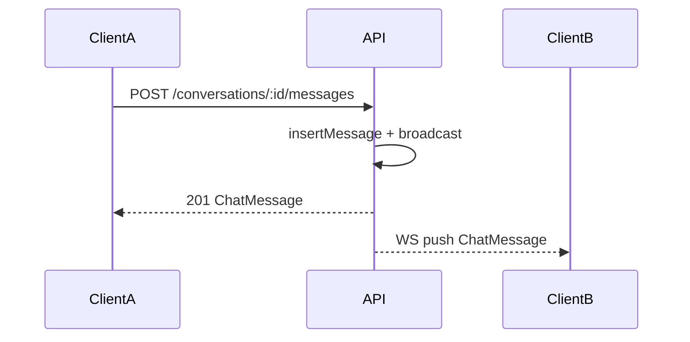

# Rails API parity — Phase 5b (WebSocket chat)

**PR:** [#104](https://github.com/AllAboard-THP/All-Aboard/pull/104)  
**OpenAPI:** `0.9.0` — [`apps/api/openapi.yaml`](../../../apps/api/openapi.yaml)  
**Prerequisite:** [Phase 5 REST](../api-rails-parity-phase5/README.md)  
**Rails reference:** `Message#broadcast_to_conversation` → `ConversationChannel` (`apps/thp-final`)

## Goal

Push new messages in real time to conversation participants, complementing Phase 5 REST (send via `POST …/messages`).

## Dependencies

- `@fastify/websocket` in `apps/api/package.json`
- `@types/ws` (dev)

## Endpoints

| Route | Auth | Description |
|-------|------|-------------|
| `GET /conversations/:id/ws` | JWT (WebSocket upgrade) | Broadcast subscription; participant only |

REST unchanged: `GET/POST /conversations`, `GET/POST …/messages`, `PATCH …/read` — see [phase5](../api-rails-parity-phase5/README.md).

## WebSocket auth

1. Cookie `access_token` (like REST after login), **or** query `?token=<JWT>` (clients without cookie)
2. Participant check via `isConversationParticipant`
3. Close codes: `4401` (unauthenticated), `4403` (not participant), `4503` (conversation not found)

## Broadcast payload

Same as REST `ChatMessage` (`type: "message"`) — aligned with Rails `Message#as_chat_json`. Sent to all conversation subscribers **except** REST sender (already gets `201` response).

## Architecture

| File | Role |
|------|------|
| [`apps/api/src/services/chat-broadcast.ts`](../../../apps/api/src/services/chat-broadcast.ts) | In-memory `Map<conversationId, Set<WebSocket>>` hub |
| [`apps/api/src/routes/conversations-ws.ts`](../../../apps/api/src/routes/conversations-ws.ts) | WS upgrade route |
| [`apps/api/src/routes/conversations.ts`](../../../apps/api/src/routes/conversations.ts) | Calls `broadcastChatMessage` after `insertMessage` |
| [`apps/api/src/app.ts`](../../../apps/api/src/app.ts) | WS plugin registration |



## Limits (MVP)

- **Single-instance** API: in-process memory hub; no Redis pub/sub in this lot (OK dev/staging Dokploy single replica)
- **Out of scope:** `typing` events, attachments (present in Rails, v2)

## Verification

```bash
pnpm --filter api test    # unit hub: chat-broadcast.test.ts
```

Manual smoke: two WS clients on same conversation; REST send → push to peer.

## Next

**Phase 7** (AI): [api-rails-parity-phase7](../api-rails-parity-phase7/README.md)  
Hub: [api-rails-parity](../api-rails-parity/README.md)

## Files

| File | Role |
|------|------|
| `README.md` | This file |
