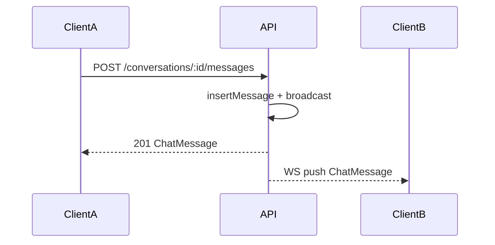

# API parité Rails — Phase 5b (chat WebSocket)

**PR** : [#104](https://github.com/AllAboard-THP/All-Aboard/pull/104)  
**OpenAPI** : `0.9.0` — [`apps/api/openapi.yaml`](../../../apps/api/openapi.yaml)  
**Prérequis** : [Phase 5 REST](../api-rails-parity-phase5/README.md)  
**Référence Rails** : `Message#broadcast_to_conversation` → `ConversationChannel` (`apps/thp-final`)

## Objectif

Pousser les nouveaux messages en temps réel aux participants d’une conversation, en complément du REST phase 5 (envoi via `POST …/messages`).

## Dépendances

- `@fastify/websocket` dans `apps/api/package.json`
- `@types/ws` (dev)

## Endpoints

| Route | Auth | Description |
|-------|------|-------------|
| `GET /conversations/:id/ws` | JWT (upgrade WebSocket) | Abonnement broadcast ; participant uniquement |

REST inchangé : `GET/POST /conversations`, `GET/POST …/messages`, `PATCH …/read` — voir [phase5](../api-rails-parity-phase5/README.md).

## Auth WebSocket

1. Cookie `access_token` (comme REST après login), **ou** query `?token=<JWT>` (clients sans cookie)
2. Vérification participant via `isConversationParticipant`
3. Codes fermeture : `4401` (non authentifié), `4403` (non participant), `4503` (conversation introuvable)

## Payload broadcast

Identique à `ChatMessage` REST (`type: "message"`) — aligné `Message#as_chat_json` Rails. Envoyé à tous les abonnés de la conversation **sauf** l’expéditeur REST (qui reçoit déjà la réponse `201`).

## Architecture

| Fichier | Rôle |
|---------|------|
| [`apps/api/src/services/chat-broadcast.ts`](../../../apps/api/src/services/chat-broadcast.ts) | Hub `Map<conversationId, Set<WebSocket>>` en mémoire |
| [`apps/api/src/routes/conversations-ws.ts`](../../../apps/api/src/routes/conversations-ws.ts) | Route upgrade WS |
| [`apps/api/src/routes/conversations.ts`](../../../apps/api/src/routes/conversations.ts) | Appelle `broadcastChatMessage` après `insertMessage` |
| [`apps/api/src/app.ts`](../../../apps/api/src/app.ts) | Enregistrement plugin WS |



## Limites (MVP)

- **Mono-instance** API : hub en mémoire process ; pas de Redis pub/sub dans ce lot (OK dev/staging Dokploy mono-replica)
- **Hors scope** : événements `typing`, pièces jointes (présents côté Rails, v2)

## Vérification

```bash
pnpm --filter api test    # unit hub : chat-broadcast.test.ts
```

Smoke manuel : deux clients WS sur la même conversation ; envoi REST → push sur le pair.

## Suite

**Phase 7** (IA) : [api-rails-parity-phase7](../api-rails-parity-phase7/README.md)  
Hub : [api-rails-parity](../api-rails-parity/README.md)

## Fichiers

| Fichier | Rôle |
|---------|------|
| `README.md` | Ce fichier |
