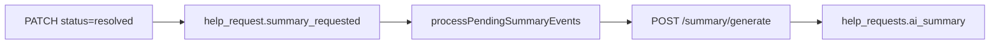

# Rails API parity — Phase 7 (suggest-tags + ai_summary)

**PR:** [#104](https://github.com/AllAboard-THP/All-Aboard/pull/104)  
**OpenAPI:** `0.10.0` — [`apps/api/openapi.yaml`](../../../apps/api/openapi.yaml)  
**Prerequisite:** [Phase 1](../api-rails-parity-phase1/README.md) (`ai_summary` column, `status resolved`)  
**Rails reference:** `posts#suggest_tags`, `GeneratePostSummaryJob` (`apps/thp-final`)

## Goal

Suggest tags while drafting and generate an AI summary when a request moves to `resolved`, via `apps/agent` proxy (stub without LLM key; optional LLM later).

---

## C.1 Suggest tags

| Layer | Endpoint | Behaviour |
|-------|----------|-----------|
| Agent | `POST /tags/suggest` | Body `{ title?, body? }` → `{ tags: string[] }` (2–5 tags, lowercase) |
| API | `POST /help-requests/suggest-tags` | JWT required; proxies `AGENT_URL` + local stub fallback |

**Agent stub** (without `ANTHROPIC_API_KEY`): keyword heuristic (words > 4 letters, stopwords filtered) — sufficient for dev/CI.

### Modules

| File | Role |
|------|------|
| [`apps/agent/src/tag-suggest.ts`](../../../apps/agent/src/tag-suggest.ts) | Heuristic / future LLM |
| [`apps/agent/src/app.ts`](../../../apps/agent/src/app.ts) | `POST /tags/suggest` |
| [`apps/api/src/agent/tag-suggestion.ts`](../../../apps/api/src/agent/tag-suggestion.ts) | Agent proxy |
| [`apps/api/src/routes/suggest-tags.ts`](../../../apps/api/src/routes/suggest-tags.ts) | API route |

### Types

`SuggestTagsBody`, `SuggestTagsResponse`, `AgentTagsSuggestBody`, `AgentTagsSuggestResponse` in [`packages/types`](../../../packages/types/src/index.ts).

---

## C.2 AI summary on resolution

**Trigger:** `PATCH /help-requests/:id` when `status` becomes `resolved` (Rails `after_update_commit` equivalent).

**Pipeline (outbox, ADR 0004):**



| File | Role |
|------|------|
| [`apps/api/src/intuition/outbox.ts`](../../../apps/api/src/intuition/outbox.ts) | `enqueueHelpRequestSummaryRequested` |
| [`apps/api/src/services/ai-summary-worker.ts`](../../../apps/api/src/services/ai-summary-worker.ts) | Poll outbox, call agent, `UPDATE ai_summary` |
| [`apps/api/src/index.ts`](../../../apps/api/src/index.ts) | Starts worker when `AI_SUMMARY_ENABLED=true` |
| [`apps/agent/src/summary-generate.ts`](../../../apps/agent/src/summary-generate.ts) | Stub "Problem / Solution" |
| [`apps/api/src/agent/summary.ts`](../../../apps/api/src/agent/summary.ts) | Agent proxy |

**Idempotence:** no re-enqueue if `ai_summary` already set; `onConflictDoNothing` on outbox.

---

## Environment variables

| Variable | Service | Role |
|----------|---------|------|
| `AGENT_URL` | API | Agent base URL (tags + summary) |
| `AI_SUMMARY_ENABLED` | API | Enables poll worker (default: off) |
| `ANTHROPIC_API_KEY` | Agent | Future LLM (stub if absent) |

---

## Verification

```bash
pnpm --filter @allaboard/types build
pnpm --filter agent test
pnpm --filter api test
```

API tests: suggest-tags stub; `PATCH` → `resolved` → outbox row; `processPendingSummaryEvents` fills `ai_summary`.

## Next

Hub: [api-rails-parity](../api-rails-parity/README.md)

## Files

| File | Role |
|------|------|
| `README.md` | This file |
