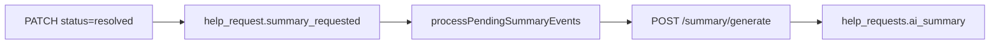

# API parité Rails — Phase 7 (suggest-tags + ai_summary)

**PR** : [#104](https://github.com/AllAboard-THP/All-Aboard/pull/104)  
**OpenAPI** : `0.10.0` — [`apps/api/openapi.yaml`](../../../apps/api/openapi.yaml)  
**Prérequis** : [Phase 1](../api-rails-parity-phase1/README.md) (`ai_summary` colonne, `status resolved`)  
**Référence Rails** : `posts#suggest_tags`, `GeneratePostSummaryJob` (`apps/thp-final`)

## Objectif

Proposer des tags à la rédaction et générer un résumé IA quand une demande passe à `resolved`, via proxy `apps/agent` (stub sans clé LLM ; LLM optionnel plus tard).

---

## C.1 Suggest tags

| Couche | Endpoint | Comportement |
|--------|----------|--------------|
| Agent | `POST /tags/suggest` | Body `{ title?, body? }` → `{ tags: string[] }` (2–5 tags, lowercase) |
| API | `POST /help-requests/suggest-tags` | JWT requis ; proxy `AGENT_URL` + fallback stub local |

**Stub agent** (sans `ANTHROPIC_API_KEY`) : heuristique mots-clés (mots > 4 lettres, stopwords filtrés) — suffisant dev/CI.

### Modules

| Fichier | Rôle |
|---------|------|
| [`apps/agent/src/tag-suggest.ts`](../../../apps/agent/src/tag-suggest.ts) | Heuristique / futur LLM |
| [`apps/agent/src/app.ts`](../../../apps/agent/src/app.ts) | `POST /tags/suggest` |
| [`apps/api/src/agent/tag-suggestion.ts`](../../../apps/api/src/agent/tag-suggestion.ts) | Proxy agent |
| [`apps/api/src/routes/suggest-tags.ts`](../../../apps/api/src/routes/suggest-tags.ts) | Route API |

### Types

`SuggestTagsBody`, `SuggestTagsResponse`, `AgentTagsSuggestBody`, `AgentTagsSuggestResponse` dans [`packages/types`](../../../packages/types/src/index.ts).

---

## C.2 Résumé IA à la résolution

**Déclencheur** : `PATCH /help-requests/:id` quand `status` passe à `resolved` (équivalent Rails `after_update_commit`).

**Pipeline (outbox, ADR 0004)** :



| Fichier | Rôle |
|---------|------|
| [`apps/api/src/intuition/outbox.ts`](../../../apps/api/src/intuition/outbox.ts) | `enqueueHelpRequestSummaryRequested` |
| [`apps/api/src/services/ai-summary-worker.ts`](../../../apps/api/src/services/ai-summary-worker.ts) | Poll outbox, appelle agent, `UPDATE ai_summary` |
| [`apps/api/src/index.ts`](../../../apps/api/src/index.ts) | Démarre worker si `AI_SUMMARY_ENABLED=true` |
| [`apps/agent/src/summary-generate.ts`](../../../apps/agent/src/summary-generate.ts) | Stub « Problème / Solution » |
| [`apps/api/src/agent/summary.ts`](../../../apps/api/src/agent/summary.ts) | Proxy agent |

**Idempotence** : pas de re-enqueue si `ai_summary` déjà rempli ; `onConflictDoNothing` sur outbox.

---

## Variables d’environnement

| Variable | Service | Rôle |
|----------|---------|------|
| `AGENT_URL` | API | Base URL agent (tags + summary) |
| `AI_SUMMARY_ENABLED` | API | Active le poll worker (défaut : off) |
| `ANTHROPIC_API_KEY` | Agent | LLM futur (stub si absent) |

---

## Vérification

```bash
pnpm --filter @allaboard/types build
pnpm --filter agent test
pnpm --filter api test
```

Tests API : suggest-tags stub ; `PATCH` → `resolved` → ligne outbox ; `processPendingSummaryEvents` remplit `ai_summary`.

## Suite

Hub : [api-rails-parity](../api-rails-parity/README.md)

## Fichiers

| Fichier | Rôle |
|---------|------|
| `README.md` | Ce fichier |
