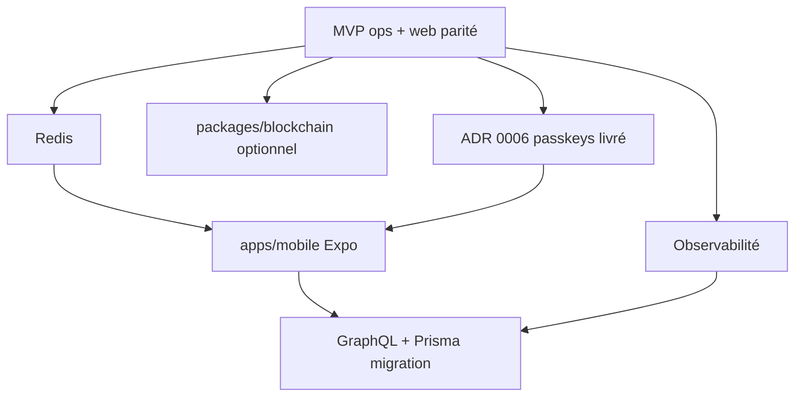

# Roadmap future — Vision v1+ (hors MVP strict)

**Statut** : cadrage / backlog — **pas** la prochaine livraison MVP.  
**Mise à jour** : 2026-06-11.  
**Référence stack cible** : [proposition-stack-technique-monorepo-2026.md](../proposition-stack-technique-monorepo-2026.md).  
**État actuel du dépôt** : [README.md](../README.md) (phases 0–4 livrées côté doc ; API parité Rails livrée ; web en retard).

> **Mot-clé agent** : quand l’humain dit **« roadmap »**, lire ce fichier en premier, puis les plans Cursor listés en §2, puis proposer l’élaboration des plans d’exécution manquants (§4).

---

## 1. Principe : un hub, plusieurs plans d’exécution

Les pistes v1+ ci-dessous sont **trop vastes pour un seul plan d’implémentation**. Structure retenue :

| Niveau | Rôle |
|--------|------|
| **Ce document** | Hub roadmap : ordre, dépendances, ADR à écrire, liens |
| **Plans Cursor séparés** | Un plan par piste, créés **à la demande** après cadrage |
| **ADR** | Décision validée avant gros chantier (surtout GraphQL/Prisma, auth Web3, mobile) |

Ne pas mélanger implémentation MVP (web parité, ops staging) avec migration v1+ dans une même PR.

---

## 2. Priorité actuelle (MVP — avant v1+)

Travail **immédiat** documenté ailleurs ; à finir ou lancer **avant** les pistes §3 :

| # | Pilier | Plan Cursor | Fichier |
|---|--------|-------------|---------|
| 1 | Ops | Staging Phase 4 + Agent + vars | `~/.cursor/plans/ops_staging_phase_4_*.plan.md` |
| 2 | Backend | Smoke + Intuition live + doc modération | `~/.cursor/plans/backend_smoke_intuition_*.plan.md` |
| 3 | Web | Parité UI P1 (feed, profil, social) | `~/.cursor/plans/web_parity_p1_*.plan.md` |
| 5 | Web | Resources, mentor dashboard, chat | `~/.cursor/plans/web_parity_p2_resources_chat_*.plan.md` |

**En suspens** (décision produit) : ~~Phase 3b auth email, ADR auth Web3 (wallet / Gnosis / hybride)~~ → **résolu** : [ADR 0006](../adr/0006-authentication-passkeys.md) (passkeys WebAuthn). Wallet Intuition = publish serveur, pas login utilisateur.

**Auth passkeys** : plan d’implémentation intégré au Web P1 (lots W-P1-00 / W-P1-04) ; pas une piste v1+ séparée.

---

## 3. Pistes v1+ (absentes ou partielles dans le dépôt)

Source : [proposition-stack-technique-monorepo-2026.md](../proposition-stack-technique-monorepo-2026.md). État **aujourd’hui** :

| Piste | Cible doc | État dépôt | Taille | Plan dédié |
|-------|-----------|------------|--------|------------|
| **Observabilité** | OpenTelemetry + Sentry, logs structurés (pino) | Non implémenté | S–M (~1 sem.) | À créer : `vision-observability` |
| **Redis** | Cache, rate limits, WS multi-instance (Phase 5b scale) | Non implémenté ; hub WS mémoire mono-instance | M | À créer : `vision-redis` |
| **`packages/blockchain`** | Abstraction Web3 / Intuition ; lien wallet ↔ compte (optionnel) | Partiel : `apps/api/src/intuition/` | M | À créer : `vision-blockchain-package` |
| ~~**Auth Web3**~~ **Auth passkeys** | ~~Wallet / Gnosis / SIWE~~ → **WebAuthn** ([ADR 0006](../adr/0006-authentication-passkeys.md)) | En cours (Web P1 W-P1-00) | M | Web P1 + ADR 0006 |
| **`apps/mobile`** | Expo / React Native, partage `packages/types` (+ UI si pertinent) | Absent | L–XL | À créer : `vision-mobile-expo` |
| **GraphQL + Prisma** | BFF GraphQL, ORM Prisma, migrations | **Non** — MVP = Fastify REST + Drizzle | XL (migration) | À créer : `vision-graphql-prisma` (ADR d’abord) |

### Ordre recommandé (quand le MVP web/ops est rattrapé)

1. **Observabilité** — transverse, peu de rework, utile avant montée en charge  
2. **Redis** — si besoin scaling WS ou cache feed/sessions  
3. **`packages/blockchain`** — lien wallet optionnel ; identité = passkeys (ADR 0006)  
4. **`apps/mobile`** — API REST actuelle suffit ; contrat `packages/types` stable requis  
5. **GraphQL + Prisma** — **en dernier** ; migration la plus disruptive (remplace REST + Drizzle)

---

## 4. Élaboration des plans (workflow « roadmap »)

Quand l’humain demande **roadmap** :

1. Lire **ce fichier** + [vision/README.md](README.md).  
2. Rappeler l’état §2 (MVP en cours) vs §3 (v1+ backlog).  
3. Demander quelle **piste v1+** élaborer en premier (ou confirmer que le MVP §2 n’est pas terminé).  
4. Créer **un plan Cursor séparé** pour la piste choisie (pas un méga-plan).  
5. Si la piste l’exige : brouillon **ADR** dans `Docs/tasks/<NN>-slug/` avant code.

### Gabarit plan d’exécution (par piste)

- Contexte + prérequis MVP  
- ADR requis (oui/non)  
- Périmètre / hors scope  
- Fichiers / services touchés  
- Variables env / ops  
- Vérification (`pnpm verify`, smoke)  
- Effort estimé  
- Risques  

---

## 5. Dépendances et risques transverses

| Risque | Mitigation |
|--------|------------|
| GraphQL/Prisma trop tôt | Garder REST + Drizzle tant que le web consomme l’OpenAPI actuel |
| Auth passkeys vs email | [ADR 0006](../adr/0006-authentication-passkeys.md) — Phase 3b annulée |
| Mobile sans API stable | Finir parité web P1/P2 + contrat types figé |
| Intuition déjà dans `apps/api` | `packages/blockchain` = extraction + auth user, pas remplacement outbox existant |
| Redis obligatoire pour prod WS | Documenté hors scope Phase 5b ; activer avant multi-replica API |

---

## 6. Liens

- [Dataflow cible](../dataflow-architecture.md)  
- [ADR 0004 Agent / Intuition](../adr/0004-agent-indexer-architecture.md)  
- [Hub parité API](../tasks/api-rails-parity/README.md)  
- [GitHub Project #3](https://github.com/orgs/AllAboard-THP/projects/3) — pilotage issues (pas de duplication ici)

---

## 7. Journal

| Date | Note |
|------|------|
| 2026-06-11 | Décision passkeys — [ADR 0006](../adr/0006-authentication-passkeys.md) ; Phase 3b annulée ; auth retirée du backlog v1+ wallet |
